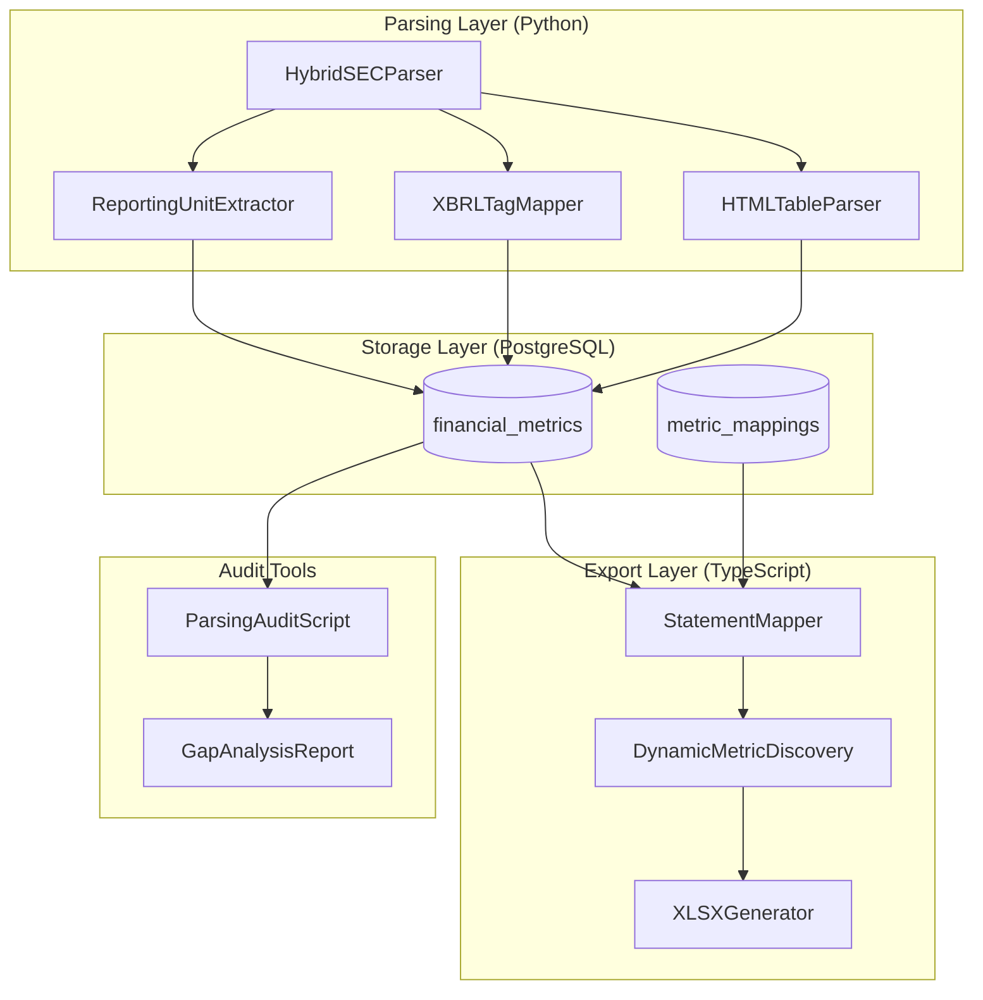

# Design Document: Complete Financial Statement Parsing

## Overview

This design addresses critical gaps in the SEC filing parser that result in incomplete Excel exports. The solution involves enhancements across three layers:

1. **Parsing Layer**: Enhanced Python parser to extract ALL line items and reporting units from SEC filings
2. **Storage Layer**: Database schema already supports reporting units; focus on ensuring complete data persistence
3. **Export Layer**: Enhanced Excel generator to display reporting units correctly and include all extracted metrics

The design follows the existing architecture patterns in the codebase, extending the `HybridSECParser`, `XBRLTagMapper`, `StatementMapper`, and `XLSXGenerator` components.

### Key Problems Addressed

| Problem | Root Cause | Solution |
|---------|------------|----------|
| Missing sub-line items (CMCSA example) | XBRL tag mapper lacks mappings for company-specific tags | Add comprehensive tag mappings including extensions |
| Reporting units not captured | Parser extracts scale but doesn't persist unit type | Enhance parser to extract and store unit strings |
| Excel exports don't match SEC filings | Statement mapper missing metric definitions | Add dynamic metric discovery and complete configurations |

## Architecture



## Components and Interfaces

### 1. ReportingUnitExtractor (New Component)

Extracts reporting units from SEC filing headers and table headers.

```python
@dataclass
class ReportingUnitInfo:
    """Extracted reporting unit information"""
    default_unit: str  # 'units', 'thousands', 'millions', 'billions'
    share_unit: str    # Unit for share-related metrics
    per_share_unit: str  # Unit for per-share amounts (usually 'units')
    source: str        # 'header', 'table_header', 'ixbrl_scale', 'default'

class ReportingUnitExtractor:
    """
    Extracts reporting units from SEC filings.
    
    Handles patterns like:
    - "(In millions, except number of shares, which are reflected in thousands, and per-share amounts)"
    - "(Dollars in millions)"
    - "(In thousands)"
    """
    
    # Common patterns for reporting unit extraction
    UNIT_PATTERNS = [
        # Full pattern with exceptions
        r'\(In\s+(millions|thousands|billions)(?:,?\s+except\s+(?:number\s+of\s+)?shares?,?\s+which\s+are\s+(?:reflected\s+)?in\s+(thousands|millions))?(?:,?\s+and\s+per[- ]share\s+amounts?)?\)',
        # Simple pattern
        r'\((?:Dollars?\s+)?[Ii]n\s+(millions|thousands|billions)\)',
        # Table header pattern
        r'\$\s*in\s+(millions|thousands|billions)',
    ]
    
    def extract_from_filing(self, html_content: str) -> ReportingUnitInfo:
        """Extract reporting unit from filing header or table headers"""
        pass
    
    def extract_from_table_header(self, table_element) -> Optional[ReportingUnitInfo]:
        """Extract reporting unit from a specific table's header"""
        pass
    
    def get_unit_for_metric(self, metric_name: str, unit_info: ReportingUnitInfo) -> str:
        """Determine the correct unit for a specific metric type"""
        pass
```

### 2. Enhanced XBRLTagMapper

Extended tag mappings for complete line item coverage.

```python
# New mappings for missing CMCSA-style line items
MEDIA_COMPANY_MAPPINGS = [
    MetricMapping(
        normalized_metric='programming_and_production',
        display_name='Programming and Production',
        statement_type='income_statement',
        xbrl_tags=[
            'cmcsa:ProgrammingAndProduction',
            'us-gaap:ProgrammingCosts',
            'us-gaap:CostOfGoodsAndServicesSoldProgrammingAndProduction',
        ],
        synonyms=['programming and production', 'programming costs'],
    ),
    MetricMapping(
        normalized_metric='marketing_and_promotion',
        display_name='Marketing and Promotion',
        statement_type='income_statement',
        xbrl_tags=[
            'cmcsa:MarketingAndPromotion',
            'us-gaap:MarketingAndAdvertisingExpense',
            'us-gaap:SellingAndMarketingExpense',
        ],
        synonyms=['marketing and promotion', 'marketing expense'],
    ),
    MetricMapping(
        normalized_metric='other_operating_and_administrative',
        display_name='Other Operating and Administrative',
        statement_type='income_statement',
        xbrl_tags=[
            'cmcsa:OtherOperatingAndAdministrative',
            'us-gaap:OtherCostAndExpenseOperating',
        ],
        synonyms=['other operating and administrative'],
    ),
    MetricMapping(
        normalized_metric='depreciation',
        display_name='Depreciation',
        statement_type='income_statement',
        xbrl_tags=[
            'us-gaap:Depreciation',
            'us-gaap:DepreciationNonproduction',
        ],
        synonyms=['depreciation'],
    ),
    MetricMapping(
        normalized_metric='amortization',
        display_name='Amortization',
        statement_type='income_statement',
        xbrl_tags=[
            'us-gaap:AmortizationOfIntangibleAssets',
            'us-gaap:Amortization',
        ],
        synonyms=['amortization'],
    ),
    MetricMapping(
        normalized_metric='goodwill_and_long_lived_asset_impairments',
        display_name='Goodwill and Long-lived Asset Impairments',
        statement_type='income_statement',
        xbrl_tags=[
            'cmcsa:GoodwillAndLongLivedAssetImpairments',
            'us-gaap:GoodwillAndIntangibleAssetImpairment',
            'us-gaap:AssetImpairmentCharges',
        ],
        synonyms=['goodwill impairment', 'asset impairment'],
    ),
]

class XBRLTagMapper:
    """Enhanced mapper with dynamic tag discovery"""
    
    def __init__(self):
        self.tag_to_metric: Dict[str, MetricMapping] = {}
        self.unmapped_tags: Set[str] = set()  # Track unmapped tags for reporting
        self._load_all_mappings()
    
    def get_normalized_metric(self, xbrl_tag: str) -> Tuple[Optional[str], float]:
        """Get normalized metric with confidence score"""
        pass
    
    def register_unmapped_tag(self, xbrl_tag: str, context: str):
        """Track unmapped tags for gap analysis"""
        self.unmapped_tags.add((xbrl_tag, context))
    
    def get_unmapped_tags_report(self) -> List[Dict]:
        """Generate report of unmapped tags for review"""
        pass
    
    def add_dynamic_mapping(self, xbrl_tag: str, normalized_metric: str, statement_type: str):
        """Add a new mapping at runtime (for company-specific tags)"""
        pass
```

### 3. Enhanced HybridSECParser

Updated parser with reporting unit extraction and complete line item capture.

```python
@dataclass
class ExtractedMetric:
    """Enhanced metric with reporting unit"""
    ticker: str
    normalized_metric: str
    raw_label: str
    value: float
    fiscal_period: str
    period_type: str
    filing_type: str
    statement_type: str
    confidence_score: float
    source: str
    xbrl_tag: Optional[str] = None
    context_ref: Optional[str] = None
    is_derived: bool = False
    reporting_unit: str = 'units'  # NEW: Original scale from SEC
    parent_metric: Optional[str] = None  # NEW: For hierarchical relationships

class HybridSECParser:
    """Enhanced parser with complete extraction"""
    
    def __init__(self):
        self.ixbrl_parser = IXBRLParser()
        self.tag_mapper = get_mapper()
        self.unit_extractor = ReportingUnitExtractor()  # NEW
    
    def parse_filing(self, html_content: str, ticker: str, filing_type: str, cik: str) -> Dict[str, Any]:
        """Parse with reporting unit extraction"""
        # Extract reporting units first
        unit_info = self.unit_extractor.extract_from_filing(html_content)
        
        # Extract iXBRL facts
        ixbrl_result = self.ixbrl_parser.parse(html_content, ticker)
        
        # Convert with proper reporting units
        metrics = self._convert_ixbrl_to_metrics(
            ixbrl_result['facts'], ticker, filing_type, unit_info
        )
        
        # Fallback to HTML tables if needed
        if len(metrics) == 0:
            metrics = self._extract_html_table_metrics(
                html_content, ticker, filing_type, unit_info
            )
        
        return {
            'structured_metrics': [asdict(m) for m in metrics],
            'narrative_chunks': self._extract_narratives(html_content, ticker, filing_type),
            'metadata': {
                'reporting_unit_info': asdict(unit_info),
                'unmapped_tags': list(self.tag_mapper.unmapped_tags),
                # ... other metadata
            }
        }
    
    def _convert_ixbrl_to_metrics(
        self,
        facts: List[IXBRLFact],
        ticker: str,
        filing_type: str,
        unit_info: ReportingUnitInfo
    ) -> List[ExtractedMetric]:
        """Convert iXBRL facts with proper reporting units"""
        metrics = []
        for fact in facts:
            # Get normalized metric
            normalized_metric, confidence = self.tag_mapper.get_normalized_metric(fact.name)
            
            # Track unmapped tags
            if normalized_metric is None:
                self.tag_mapper.register_unmapped_tag(fact.name, f"{ticker}:{filing_type}")
                normalized_metric = self.tag_mapper.slugify_tag(fact.name)
                confidence = 0.5
            
            # Determine reporting unit for this metric
            reporting_unit = self.unit_extractor.get_unit_for_metric(
                normalized_metric, unit_info
            )
            
            metric = ExtractedMetric(
                ticker=ticker,
                normalized_metric=normalized_metric,
                raw_label=fact.name,
                value=fact.value,
                fiscal_period=fact.fiscal_period,
                period_type=self._get_period_type(fact),
                filing_type=filing_type,
                statement_type=self.tag_mapper.get_statement_type(fact.name),
                confidence_score=confidence,
                source='ixbrl',
                xbrl_tag=fact.name,
                context_ref=fact.context_ref,
                reporting_unit=reporting_unit,
            )
            metrics.append(metric)
        
        return metrics
```

### 4. Enhanced StatementMapper

Updated mapper with dynamic metric discovery.

```typescript
interface MetricDefinition {
  normalizedMetric: string;
  displayName: string;
  isHeader?: boolean;
  indent?: number;
  format?: 'currency' | 'percentage' | 'number' | 'eps';
  parentMetric?: string;  // NEW: For hierarchical display
}

// NEW: Additional Income Statement metrics for media companies
const MEDIA_INCOME_STATEMENT_ADDITIONS: MetricDefinition[] = [
  // Cost and Expenses breakdown (CMCSA style)
  { normalizedMetric: 'costs_and_expenses_header', displayName: 'COSTS AND EXPENSES', isHeader: true },
  { normalizedMetric: 'programming_and_production', displayName: 'Programming and Production', format: 'currency', indent: 1 },
  { normalizedMetric: 'marketing_and_promotion', displayName: 'Marketing and Promotion', format: 'currency', indent: 1 },
  { normalizedMetric: 'other_operating_and_administrative', displayName: 'Other Operating and Administrative', format: 'currency', indent: 1 },
  { normalizedMetric: 'depreciation', displayName: 'Depreciation', format: 'currency', indent: 1 },
  { normalizedMetric: 'amortization', displayName: 'Amortization', format: 'currency', indent: 1 },
  { normalizedMetric: 'goodwill_and_long_lived_asset_impairments', displayName: 'Goodwill and Long-lived Asset Impairments', format: 'currency', indent: 1 },
];

@Injectable()
class StatementMapper {
  /**
   * Map metrics with dynamic discovery for unmapped metrics
   */
  mapMetricsToStatement(
    rawMetrics: RawMetric[],
    statementType: StatementType,
    periods: string[],
  ): MetricRow[] {
    const config = this.getStatementConfig(statementType);
    const rows: MetricRow[] = [];
    const addedMetrics = new Set<string>();
    
    // First pass: Add configured metrics in order
    for (const metricDef of config.metricOrder) {
      // ... existing logic
      addedMetrics.add(metricDef.normalizedMetric);
    }
    
    // Second pass: Add any metrics from database not in configuration
    // This ensures we never lose data even if mapper config is incomplete
    for (const metric of rawMetrics) {
      const normalizedName = metric.normalized_metric?.toLowerCase() || '';
      if (!addedMetrics.has(normalizedName)) {
        // Dynamic metric discovery - add with generic formatting
        rows.push(this.createDynamicMetricRow(metric, periods));
        addedMetrics.add(normalizedName);
        this.logger.warn(`Dynamic metric added: ${normalizedName} (not in configuration)`);
      }
    }
    
    return rows;
  }
  
  /**
   * Create a metric row for metrics not in the static configuration
   */
  private createDynamicMetricRow(metric: RawMetric, periods: string[]): MetricRow {
    return {
      displayName: this.humanizeMetricName(metric.normalized_metric),
      normalizedMetric: metric.normalized_metric,
      values: this.buildValuesMap(metric, periods),
      reportingUnits: this.buildUnitsMap(metric, periods),
      isHeader: false,
      indent: 1,  // Default indent for dynamic metrics
      format: this.inferFormat(metric.normalized_metric),
    };
  }
  
  /**
   * Convert snake_case metric name to human-readable display name
   */
  private humanizeMetricName(metricName: string): string {
    return metricName
      .split('_')
      .map(word => word.charAt(0).toUpperCase() + word.slice(1))
      .join(' ');
  }
}
```

### 5. Enhanced XLSXGenerator

Updated generator with proper reporting unit display.

```typescript
@Injectable()
class XLSXGenerator {
  /**
   * Add company header with reporting unit information
   */
  private addCompanyHeader(
    worksheet: ExcelJS.Worksheet,
    startRow: number,
    options: WorkbookOptions,
    periodCount: number,
    reportingUnitInfo?: ReportingUnitInfo,
  ): number {
    // Company name row
    const companyRow = worksheet.getRow(startRow);
    companyRow.getCell(1).value = options.companyName;
    companyRow.getCell(1).font = { bold: true, size: 14 };
    worksheet.mergeCells(startRow, 1, startRow, periodCount + 1);

    // Ticker row
    const tickerRow = worksheet.getRow(startRow + 1);
    tickerRow.getCell(1).value = `Ticker: ${options.ticker} | ${options.filingType}`;
    tickerRow.getCell(1).font = { size: 11, color: { argb: 'FF666666' } };
    worksheet.mergeCells(startRow + 1, 1, startRow + 1, periodCount + 1);

    // Units row - Display actual reporting unit from SEC filing
    const unitsRow = worksheet.getRow(startRow + 2);
    const unitsText = this.formatReportingUnitHeader(reportingUnitInfo);
    unitsRow.getCell(1).value = unitsText;
    unitsRow.getCell(1).font = { size: 10, italic: true, color: { argb: 'FF666666' } };
    worksheet.mergeCells(startRow + 2, 1, startRow + 2, periodCount + 1);

    return startRow + 4;
  }
  
  /**
   * Format reporting unit header to match SEC filing style
   */
  private formatReportingUnitHeader(unitInfo?: ReportingUnitInfo): string {
    if (!unitInfo) {
      return '(Values in USD)';
    }
    
    const parts: string[] = [];
    
    // Main unit
    if (unitInfo.default_unit !== 'units') {
      parts.push(`In ${unitInfo.default_unit}`);
    }
    
    // Share exception
    if (unitInfo.share_unit && unitInfo.share_unit !== unitInfo.default_unit) {
      parts.push(`except number of shares, which are reflected in ${unitInfo.share_unit}`);
    }
    
    // Per-share exception
    if (unitInfo.per_share_unit === 'units') {
      parts.push('and per-share amounts');
    }
    
    if (parts.length === 0) {
      return '(Values in USD)';
    }
    
    return `(${parts.join(', ')})`;
  }
  
  /**
   * Format value cell using actual reporting unit from database
   */
  private formatValueCell(
    cell: ExcelJS.Cell,
    value: number,
    format: 'currency' | 'percentage' | 'number' | 'eps',
    reportingUnit: string = 'units',
  ): void {
    cell.alignment = { horizontal: 'right', vertical: 'middle' };
    cell.font = this.DATA_FONT;

    switch (format) {
      case 'currency':
        this.applyCurrencyFormatWithUnit(cell, value, reportingUnit);
        break;
      case 'percentage':
        cell.numFmt = '0.00%';
        break;
      case 'eps':
        // EPS always in actual units
        cell.numFmt = '$#,##0.00';
        break;
      case 'number':
        this.applyNumberFormatWithUnit(cell, value, reportingUnit);
        break;
    }
  }
  
  /**
   * Apply currency format based on actual reporting unit
   */
  private applyCurrencyFormatWithUnit(
    cell: ExcelJS.Cell,
    value: number,
    reportingUnit: string,
  ): void {
    // Use the actual reporting unit from SEC filing
    switch (reportingUnit) {
      case 'billions':
        cell.numFmt = '$#,##0.0,,,"B"';
        break;
      case 'millions':
        cell.numFmt = '$#,##0.0,,"M"';
        break;
      case 'thousands':
        cell.numFmt = '$#,##0.0,"K"';
        break;
      default:
        // For 'units' or unknown, use magnitude-based formatting
        if (Math.abs(value) >= 1e9) {
          cell.numFmt = '$#,##0.0,,,"B"';
        } else if (Math.abs(value) >= 1e6) {
          cell.numFmt = '$#,##0.0,,"M"';
        } else {
          cell.numFmt = '$#,##0.00';
        }
    }
  }
}
```

### 6. Parsing Audit Script

New script for gap analysis and completeness verification.

```python
class ParsingAuditScript:
    """
    Audits parsing completeness by comparing extracted metrics
    against original SEC filing content.
    """
    
    def __init__(self, db_connection, sec_api_client):
        self.db = db_connection
        self.sec_api = sec_api_client
    
    def audit_filing(self, ticker: str, filing_type: str, fiscal_period: str) -> AuditReport:
        """
        Audit a single filing for completeness.
        
        Returns:
            AuditReport with extraction statistics and gaps
        """
        # Get extracted metrics from database
        extracted_metrics = self.db.query_metrics(ticker, filing_type, fiscal_period)
        
        # Get original filing from SEC
        filing_html = self.sec_api.get_filing(ticker, filing_type, fiscal_period)
        
        # Parse filing to get all available line items
        parser = HybridSECParser()
        all_available = parser.parse_filing(filing_html, ticker, filing_type, '')
        
        # Compare
        extracted_set = set(m['normalized_metric'] for m in extracted_metrics)
        available_set = set(m['normalized_metric'] for m in all_available['structured_metrics'])
        
        missing = available_set - extracted_set
        extra = extracted_set - available_set  # Derived metrics
        
        return AuditReport(
            ticker=ticker,
            filing_type=filing_type,
            fiscal_period=fiscal_period,
            total_available=len(available_set),
            total_extracted=len(extracted_set),
            missing_metrics=list(missing),
            extra_metrics=list(extra),
            completeness_pct=len(extracted_set) / len(available_set) * 100 if available_set else 100,
            unmapped_tags=all_available['metadata'].get('unmapped_tags', []),
        )
    
    def generate_gap_report(self, tickers: List[str]) -> GapAnalysisReport:
        """
        Generate comprehensive gap analysis across multiple tickers.
        """
        reports = []
        unmapped_tags_all = set()
        
        for ticker in tickers:
            for filing_type in ['10-K', '10-Q']:
                periods = self.db.get_available_periods(ticker, filing_type)
                for period in periods[-3:]:  # Last 3 periods
                    report = self.audit_filing(ticker, filing_type, period)
                    reports.append(report)
                    unmapped_tags_all.update(report.unmapped_tags)
        
        return GapAnalysisReport(
            audit_reports=reports,
            total_unmapped_tags=list(unmapped_tags_all),
            avg_completeness=sum(r.completeness_pct for r in reports) / len(reports),
            recommendations=self._generate_recommendations(reports, unmapped_tags_all),
        )
```

## Data Models

### ReportingUnitInfo

```python
@dataclass
class ReportingUnitInfo:
    default_unit: str      # 'units', 'thousands', 'millions', 'billions'
    share_unit: str        # Unit for share counts
    per_share_unit: str    # Unit for EPS, DPS (usually 'units')
    source: str            # Where the unit was extracted from
```

### AuditReport

```python
@dataclass
class AuditReport:
    ticker: str
    filing_type: str
    fiscal_period: str
    total_available: int
    total_extracted: int
    missing_metrics: List[str]
    extra_metrics: List[str]
    completeness_pct: float
    unmapped_tags: List[str]
```

### GapAnalysisReport

```python
@dataclass
class GapAnalysisReport:
    audit_reports: List[AuditReport]
    total_unmapped_tags: List[str]
    avg_completeness: float
    recommendations: List[str]
```

### Enhanced FinancialMetric (Database)

The existing schema already supports reporting_unit:

```prisma
model FinancialMetric {
  id               String   @id @default(uuid())
  ticker           String
  normalizedMetric String   @map("normalized_metric")
  rawLabel         String   @map("raw_label")
  value            Decimal  @db.Decimal(20, 2)
  reportingUnit    String   @default("units") @map("reporting_unit")
  fiscalPeriod     String   @map("fiscal_period")
  periodType       String   @map("period_type")
  filingType       String   @map("filing_type")
  statementType    String   @map("statement_type")
  filingDate       DateTime @map("filing_date")
  statementDate    DateTime @map("statement_date")
  confidenceScore  Float    @default(1.0) @map("confidence_score")
  sourcePage       Int?     @map("source_page")
  xbrlTag          String?  @map("xbrl_tag")
  dataSourceId     String?  @map("data_source_id")
  createdAt        DateTime @default(now()) @map("created_at")
  updatedAt        DateTime @updatedAt @map("updated_at")

  @@unique([ticker, normalizedMetric, fiscalPeriod, filingType])
  @@index([ticker, normalizedMetric])
  @@index([filingDate])
  @@index([dataSourceId])
  @@index([ticker, reportingUnit])
  @@map("financial_metrics")
}
```


## Correctness Properties

*A property is a characteristic or behavior that should hold true across all valid executions of a system—essentially, a formal statement about what the system should do. Properties serve as the bridge between human-readable specifications and machine-verifiable correctness guarantees.*

Based on the prework analysis, the following correctness properties have been identified. Properties have been consolidated to eliminate redundancy while ensuring comprehensive coverage.

### Property 1: Reporting Unit Extraction Consistency

*For any* SEC filing with a reporting unit header (e.g., "In millions"), the Hybrid_Parser SHALL extract the correct unit and associate it with all metrics from that filing. When multiple units are specified (e.g., "millions except shares in thousands"), each metric type SHALL receive its appropriate unit.

**Validates: Requirements 1.1, 1.2, 1.3, 1.5**

### Property 2: Reporting Unit Storage Round-Trip

*For any* financial metric stored with a reporting_unit value, querying that metric SHALL return the same reporting_unit value that was stored. This ensures no data loss in the storage layer.

**Validates: Requirements 2.2, 2.4**

### Property 3: Excel Formatting with Reporting Units

*For any* Excel export, the XLSX_Generator SHALL format each metric using its actual reporting_unit from the database (not inferred from magnitude). Metrics with "millions" SHALL display with "M" suffix, "billions" with "B", and "thousands" with "K".

**Validates: Requirements 3.1, 3.2, 3.6**

### Property 4: Income Statement Extraction Completeness

*For any* SEC Income Statement, the Hybrid_Parser SHALL extract ALL line items including: revenue breakdowns, cost and expense sub-items (programming/production, marketing, depreciation, amortization, impairments), operating expenses, non-operating items, and per-share data. The count of extracted metrics SHALL equal or exceed the count of visible line items in the original filing.

**Validates: Requirements 4.1, 4.2, 4.3, 4.4, 4.5**

### Property 5: Balance Sheet Extraction Completeness

*For any* SEC Balance Sheet, the Hybrid_Parser SHALL extract ALL line items including: current assets with sub-breakdowns, non-current assets (goodwill, intangibles, PP&E), current liabilities with sub-breakdowns, non-current liabilities, and all stockholders' equity components.

**Validates: Requirements 5.1, 5.2, 5.3, 5.4, 5.5**

### Property 6: Cash Flow Statement Extraction Completeness

*For any* SEC Cash Flow Statement, the Hybrid_Parser SHALL extract ALL line items including: operating activities with reconciliation adjustments, investing activities (CapEx, acquisitions, investments), financing activities (debt, equity, dividends), and summary items (net change in cash, beginning/ending balances).

**Validates: Requirements 6.1, 6.2, 6.3, 6.4**

### Property 7: Hierarchical Line Item Preservation

*For any* SEC filing with hierarchical line items (parent/child relationships), the system SHALL preserve these relationships through: (1) normalized metric naming conventions, (2) appropriate indentation in Excel exports, and (3) correct ordering matching standard SEC filing order.

**Validates: Requirements 7.1, 7.2, 7.3, 7.4**

### Property 8: XBRL Tag Fallback Handling

*For any* XBRL tag not in the static mapping table, the XBRL_Tag_Mapper SHALL: (1) convert it to a normalized slug using CamelCase-to-snake_case conversion, (2) log it for future mapping review, and (3) support company-specific extension prefixes (e.g., cmcsa:, jpm:).

**Validates: Requirements 8.4, 8.5**

### Property 9: Dynamic Metric Discovery

*For any* metric that exists in the database but is not defined in the StatementMapper configuration, the system SHALL still include it in Excel exports with a humanized display name derived from the normalized_metric field.

**Validates: Requirements 9.4, 9.5**

### Property 10: Audit Completeness Reporting

*For any* audit run, the system SHALL report: (1) line items present in SEC filing but missing from database, (2) unmapped XBRL tags encountered, (3) extraction completeness percentage per statement type, and (4) specific missing items identified by company and filing.

**Validates: Requirements 10.2, 10.3, 10.4, 10.5**

### Property 11: HTML Fallback Completeness

*For any* SEC filing without iXBRL tags (pre-2019 or non-tagged tables), the HTML table parser SHALL: (1) extract all visible line items including sub-items, (2) detect reporting units from table headers, (3) preserve hierarchical relationships based on visual indentation, and (4) handle various SEC filing HTML formats.

**Validates: Requirements 11.1, 11.2, 11.3, 11.4, 11.5**

### Property 12: Data Validation and Reconciliation

*For any* filing with hierarchical totals (e.g., Total Assets = Current Assets + Non-Current Assets), the system SHALL validate that totals equal the sum of sub-items. Discrepancies SHALL be logged but data SHALL still be stored. Excel exports SHALL include a confidence indicator.

**Validates: Requirements 12.1, 12.2, 12.4**

## Error Handling

### Parsing Errors

| Error Condition | Handling Strategy |
|-----------------|-------------------|
| Malformed HTML | Log warning, attempt partial extraction, continue |
| Missing iXBRL namespace | Fall back to HTML table parsing |
| Invalid scale attribute | Default to 'units', log warning |
| Unmapped XBRL tag | Convert to slug, log for review, continue |
| Table parsing failure | Log error, skip table, continue with other tables |

### Storage Errors

| Error Condition | Handling Strategy |
|-----------------|-------------------|
| Duplicate metric | Update existing record with newer filing_date |
| Invalid reporting_unit | Default to 'units', log warning |
| Database connection failure | Retry with exponential backoff, fail after 3 attempts |
| Constraint violation | Log error, skip metric, continue |

### Export Errors

| Error Condition | Handling Strategy |
|-----------------|-------------------|
| Missing metric in mapper | Use dynamic discovery, humanize metric name |
| Invalid format type | Default to 'currency' format |
| Excel generation failure | Return error response with details |
| Large dataset timeout | Implement streaming/chunked generation |

## Testing Strategy

### Dual Testing Approach

The testing strategy employs both unit tests and property-based tests for comprehensive coverage:

- **Unit tests**: Verify specific examples, edge cases, and error conditions
- **Property tests**: Verify universal properties across all valid inputs using randomized test data

### Property-Based Testing Configuration

- **Library**: pytest with hypothesis for Python components, fast-check for TypeScript components
- **Minimum iterations**: 100 per property test
- **Tag format**: `Feature: complete-financial-statement-parsing, Property {number}: {property_text}`

### Test Categories

#### 1. Reporting Unit Tests

```python
# Property test: Reporting unit extraction
@given(filing_html=sec_filing_with_units())
def test_reporting_unit_extraction(filing_html):
    """Feature: complete-financial-statement-parsing, Property 1: Reporting Unit Extraction"""
    parser = HybridSECParser()
    result = parser.parse_filing(filing_html, 'TEST', '10-K', '0000000000')
    
    # All metrics should have a valid reporting_unit
    for metric in result['structured_metrics']:
        assert metric['reporting_unit'] in ['units', 'thousands', 'millions', 'billions']
```

#### 2. Extraction Completeness Tests

```python
# Property test: Income statement completeness
@given(income_statement_html=income_statement_generator())
def test_income_statement_completeness(income_statement_html):
    """Feature: complete-financial-statement-parsing, Property 4: Income Statement Completeness"""
    parser = HybridSECParser()
    result = parser.parse_filing(income_statement_html, 'TEST', '10-K', '0000000000')
    
    income_metrics = [m for m in result['structured_metrics'] 
                      if m['statement_type'] == 'income_statement']
    
    # Should extract at least the core metrics
    metric_names = {m['normalized_metric'] for m in income_metrics}
    assert 'revenue' in metric_names
    assert 'net_income' in metric_names
```

#### 3. Round-Trip Tests

```python
# Property test: Storage round-trip
@given(metric=financial_metric_generator())
def test_storage_round_trip(metric):
    """Feature: complete-financial-statement-parsing, Property 2: Storage Round-Trip"""
    # Store metric
    stored_id = db.store_metric(metric)
    
    # Retrieve metric
    retrieved = db.get_metric(stored_id)
    
    # Verify reporting_unit preserved
    assert retrieved.reporting_unit == metric.reporting_unit
```

#### 4. Dynamic Discovery Tests

```typescript
// Property test: Dynamic metric discovery
test.prop([fc.string().filter(s => s.length > 0 && !s.includes(' '))])(
  'Feature: complete-financial-statement-parsing, Property 9: Dynamic Metric Discovery',
  (unknownMetric) => {
    const rawMetrics = [{ normalized_metric: unknownMetric, value: 1000, fiscal_period: 'FY2024' }];
    const rows = statementMapper.mapMetricsToStatement(rawMetrics, StatementType.INCOME_STATEMENT, ['FY2024']);
    
    // Unknown metric should still appear in output
    const found = rows.some(r => r.normalizedMetric === unknownMetric);
    expect(found).toBe(true);
  }
);
```

### Unit Test Examples

```python
# Unit test: Specific CMCSA line items
def test_cmcsa_cost_breakdown_extraction():
    """Verify CMCSA-specific cost breakdown items are extracted"""
    cmcsa_filing = load_test_filing('CMCSA_10K_2023.html')
    parser = HybridSECParser()
    result = parser.parse_filing(cmcsa_filing, 'CMCSA', '10-K', '0001166691')
    
    metric_names = {m['normalized_metric'] for m in result['structured_metrics']}
    
    assert 'programming_and_production' in metric_names
    assert 'marketing_and_promotion' in metric_names
    assert 'other_operating_and_administrative' in metric_names
    assert 'depreciation' in metric_names
    assert 'amortization' in metric_names

# Unit test: Reporting unit header parsing
def test_reporting_unit_header_parsing():
    """Verify complex reporting unit headers are parsed correctly"""
    header = "(In millions, except number of shares, which are reflected in thousands, and per-share amounts)"
    extractor = ReportingUnitExtractor()
    unit_info = extractor.parse_header(header)
    
    assert unit_info.default_unit == 'millions'
    assert unit_info.share_unit == 'thousands'
    assert unit_info.per_share_unit == 'units'
```

### Integration Test Examples

```python
# Integration test: Full pipeline
def test_full_extraction_pipeline():
    """Test complete extraction from SEC filing to Excel export"""
    # 1. Parse filing
    filing_html = fetch_sec_filing('AAPL', '10-K', '2023')
    parser = HybridSECParser()
    result = parser.parse_filing(filing_html, 'AAPL', '10-K', '0000320193')
    
    # 2. Store in database
    for metric in result['structured_metrics']:
        db.store_metric(metric)
    
    # 3. Generate Excel export
    export_service = ExportService()
    excel_buffer = export_service.generate_annual_export('AAPL', ['2023'], ['income_statement'])
    
    # 4. Verify Excel contains expected data
    workbook = load_workbook(excel_buffer)
    income_sheet = workbook['Income Statement']
    
    # Verify reporting unit header
    assert 'millions' in income_sheet['A3'].value.lower()
    
    # Verify revenue row exists
    revenue_found = any('Revenue' in str(row[0].value) for row in income_sheet.iter_rows())
    assert revenue_found
```

