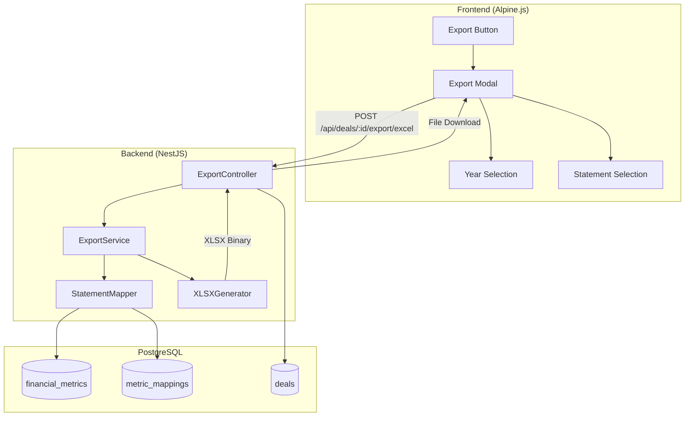

# Design Document: Financial Statements Excel Export

## Overview

The Financial Statements Excel Export feature enables FundLens users to export financial statement data to professionally formatted XLSX files. The feature integrates with the existing financial-analysis.html page and leverages the `financial_metrics` PostgreSQL table as the data source.

The architecture follows the existing NestJS patterns in the codebase, adding a new export service and controller that work alongside the existing deal management infrastructure. The frontend uses Alpine.js for the export modal, consistent with the current UI framework.

### Filing Type Support

The export feature supports multiple SEC filing types with appropriate handling:

| Filing Type | Description | Export Options |
|-------------|-------------|----------------|
| **10-K** | Annual Report | Full financial statements for selected fiscal years |
| **10-Q** | Quarterly Report | Quarterly statements (Q1, Q2, Q3) for selected years |
| **8-K** | Current Report | Event-driven disclosures (limited financial data) |

**10-K vs 10-Q Parity:**
- Both filing types contain the same three core statements (Income Statement, Balance Sheet, Cash Flow)
- 10-K provides full-year data; 10-Q provides quarterly data
- Users can export:
  - All 10-Ks for a ticker (multi-year annual view)
  - All 10-Qs for a specific year (quarterly breakdown)
  - Combined view with both annual and quarterly data

**8-K Handling:**
- 8-K filings contain event-driven disclosures, not standard financial statements
- Limited financial data may be available (e.g., earnings announcements, M&A details)
- Export option available but with clear indication of limited data scope

## Architecture



## Components and Interfaces

### 1. ExportController (`src/deals/export.controller.ts`)

Handles HTTP requests for Excel export operations.

```typescript
interface ExportRequest {
  filingType: '10-K' | '10-Q' | '8-K';
  exportMode: 'annual' | 'quarterly' | 'combined';
  years: string[];           // e.g., ['2024', '2023', '2022']
  quarters?: string[];       // e.g., ['Q1', 'Q2', 'Q3'] for quarterly mode
  statements: StatementType[]; // e.g., ['income_statement', 'balance_sheet', 'cash_flow']
  includeCalculatedMetrics?: boolean;
}

interface ExportResponse {
  // Binary XLSX file stream
  // Content-Type: application/vnd.openxmlformats-officedocument.spreadsheetml.sheet
  // Content-Disposition: attachment; filename="{TICKER}_{FilingType}_Statements_{date}.xlsx"
}

interface AvailablePeriodsResponse {
  annualPeriods: string[];
  quarterlyPeriods: { year: string; quarters: string[] }[];
  has8KFilings: boolean;
  earliest8KDate?: string;
  latest8KDate?: string;
}

@Controller('deals')
@UseGuards(TenantGuard)
class ExportController {
  @Post(':id/export/excel')
  async exportToExcel(
    @Param('id') dealId: string,
    @Body() request: ExportRequest,
    @Res() response: Response
  ): Promise<void>;

  @Get(':id/export/available-periods')
  async getAvailablePeriods(
    @Param('id') dealId: string
  ): Promise<AvailablePeriodsResponse>;
  
  @Post(':id/export/8k')
  async export8KFilings(
    @Param('id') dealId: string,
    @Body() request: { startDate: string; endDate: string },
    @Res() response: Response
  ): Promise<void>;
}
```

### 2. ExportService (`src/deals/export.service.ts`)

Core business logic for generating Excel exports.

```typescript
type StatementType = 'income_statement' | 'balance_sheet' | 'cash_flow';
type FilingType = '10-K' | '10-Q' | '8-K';
type ExportMode = 'annual' | 'quarterly' | 'combined';

interface ExportOptions {
  ticker: string;
  companyName: string;
  filingType: FilingType;
  exportMode: ExportMode;
  years: string[];           // e.g., ['2024', '2023', '2022'] for annual
  quarters?: string[];       // e.g., ['Q1', 'Q2', 'Q3', 'Q4'] for quarterly
  statements: StatementType[];
  includeCalculatedMetrics: boolean;
}

interface AvailablePeriodsResponse {
  annualPeriods: string[];   // ['FY2024', 'FY2023', 'FY2022']
  quarterlyPeriods: {        // Grouped by year
    year: string;
    quarters: string[];      // ['Q1 2024', 'Q2 2024', 'Q3 2024']
  }[];
  has8KFilings: boolean;
}

interface StatementData {
  statementType: StatementType;
  filingType: FilingType;
  period: string;
  metrics: MetricRow[];
}

interface MetricRow {
  displayName: string;
  normalizedMetric: string;
  values: Map<string, number | null>; // period -> value
  isHeader?: boolean;
  indent?: number;
}

@Injectable()
class ExportService {
  async generateExcelExport(options: ExportOptions): Promise<Buffer>;
  async getAvailablePeriods(ticker: string): Promise<AvailablePeriodsResponse>;
  
  // Annual export: All 10-Ks for selected years
  async generateAnnualExport(
    ticker: string,
    years: string[],
    statements: StatementType[]
  ): Promise<Buffer>;
  
  // Quarterly export: All 10-Qs for a specific year
  async generateQuarterlyExport(
    ticker: string,
    year: string,
    quarters: string[],
    statements: StatementType[]
  ): Promise<Buffer>;
  
  // Combined export: Both annual and quarterly data
  async generateCombinedExport(
    ticker: string,
    years: string[],
    statements: StatementType[]
  ): Promise<Buffer>;
  
  // 8-K export: Event-driven disclosures
  async generate8KExport(
    ticker: string,
    dateRange: { start: Date; end: Date }
  ): Promise<Buffer>;
  
  private async fetchMetricsForStatements(
    ticker: string,
    filingType: FilingType,
    periods: string[],
    statements: StatementType[]
  ): Promise<StatementData[]>;
}
```

### 3. StatementMapper (`src/deals/statement-mapper.ts`)

Maps database metrics to organized financial statement structures.

```typescript
interface StatementConfig {
  type: StatementType;
  displayName: string;
  worksheetName: string;
  metricOrder: MetricDefinition[];
}

interface MetricDefinition {
  normalizedMetric: string;
  displayName: string;
  isHeader?: boolean;
  indent?: number;
  format?: 'currency' | 'percentage' | 'number' | 'eps';
}

class StatementMapper {
  static readonly INCOME_STATEMENT_CONFIG: StatementConfig;
  static readonly BALANCE_SHEET_CONFIG: StatementConfig;
  static readonly CASH_FLOW_CONFIG: StatementConfig;

  mapMetricsToStatement(
    rawMetrics: FinancialMetric[],
    config: StatementConfig,
    years: string[]
  ): MetricRow[];

  getStatementConfig(type: StatementType): StatementConfig;
}
```

### 4. XLSXGenerator (`src/deals/xlsx-generator.ts`)

Generates formatted Excel workbooks using exceljs.

```typescript
interface WorksheetOptions {
  name: string;
  headerInfo: {
    companyName: string;
    ticker: string;
    statementType: string;
  };
  columns: string[];  // Fiscal years
  rows: MetricRow[];
}

class XLSXGenerator {
  async generateWorkbook(
    worksheets: WorksheetOptions[]
  ): Promise<Buffer>;

  private addWorksheet(
    workbook: ExcelJS.Workbook,
    options: WorksheetOptions
  ): void;

  private formatCell(
    cell: ExcelJS.Cell,
    value: number | null,
    format: string
  ): void;

  private applyHeaderStyles(row: ExcelJS.Row): void;
  private autoSizeColumns(worksheet: ExcelJS.Worksheet): void;
}
```

### 5. Export Modal (Frontend Component)

Alpine.js component for the export dialog with full 10-K/10-Q/8-K support.

```javascript
// Added to financialAnalysisApp() in financial-analysis.html
{
  // Export modal state
  showExportModal: false,
  exportLoading: false,
  exportError: null,
  
  // Available periods from API
  availablePeriods: {
    annualPeriods: [],      // ['FY2024', 'FY2023', 'FY2022']
    quarterlyPeriods: [],   // [{ year: '2024', quarters: ['Q1', 'Q2', 'Q3'] }]
    has8KFilings: false,
  },
  
  // User selections
  filingType: '10-K',       // '10-K', '10-Q', '8-K'
  exportMode: 'annual',     // 'annual', 'quarterly', 'combined'
  selectedYears: [],        // For annual: ['2024', '2023']
  selectedYear: null,       // For quarterly: '2024'
  selectedQuarters: [],     // For quarterly: ['Q1', 'Q2', 'Q3']
  selectedStatements: ['income_statement', 'balance_sheet', 'cash_flow'],
  includeCalculatedMetrics: true,
  
  // 8-K specific
  eightKDateRange: {
    start: null,
    end: null,
  },
  
  // Methods
  async openExportModal() { ... },
  async loadAvailablePeriods() { ... },
  
  // Filing type handlers
  setFilingType(type) {
    this.filingType = type;
    if (type === '10-K') {
      this.exportMode = 'annual';
    } else if (type === '10-Q') {
      this.exportMode = 'quarterly';
    }
  },
  
  // Selection handlers
  toggleYear(year) { ... },
  toggleQuarter(quarter) { ... },
  toggleStatement(statement) { ... },
  selectAllYears() { ... },
  selectAllQuarters() { ... },
  
  // Validation
  canExport() {
    if (this.filingType === '8-K') {
      return this.eightKDateRange.start && this.eightKDateRange.end;
    }
    if (this.exportMode === 'quarterly') {
      return this.selectedYear && this.selectedQuarters.length > 0 && this.selectedStatements.length > 0;
    }
    return this.selectedYears.length > 0 && this.selectedStatements.length > 0;
  },
  
  // Export execution
  async executeExport() { ... },
  downloadFile(blob, filename) { ... }
}
```

### Export Modal UI Layout

```
┌─────────────────────────────────────────────────────────────┐
│  Export Financial Statements                            [X] │
├─────────────────────────────────────────────────────────────┤
│                                                             │
│  Filing Type:                                               │
│  ┌─────────┐ ┌─────────┐ ┌─────────┐                       │
│  │  10-K   │ │  10-Q   │ │   8-K   │                       │
│  │ Annual  │ │Quarterly│ │ Events  │                       │
│  └─────────┘ └─────────┘ └─────────┘                       │
│                                                             │
│  ─────────────────────────────────────────────────────────  │
│                                                             │
│  [If 10-K selected]                                         │
│  Select Fiscal Years:                                       │
│  ☑ FY2024  ☑ FY2023  ☑ FY2022  ☐ FY2021  ☐ FY2020         │
│  [Select All] [Clear All]                                   │
│                                                             │
│  [If 10-Q selected]                                         │
│  Select Year: [2024 ▼]                                      │
│  Select Quarters:                                           │
│  ☑ Q1 2024  ☑ Q2 2024  ☑ Q3 2024  ☐ Q4 2024               │
│  [Select All Quarters]                                      │
│                                                             │
│  [If 8-K selected]                                          │
│  Date Range:                                                │
│  From: [2024-01-01] To: [2024-12-31]                        │
│  Note: 8-K filings contain event disclosures, not full      │
│  financial statements.                                      │
│                                                             │
│  ─────────────────────────────────────────────────────────  │
│                                                             │
│  Statements to Include:                                     │
│  ☑ Income Statement                                         │
│  ☑ Balance Sheet                                            │
│  ☑ Cash Flow Statement                                      │
│                                                             │
│  Options:                                                   │
│  ☑ Include calculated metrics (margins, ratios, growth)     │
│                                                             │
├─────────────────────────────────────────────────────────────┤
│                              [Cancel]  [Export to Excel]    │
└─────────────────────────────────────────────────────────────┘
```

## Data Models

### Financial Metrics Query Result

```typescript
interface RawFinancialMetric {
  id: string;
  ticker: string;
  normalized_metric: string;
  raw_label: string;
  value: number;
  fiscal_period: string;
  period_type: string;
  filing_type: string;
  statement_type: string;
  filing_date: Date;
  confidence_score: number;
}
```

### Statement Metric Configurations

#### Income Statement Metrics (in order)
```typescript
// Comprehensive Income Statement for PE/IB/HF Analysis
const INCOME_STATEMENT_METRICS: MetricDefinition[] = [
  // Revenue Section
  { normalizedMetric: 'revenue_header', displayName: 'REVENUE', isHeader: true },
  { normalizedMetric: 'revenue', displayName: 'Total Revenue', format: 'currency' },
  { normalizedMetric: 'product_revenue', displayName: 'Product Revenue', format: 'currency', indent: 1 },
  { normalizedMetric: 'service_revenue', displayName: 'Service Revenue', format: 'currency', indent: 1 },
  { normalizedMetric: 'other_revenue', displayName: 'Other Revenue', format: 'currency', indent: 1 },
  
  // Cost of Revenue Section
  { normalizedMetric: 'cost_header', displayName: 'COST OF REVENUE', isHeader: true },
  { normalizedMetric: 'cost_of_revenue', displayName: 'Total Cost of Revenue', format: 'currency' },
  { normalizedMetric: 'cost_of_products', displayName: 'Cost of Products', format: 'currency', indent: 1 },
  { normalizedMetric: 'cost_of_services', displayName: 'Cost of Services', format: 'currency', indent: 1 },
  
  // Gross Profit Section
  { normalizedMetric: 'gross_profit', displayName: 'Gross Profit', format: 'currency' },
  { normalizedMetric: 'gross_margin', displayName: 'Gross Margin %', format: 'percentage' },
  
  // Operating Expenses Section
  { normalizedMetric: 'opex_header', displayName: 'OPERATING EXPENSES', isHeader: true },
  { normalizedMetric: 'research_development', displayName: 'Research & Development', format: 'currency', indent: 1 },
  { normalizedMetric: 'selling_general_administrative', displayName: 'Selling, General & Administrative', format: 'currency', indent: 1 },
  { normalizedMetric: 'marketing_expense', displayName: 'Marketing & Advertising', format: 'currency', indent: 1 },
  { normalizedMetric: 'depreciation_amortization_opex', displayName: 'Depreciation & Amortization', format: 'currency', indent: 1 },
  { normalizedMetric: 'restructuring_charges', displayName: 'Restructuring Charges', format: 'currency', indent: 1 },
  { normalizedMetric: 'other_operating_expenses', displayName: 'Other Operating Expenses', format: 'currency', indent: 1 },
  { normalizedMetric: 'operating_expenses', displayName: 'Total Operating Expenses', format: 'currency' },
  
  // Operating Income Section
  { normalizedMetric: 'operating_income', displayName: 'Operating Income (EBIT)', format: 'currency' },
  { normalizedMetric: 'operating_margin', displayName: 'Operating Margin %', format: 'percentage' },
  { normalizedMetric: 'ebitda', displayName: 'EBITDA', format: 'currency' },
  { normalizedMetric: 'ebitda_margin', displayName: 'EBITDA Margin %', format: 'percentage' },
  
  // Non-Operating Section
  { normalizedMetric: 'nonop_header', displayName: 'NON-OPERATING ITEMS', isHeader: true },
  { normalizedMetric: 'interest_income', displayName: 'Interest Income', format: 'currency', indent: 1 },
  { normalizedMetric: 'interest_expense', displayName: 'Interest Expense', format: 'currency', indent: 1 },
  { normalizedMetric: 'net_interest_expense', displayName: 'Net Interest Expense', format: 'currency', indent: 1 },
  { normalizedMetric: 'other_income_expense', displayName: 'Other Income (Expense)', format: 'currency', indent: 1 },
  { normalizedMetric: 'equity_method_investments', displayName: 'Equity Method Investments', format: 'currency', indent: 1 },
  { normalizedMetric: 'foreign_exchange_gain_loss', displayName: 'Foreign Exchange Gain (Loss)', format: 'currency', indent: 1 },
  
  // Pre-Tax Income Section
  { normalizedMetric: 'income_before_taxes', displayName: 'Income Before Taxes', format: 'currency' },
  { normalizedMetric: 'income_tax_expense', displayName: 'Income Tax Expense', format: 'currency' },
  { normalizedMetric: 'effective_tax_rate', displayName: 'Effective Tax Rate %', format: 'percentage' },
  
  // Net Income Section
  { normalizedMetric: 'net_income_header', displayName: 'NET INCOME', isHeader: true },
  { normalizedMetric: 'net_income_continuing', displayName: 'Net Income from Continuing Operations', format: 'currency', indent: 1 },
  { normalizedMetric: 'net_income_discontinued', displayName: 'Net Income from Discontinued Operations', format: 'currency', indent: 1 },
  { normalizedMetric: 'net_income', displayName: 'Net Income', format: 'currency' },
  { normalizedMetric: 'net_income_attributable', displayName: 'Net Income Attributable to Common', format: 'currency' },
  { normalizedMetric: 'net_margin', displayName: 'Net Margin %', format: 'percentage' },
  
  // Per Share Data Section
  { normalizedMetric: 'eps_header', displayName: 'PER SHARE DATA', isHeader: true },
  { normalizedMetric: 'earnings_per_share_basic', displayName: 'Basic EPS', format: 'eps' },
  { normalizedMetric: 'earnings_per_share_diluted', displayName: 'Diluted EPS', format: 'eps' },
  { normalizedMetric: 'weighted_avg_shares_basic', displayName: 'Weighted Avg Shares (Basic)', format: 'number' },
  { normalizedMetric: 'weighted_avg_shares_diluted', displayName: 'Weighted Avg Shares (Diluted)', format: 'number' },
  { normalizedMetric: 'dividends_per_share', displayName: 'Dividends Per Share', format: 'currency' },
];
```

#### Balance Sheet Metrics (in order)
```typescript
// Comprehensive Balance Sheet for PE/IB/HF Analysis
const BALANCE_SHEET_METRICS: MetricDefinition[] = [
  // ASSETS
  { normalizedMetric: 'assets_header', displayName: 'ASSETS', isHeader: true },
  
  // Current Assets
  { normalizedMetric: 'current_assets_header', displayName: 'Current Assets', isHeader: true, indent: 1 },
  { normalizedMetric: 'cash_and_equivalents', displayName: 'Cash and Cash Equivalents', format: 'currency', indent: 2 },
  { normalizedMetric: 'short_term_investments', displayName: 'Short-term Investments', format: 'currency', indent: 2 },
  { normalizedMetric: 'marketable_securities', displayName: 'Marketable Securities', format: 'currency', indent: 2 },
  { normalizedMetric: 'accounts_receivable', displayName: 'Accounts Receivable, Net', format: 'currency', indent: 2 },
  { normalizedMetric: 'allowance_doubtful_accounts', displayName: 'Allowance for Doubtful Accounts', format: 'currency', indent: 3 },
  { normalizedMetric: 'inventory', displayName: 'Inventory', format: 'currency', indent: 2 },
  { normalizedMetric: 'raw_materials', displayName: 'Raw Materials', format: 'currency', indent: 3 },
  { normalizedMetric: 'work_in_progress', displayName: 'Work in Progress', format: 'currency', indent: 3 },
  { normalizedMetric: 'finished_goods', displayName: 'Finished Goods', format: 'currency', indent: 3 },
  { normalizedMetric: 'prepaid_expenses', displayName: 'Prepaid Expenses', format: 'currency', indent: 2 },
  { normalizedMetric: 'deferred_tax_assets_current', displayName: 'Deferred Tax Assets (Current)', format: 'currency', indent: 2 },
  { normalizedMetric: 'other_current_assets', displayName: 'Other Current Assets', format: 'currency', indent: 2 },
  { normalizedMetric: 'current_assets', displayName: 'Total Current Assets', format: 'currency', indent: 1 },
  
  // Non-Current Assets
  { normalizedMetric: 'noncurrent_assets_header', displayName: 'Non-Current Assets', isHeader: true, indent: 1 },
  { normalizedMetric: 'property_plant_equipment_gross', displayName: 'Property, Plant & Equipment (Gross)', format: 'currency', indent: 2 },
  { normalizedMetric: 'accumulated_depreciation', displayName: 'Accumulated Depreciation', format: 'currency', indent: 2 },
  { normalizedMetric: 'property_plant_equipment', displayName: 'Property, Plant & Equipment (Net)', format: 'currency', indent: 2 },
  { normalizedMetric: 'operating_lease_right_of_use', displayName: 'Operating Lease Right-of-Use Assets', format: 'currency', indent: 2 },
  { normalizedMetric: 'goodwill', displayName: 'Goodwill', format: 'currency', indent: 2 },
  { normalizedMetric: 'intangible_assets', displayName: 'Intangible Assets, Net', format: 'currency', indent: 2 },
  { normalizedMetric: 'long_term_investments', displayName: 'Long-term Investments', format: 'currency', indent: 2 },
  { normalizedMetric: 'deferred_tax_assets_noncurrent', displayName: 'Deferred Tax Assets (Non-Current)', format: 'currency', indent: 2 },
  { normalizedMetric: 'other_non_current_assets', displayName: 'Other Non-Current Assets', format: 'currency', indent: 2 },
  { normalizedMetric: 'total_non_current_assets', displayName: 'Total Non-Current Assets', format: 'currency', indent: 1 },
  { normalizedMetric: 'total_assets', displayName: 'TOTAL ASSETS', format: 'currency' },
  
  // LIABILITIES
  { normalizedMetric: 'liabilities_header', displayName: 'LIABILITIES', isHeader: true },
  
  // Current Liabilities
  { normalizedMetric: 'current_liabilities_header', displayName: 'Current Liabilities', isHeader: true, indent: 1 },
  { normalizedMetric: 'accounts_payable', displayName: 'Accounts Payable', format: 'currency', indent: 2 },
  { normalizedMetric: 'accrued_liabilities', displayName: 'Accrued Liabilities', format: 'currency', indent: 2 },
  { normalizedMetric: 'accrued_compensation', displayName: 'Accrued Compensation', format: 'currency', indent: 2 },
  { normalizedMetric: 'deferred_revenue_current', displayName: 'Deferred Revenue (Current)', format: 'currency', indent: 2 },
  { normalizedMetric: 'short_term_debt', displayName: 'Short-term Debt', format: 'currency', indent: 2 },
  { normalizedMetric: 'current_portion_long_term_debt', displayName: 'Current Portion of Long-term Debt', format: 'currency', indent: 2 },
  { normalizedMetric: 'operating_lease_liabilities_current', displayName: 'Operating Lease Liabilities (Current)', format: 'currency', indent: 2 },
  { normalizedMetric: 'income_taxes_payable', displayName: 'Income Taxes Payable', format: 'currency', indent: 2 },
  { normalizedMetric: 'other_current_liabilities', displayName: 'Other Current Liabilities', format: 'currency', indent: 2 },
  { normalizedMetric: 'current_liabilities', displayName: 'Total Current Liabilities', format: 'currency', indent: 1 },
  
  // Non-Current Liabilities
  { normalizedMetric: 'noncurrent_liabilities_header', displayName: 'Non-Current Liabilities', isHeader: true, indent: 1 },
  { normalizedMetric: 'long_term_debt', displayName: 'Long-term Debt', format: 'currency', indent: 2 },
  { normalizedMetric: 'operating_lease_liabilities_noncurrent', displayName: 'Operating Lease Liabilities (Non-Current)', format: 'currency', indent: 2 },
  { normalizedMetric: 'deferred_revenue_noncurrent', displayName: 'Deferred Revenue (Non-Current)', format: 'currency', indent: 2 },
  { normalizedMetric: 'deferred_tax_liabilities', displayName: 'Deferred Tax Liabilities', format: 'currency', indent: 2 },
  { normalizedMetric: 'pension_liabilities', displayName: 'Pension & Post-Retirement Liabilities', format: 'currency', indent: 2 },
  { normalizedMetric: 'other_non_current_liabilities', displayName: 'Other Non-Current Liabilities', format: 'currency', indent: 2 },
  { normalizedMetric: 'total_non_current_liabilities', displayName: 'Total Non-Current Liabilities', format: 'currency', indent: 1 },
  { normalizedMetric: 'total_liabilities', displayName: 'TOTAL LIABILITIES', format: 'currency' },
  
  // STOCKHOLDERS' EQUITY
  { normalizedMetric: 'equity_header', displayName: 'STOCKHOLDERS\' EQUITY', isHeader: true },
  { normalizedMetric: 'preferred_stock', displayName: 'Preferred Stock', format: 'currency', indent: 1 },
  { normalizedMetric: 'common_stock', displayName: 'Common Stock', format: 'currency', indent: 1 },
  { normalizedMetric: 'additional_paid_in_capital', displayName: 'Additional Paid-in Capital', format: 'currency', indent: 1 },
  { normalizedMetric: 'retained_earnings', displayName: 'Retained Earnings', format: 'currency', indent: 1 },
  { normalizedMetric: 'treasury_stock', displayName: 'Treasury Stock', format: 'currency', indent: 1 },
  { normalizedMetric: 'accumulated_other_comprehensive_income', displayName: 'Accumulated Other Comprehensive Income (Loss)', format: 'currency', indent: 1 },
  { normalizedMetric: 'shareholders_equity', displayName: 'Total Stockholders\' Equity', format: 'currency' },
  { normalizedMetric: 'noncontrolling_interest', displayName: 'Non-controlling Interest', format: 'currency', indent: 1 },
  { normalizedMetric: 'total_equity', displayName: 'Total Equity', format: 'currency' },
  { normalizedMetric: 'total_liabilities_equity', displayName: 'TOTAL LIABILITIES & EQUITY', format: 'currency' },
  
  // Key Ratios Section
  { normalizedMetric: 'ratios_header', displayName: 'KEY BALANCE SHEET RATIOS', isHeader: true },
  { normalizedMetric: 'current_ratio', displayName: 'Current Ratio', format: 'number' },
  { normalizedMetric: 'quick_ratio', displayName: 'Quick Ratio', format: 'number' },
  { normalizedMetric: 'debt_to_equity', displayName: 'Debt to Equity Ratio', format: 'number' },
  { normalizedMetric: 'debt_to_assets', displayName: 'Debt to Assets Ratio', format: 'percentage' },
  { normalizedMetric: 'working_capital', displayName: 'Working Capital', format: 'currency' },
  { normalizedMetric: 'book_value_per_share', displayName: 'Book Value Per Share', format: 'currency' },
  { normalizedMetric: 'tangible_book_value', displayName: 'Tangible Book Value', format: 'currency' },
];
```

#### Cash Flow Statement Metrics (in order)
```typescript
// Comprehensive Cash Flow Statement for PE/IB/HF Analysis
const CASH_FLOW_METRICS: MetricDefinition[] = [
  // Operating Activities
  { normalizedMetric: 'operating_header', displayName: 'CASH FLOWS FROM OPERATING ACTIVITIES', isHeader: true },
  { normalizedMetric: 'net_income_cf', displayName: 'Net Income', format: 'currency', indent: 1 },
  
  // Adjustments to reconcile net income
  { normalizedMetric: 'adjustments_header', displayName: 'Adjustments to Reconcile Net Income:', isHeader: true, indent: 1 },
  { normalizedMetric: 'depreciation_amortization', displayName: 'Depreciation & Amortization', format: 'currency', indent: 2 },
  { normalizedMetric: 'stock_based_compensation', displayName: 'Stock-Based Compensation', format: 'currency', indent: 2 },
  { normalizedMetric: 'deferred_income_taxes', displayName: 'Deferred Income Taxes', format: 'currency', indent: 2 },
  { normalizedMetric: 'impairment_charges', displayName: 'Impairment Charges', format: 'currency', indent: 2 },
  { normalizedMetric: 'gain_loss_investments', displayName: 'Gain/Loss on Investments', format: 'currency', indent: 2 },
  { normalizedMetric: 'gain_loss_asset_sales', displayName: 'Gain/Loss on Asset Sales', format: 'currency', indent: 2 },
  { normalizedMetric: 'other_non_cash_items', displayName: 'Other Non-Cash Items', format: 'currency', indent: 2 },
  
  // Changes in working capital
  { normalizedMetric: 'working_capital_header', displayName: 'Changes in Working Capital:', isHeader: true, indent: 1 },
  { normalizedMetric: 'change_accounts_receivable', displayName: 'Change in Accounts Receivable', format: 'currency', indent: 2 },
  { normalizedMetric: 'change_inventory', displayName: 'Change in Inventory', format: 'currency', indent: 2 },
  { normalizedMetric: 'change_prepaid_expenses', displayName: 'Change in Prepaid Expenses', format: 'currency', indent: 2 },
  { normalizedMetric: 'change_accounts_payable', displayName: 'Change in Accounts Payable', format: 'currency', indent: 2 },
  { normalizedMetric: 'change_accrued_liabilities', displayName: 'Change in Accrued Liabilities', format: 'currency', indent: 2 },
  { normalizedMetric: 'change_deferred_revenue', displayName: 'Change in Deferred Revenue', format: 'currency', indent: 2 },
  { normalizedMetric: 'change_other_working_capital', displayName: 'Change in Other Working Capital', format: 'currency', indent: 2 },
  { normalizedMetric: 'operating_cash_flow', displayName: 'Net Cash from Operating Activities', format: 'currency' },
  
  // Investing Activities
  { normalizedMetric: 'investing_header', displayName: 'CASH FLOWS FROM INVESTING ACTIVITIES', isHeader: true },
  { normalizedMetric: 'capital_expenditures', displayName: 'Capital Expenditures', format: 'currency', indent: 1 },
  { normalizedMetric: 'acquisitions', displayName: 'Acquisitions, Net of Cash', format: 'currency', indent: 1 },
  { normalizedMetric: 'divestitures', displayName: 'Divestitures/Asset Sales', format: 'currency', indent: 1 },
  { normalizedMetric: 'purchases_investments', displayName: 'Purchases of Investments', format: 'currency', indent: 1 },
  { normalizedMetric: 'sales_maturities_investments', displayName: 'Sales/Maturities of Investments', format: 'currency', indent: 1 },
  { normalizedMetric: 'purchases_intangibles', displayName: 'Purchases of Intangible Assets', format: 'currency', indent: 1 },
  { normalizedMetric: 'other_investing_activities', displayName: 'Other Investing Activities', format: 'currency', indent: 1 },
  { normalizedMetric: 'investing_cash_flow', displayName: 'Net Cash from Investing Activities', format: 'currency' },
  
  // Financing Activities
  { normalizedMetric: 'financing_header', displayName: 'CASH FLOWS FROM FINANCING ACTIVITIES', isHeader: true },
  { normalizedMetric: 'debt_issued', displayName: 'Proceeds from Debt Issuance', format: 'currency', indent: 1 },
  { normalizedMetric: 'debt_repaid', displayName: 'Repayment of Debt', format: 'currency', indent: 1 },
  { normalizedMetric: 'common_stock_issued', displayName: 'Proceeds from Stock Issuance', format: 'currency', indent: 1 },
  { normalizedMetric: 'share_repurchases', displayName: 'Share Repurchases', format: 'currency', indent: 1 },
  { normalizedMetric: 'dividends_paid', displayName: 'Dividends Paid', format: 'currency', indent: 1 },
  { normalizedMetric: 'stock_option_exercises', displayName: 'Proceeds from Stock Option Exercises', format: 'currency', indent: 1 },
  { normalizedMetric: 'tax_withholding_stock_comp', displayName: 'Tax Withholding on Stock Compensation', format: 'currency', indent: 1 },
  { normalizedMetric: 'other_financing_activities', displayName: 'Other Financing Activities', format: 'currency', indent: 1 },
  { normalizedMetric: 'financing_cash_flow', displayName: 'Net Cash from Financing Activities', format: 'currency' },
  
  // Summary Section
  { normalizedMetric: 'summary_header', displayName: 'CASH FLOW SUMMARY', isHeader: true },
  { normalizedMetric: 'effect_exchange_rate', displayName: 'Effect of Exchange Rate Changes', format: 'currency', indent: 1 },
  { normalizedMetric: 'net_change_in_cash', displayName: 'Net Change in Cash', format: 'currency' },
  { normalizedMetric: 'cash_beginning_period', displayName: 'Cash at Beginning of Period', format: 'currency', indent: 1 },
  { normalizedMetric: 'cash_end_period', displayName: 'Cash at End of Period', format: 'currency', indent: 1 },
  
  // Key Cash Flow Metrics
  { normalizedMetric: 'metrics_header', displayName: 'KEY CASH FLOW METRICS', isHeader: true },
  { normalizedMetric: 'free_cash_flow', displayName: 'Free Cash Flow (OCF - CapEx)', format: 'currency' },
  { normalizedMetric: 'free_cash_flow_margin', displayName: 'Free Cash Flow Margin %', format: 'percentage' },
  { normalizedMetric: 'levered_free_cash_flow', displayName: 'Levered Free Cash Flow', format: 'currency' },
  { normalizedMetric: 'unlevered_free_cash_flow', displayName: 'Unlevered Free Cash Flow', format: 'currency' },
  { normalizedMetric: 'cash_conversion_ratio', displayName: 'Cash Conversion Ratio (OCF/Net Income)', format: 'percentage' },
  { normalizedMetric: 'capex_to_revenue', displayName: 'CapEx as % of Revenue', format: 'percentage' },
  { normalizedMetric: 'capex_to_depreciation', displayName: 'CapEx to D&A Ratio', format: 'number' },
];
```

### Excel Workbook Structure

**Annual Export (10-K):**
```
{TICKER}_10K_Financial_Statements_{YYYY-MM-DD}.xlsx
├── Income Statement
│   ├── Header: Company Name | Ticker | "Annual (10-K)"
│   ├── Columns: Metric | FY2024 | FY2023 | FY2022 | ...
│   └── Rows: All income statement line items
├── Balance Sheet
│   └── Same structure, balance sheet metrics
├── Cash Flow
│   └── Same structure, cash flow metrics
└── Summary Metrics (optional)
    └── Key ratios and growth rates
```

**Quarterly Export (10-Q):**
```
{TICKER}_10Q_{YEAR}_Financial_Statements_{YYYY-MM-DD}.xlsx
├── Income Statement
│   ├── Header: Company Name | Ticker | "Quarterly (10-Q) - 2024"
│   ├── Columns: Metric | Q1 2024 | Q2 2024 | Q3 2024 | YTD
│   └── Rows: All income statement line items
├── Balance Sheet
│   └── Same structure (point-in-time for each quarter end)
├── Cash Flow
│   └── Same structure (quarterly cash flows)
└── Summary Metrics (optional)
    └── Quarterly trends and comparisons
```

**Combined Export (10-K + 10-Q):**
```
{TICKER}_Combined_Financial_Statements_{YYYY-MM-DD}.xlsx
├── Annual Summary (10-K)
│   └── Full year data for selected years
├── Q1 {Year}
├── Q2 {Year}
├── Q3 {Year}
├── Q4 {Year} (derived from 10-K - Q1 - Q2 - Q3)
└── Quarterly Trends
    └── Quarter-over-quarter analysis
```

**8-K Export:**
```
{TICKER}_8K_Filings_{StartDate}_to_{EndDate}.xlsx
├── Filing Summary
│   ├── Filing Date | Form Type | Description | Key Items
│   └── List of all 8-K filings in date range
├── Earnings Announcements (if available)
│   └── Preliminary financial data from earnings 8-Ks
├── M&A Disclosures (if available)
│   └── Deal values, terms from M&A 8-Ks
└── Other Material Events
    └── Summary of other 8-K disclosures
```

### Additional Calculated Metrics for PE/IB/HF Analysis

The export service will calculate and include these derived metrics when underlying data is available:

```typescript
// Calculated metrics added to each statement
const CALCULATED_METRICS = {
  income_statement: [
    { name: 'gross_margin', formula: 'gross_profit / revenue', format: 'percentage' },
    { name: 'operating_margin', formula: 'operating_income / revenue', format: 'percentage' },
    { name: 'ebitda_margin', formula: 'ebitda / revenue', format: 'percentage' },
    { name: 'net_margin', formula: 'net_income / revenue', format: 'percentage' },
    { name: 'effective_tax_rate', formula: 'income_tax_expense / income_before_taxes', format: 'percentage' },
    { name: 'revenue_growth_yoy', formula: '(revenue_current - revenue_prior) / revenue_prior', format: 'percentage' },
    { name: 'net_income_growth_yoy', formula: '(net_income_current - net_income_prior) / net_income_prior', format: 'percentage' },
  ],
  balance_sheet: [
    { name: 'current_ratio', formula: 'current_assets / current_liabilities', format: 'number' },
    { name: 'quick_ratio', formula: '(current_assets - inventory) / current_liabilities', format: 'number' },
    { name: 'debt_to_equity', formula: 'total_liabilities / shareholders_equity', format: 'number' },
    { name: 'debt_to_assets', formula: 'total_liabilities / total_assets', format: 'percentage' },
    { name: 'working_capital', formula: 'current_assets - current_liabilities', format: 'currency' },
    { name: 'book_value_per_share', formula: 'shareholders_equity / shares_outstanding', format: 'currency' },
    { name: 'tangible_book_value', formula: 'shareholders_equity - goodwill - intangible_assets', format: 'currency' },
  ],
  cash_flow: [
    { name: 'free_cash_flow', formula: 'operating_cash_flow - capital_expenditures', format: 'currency' },
    { name: 'free_cash_flow_margin', formula: 'free_cash_flow / revenue', format: 'percentage' },
    { name: 'cash_conversion_ratio', formula: 'operating_cash_flow / net_income', format: 'percentage' },
    { name: 'capex_to_revenue', formula: 'capital_expenditures / revenue', format: 'percentage' },
    { name: 'capex_to_depreciation', formula: 'capital_expenditures / depreciation_amortization', format: 'number' },
    { name: 'levered_free_cash_flow', formula: 'free_cash_flow - interest_expense', format: 'currency' },
  ],
};
```

### Data Validation and Quality Assurance

To ensure financial analyst quality, the export includes:

1. **Balance Sheet Validation**: Verify Assets = Liabilities + Equity
2. **Cash Flow Reconciliation**: Verify beginning cash + net change = ending cash
3. **Cross-Statement Consistency**: Net Income on Income Statement matches Cash Flow
4. **Missing Data Indicators**: Clear "N/A" markers for unavailable metrics
5. **Data Source Attribution**: Footer noting data sourced from SEC 10-K filings


## Correctness Properties

*A property is a characteristic or behavior that should hold true across all valid executions of a system—essentially, a formal statement about what the system should do. Properties serve as the bridge between human-readable specifications and machine-verifiable correctness guarantees.*

### Property 1: Worksheet-Statement Type Correspondence

*For any* export request with selected statement types, the generated XLSX workbook SHALL contain exactly one worksheet per selected statement type, with each worksheet named correctly ("Income Statement", "Balance Sheet", "Cash Flow") and containing only metrics that belong to that statement type.

**Validates: Requirements 4.1, 4.8, 9.1, 9.2, 9.3**

### Property 2: Cell Formatting Consistency

*For any* metric cell in the generated workbook, the cell formatting SHALL match the metric's defined format type: currency format for monetary values, percentage format for ratio/margin values, and bold formatting for header rows.

**Validates: Requirements 4.4, 4.5, 4.6**

### Property 3: Statement Metric Completeness

*For any* statement type included in an export, all metrics defined in the statement configuration for that type SHALL be present as rows in the corresponding worksheet, regardless of whether data exists for those metrics.

**Validates: Requirements 5.1, 5.2, 5.3**

### Property 4: Header Information Presence

*For any* worksheet in the generated workbook, the header section SHALL contain the company name and ticker symbol, and the column headers SHALL include the metric label column followed by all selected fiscal year columns.

**Validates: Requirements 4.2, 4.3**

### Property 5: Missing Value Handling

*For any* metric and fiscal period combination where no data exists in the database, the corresponding cell in the worksheet SHALL contain either "N/A" or be empty, never an error or undefined value.

**Validates: Requirements 5.4**

### Property 6: Data Source Integrity

*For any* metric value displayed in the exported workbook, the value SHALL match the corresponding value in the financial_metrics table for that ticker, normalized_metric, and fiscal_period, filtered to filing_type='10-K'.

**Validates: Requirements 5.5, 6.1, 6.2**

### Property 7: Duplicate Metric Resolution

*For any* metric and fiscal period combination where multiple records exist in the database, the export SHALL use the value from the record with the most recent filing_date.

**Validates: Requirements 6.4**

### Property 8: Statement Metric Grouping

*For any* set of raw metrics retrieved from the database, the Statement_Mapper SHALL correctly group them by statement_type, ensuring no metric appears in a worksheet for a different statement type.

**Validates: Requirements 6.3**

### Property 9: Metric Ordering Consistency

*For any* worksheet in the generated workbook, the metrics SHALL appear in the order defined by the statement configuration, with header rows and indented sub-items in their correct positions.

**Validates: Requirements 9.4**

### Property 10: Display Name Resolution

*For any* metric that has a corresponding entry in the metric_mappings table, the worksheet SHALL use the display_name from that mapping; otherwise, it SHALL use a formatted version of the normalized_metric name.

**Validates: Requirements 9.5**

### Property 11: Export Filename Format

*For any* successful export, the downloaded file SHALL have a filename matching the pattern `{TICKER}_Financial_Statements_{YYYY-MM-DD}.xlsx` where TICKER is the deal's ticker symbol and the date is the export date.

**Validates: Requirements 7.3**

### Property 12: Selection Validation

*For any* export modal state, the export action SHALL be disabled if either the selected years array is empty OR the selected statements array is empty.

**Validates: Requirements 2.6, 3.4**

### Property 13: Default Year Selection

*For any* list of available fiscal periods with 3 or more entries, the export modal SHALL pre-select exactly the 3 most recent periods (sorted chronologically descending).

**Validates: Requirements 2.4**

### Property 14: Period Checkbox Rendering

*For any* list of available fiscal periods returned from the API, the export modal SHALL render exactly that many checkbox options, one for each period.

**Validates: Requirements 2.2**

### Property 15: Tenant Isolation

*For any* export request, the API SHALL return 404 if the deal does not exist OR if the deal belongs to a different tenant than the authenticated user.

**Validates: Requirements 8.2, 8.5**

### Property 16: Request Validation

*For any* export request with an invalid body (missing years, missing statements, or invalid values), the API SHALL return a 400 status with error details.

**Validates: Requirements 8.6**

### Property 17: Response Headers

*For any* successful export request, the API response SHALL include Content-Type header set to `application/vnd.openxmlformats-officedocument.spreadsheetml.sheet` and Content-Disposition header with the correct filename.

**Validates: Requirements 8.4**

### Property 18: Button State Based on Deal Status

*For any* deal with status other than "ready", the export button SHALL be either disabled or hidden.

**Validates: Requirements 1.3**

### Property 19: User-Friendly Error Messages

*For any* error that occurs during export, the error message displayed to the user SHALL NOT contain stack traces, SQL queries, or other technical implementation details.

**Validates: Requirements 10.4**

## Error Handling

### Frontend Error Handling

| Error Scenario | User Message | Recovery Action |
|----------------|--------------|-----------------|
| Network failure | "Unable to connect to server. Please check your connection and try again." | Re-enable export button |
| No data available | "No financial data available for the selected periods." | Show message, keep modal open |
| Server error (5xx) | "An unexpected error occurred. Please try again later." | Re-enable export button |
| Timeout | "The export is taking longer than expected. Please try again." | Re-enable export button |
| Invalid selection | "Please select at least one fiscal year and one statement type." | Highlight missing selections |

### Backend Error Handling

```typescript
// Error types and handling
enum ExportErrorCode {
  DEAL_NOT_FOUND = 'DEAL_NOT_FOUND',
  NO_DATA_AVAILABLE = 'NO_DATA_AVAILABLE',
  INVALID_REQUEST = 'INVALID_REQUEST',
  GENERATION_FAILED = 'GENERATION_FAILED',
  DATABASE_ERROR = 'DATABASE_ERROR',
}

interface ExportError {
  code: ExportErrorCode;
  message: string;
  details?: string; // Only logged, not sent to client
}

// Error handling in ExportService
try {
  const metrics = await this.fetchMetrics(ticker, years);
  if (metrics.length === 0) {
    throw new ExportException(ExportErrorCode.NO_DATA_AVAILABLE, 
      'No financial data available for the selected periods');
  }
  return await this.generateWorkbook(metrics);
} catch (error) {
  this.logger.error(`Export failed for ${ticker}: ${error.message}`, error.stack);
  if (error instanceof ExportException) {
    throw error;
  }
  throw new ExportException(ExportErrorCode.GENERATION_FAILED,
    'Failed to generate export file');
}
```

### Database Query Timeout Handling

```typescript
// Query with timeout
const QUERY_TIMEOUT_MS = 30000;

const metrics = await this.prisma.$queryRawUnsafe<RawFinancialMetric[]>(
  query,
  ...params
).catch(error => {
  if (error.code === 'P2024') { // Prisma timeout
    throw new ExportException(ExportErrorCode.DATABASE_ERROR,
      'Database query timed out. Please try with fewer periods.');
  }
  throw error;
});
```

## Testing Strategy

### Unit Tests

Unit tests focus on specific examples, edge cases, and component isolation.

**StatementMapper Tests:**
- Test mapping of a known metric to correct statement type
- Test handling of unknown metrics (should be excluded)
- Test metric ordering matches configuration
- Test display name resolution with and without mappings

**XLSXGenerator Tests:**
- Test workbook creation with single worksheet
- Test workbook creation with multiple worksheets
- Test header row formatting
- Test currency cell formatting
- Test percentage cell formatting
- Test empty/N/A cell handling

**ExportService Tests:**
- Test successful export flow
- Test error when no metrics found
- Test duplicate metric resolution (most recent filing_date wins)
- Test fiscal period filtering

**ExportController Tests:**
- Test valid request returns XLSX binary
- Test invalid deal ID returns 404
- Test missing request body returns 400
- Test response headers are correct

### Property-Based Tests

Property-based tests verify universal properties across many generated inputs. Each test runs minimum 100 iterations.

**Test Configuration:**
- Library: fast-check (TypeScript)
- Minimum iterations: 100 per property
- Shrinking enabled for failure case minimization

**Property Test Implementations:**

```typescript
// Feature: financial-statements-excel-export, Property 1: Worksheet-Statement Type Correspondence
describe('Property 1: Worksheet-Statement Type Correspondence', () => {
  it('should create correct worksheets for any statement selection', async () => {
    await fc.assert(
      fc.asyncProperty(
        fc.subarray(['income_statement', 'balance_sheet', 'cash_flow'] as const, { minLength: 1 }),
        async (selectedStatements) => {
          const workbook = await generator.generateWorkbook({
            ticker: 'TEST',
            companyName: 'Test Company',
            years: ['FY2024'],
            statements: selectedStatements,
          });
          
          expect(workbook.worksheets.length).toBe(selectedStatements.length);
          // Verify each worksheet name matches expected
          // Verify each worksheet contains only metrics of its type
        }
      ),
      { numRuns: 100 }
    );
  });
});

// Feature: financial-statements-excel-export, Property 6: Data Source Integrity
describe('Property 6: Data Source Integrity', () => {
  it('should match database values for any exported metric', async () => {
    await fc.assert(
      fc.asyncProperty(
        arbitraryTicker(),
        arbitraryFiscalPeriods(),
        async (ticker, periods) => {
          const exportedData = await service.generateExport({ ticker, periods });
          const dbData = await fetchRawMetrics(ticker, periods);
          
          // For each metric in export, verify it matches database
          for (const metric of exportedData.metrics) {
            const dbValue = dbData.find(d => 
              d.normalized_metric === metric.name && 
              d.fiscal_period === metric.period
            );
            expect(metric.value).toBe(dbValue?.value ?? null);
          }
        }
      ),
      { numRuns: 100 }
    );
  });
});

// Feature: financial-statements-excel-export, Property 12: Selection Validation
describe('Property 12: Selection Validation', () => {
  it('should disable export when selection is invalid', () => {
    fc.assert(
      fc.property(
        fc.array(fc.string(), { maxLength: 5 }),
        fc.array(fc.constantFrom('income_statement', 'balance_sheet', 'cash_flow'), { maxLength: 3 }),
        (years, statements) => {
          const isValid = years.length > 0 && statements.length > 0;
          const canExport = validateExportSelection(years, statements);
          expect(canExport).toBe(isValid);
        }
      ),
      { numRuns: 100 }
    );
  });
});
```

### Integration Tests

- Test full export flow from API request to file download
- Test with real database containing sample metrics
- Test tenant isolation with multi-tenant setup
- Test concurrent export requests

### Manual Testing Checklist

- [ ] Export button appears only for "ready" deals
- [ ] Modal opens with correct default selections
- [ ] Year checkboxes match available data
- [ ] Statement selection toggles work correctly
- [ ] Loading indicator shows during export
- [ ] File downloads with correct name
- [ ] Excel file opens in Microsoft Excel
- [ ] Excel file opens in Google Sheets
- [ ] All metrics present and formatted correctly
- [ ] Test with AAPL, MSFT, AMZN data
- [ ] Compare exported values to SEC filings
