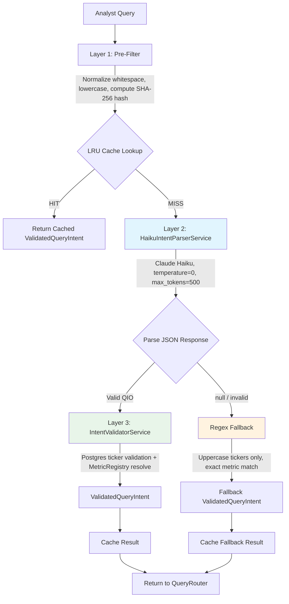
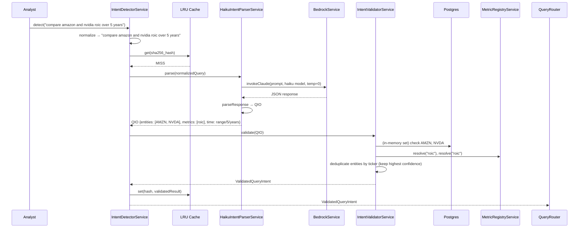

# Design Document: Haiku-First Intent Detection

## Overview

This design replaces the regex-first intent detection pipeline in FundLens with a Haiku-first architecture. The current system uses regex as Layer 1 (primary) and Haiku as a fallback, which fails on lowercase tickers, company names, single-letter tickers, metric/ticker ambiguity, and natural language time periods. The new architecture inverts this: Claude Haiku performs structured JSON extraction as the primary parser, a deterministic validation layer confirms results against Postgres and MetricRegistryService, and simplified regex serves as a fallback only when Bedrock is unavailable.

The pipeline flow is:

```
Query → Normalize + LRU Cache check (~2ms)
      → Claude Haiku structured extraction (~200-500ms on cache miss)
      → Deterministic validation against Postgres + MetricRegistry (~3-10ms)
      → Fallback: Simplified regex (only when Bedrock is unavailable)
```

### Design Rationale

Regex cannot solve open-world linguistic problems: company-name-to-ticker resolution, case-insensitive ticker matching, metric/ticker disambiguation, and natural language time period parsing. These require language understanding. Claude Haiku provides this at ~$0.60/day for 10 firms (1,500 cache-miss calls/day), scaling to ~$30/day at 500 firms. The deterministic validation layer catches Haiku's non-determinism by confirming tickers against the companies table and resolving metrics via MetricRegistryService.

## Architecture



### Latency Budget

| Component | p50 | p99 | Notes |
|---|---|---|---|
| Pre-filter + cache check | 1ms | 3ms | In-memory hash + LRU lookup |
| Cache hit path (total) | 1ms | 5ms | ~60-80% of queries at steady state |
| Haiku extraction (Bedrock) | 250ms | 600ms | Cache miss path only |
| Deterministic validation | 3ms | 10ms | Postgres lookup + MetricRegistry resolve |
| Cache miss path (total) | 260ms | 620ms | ~20-40% of queries |
| Weighted average (70% hit) | ~80ms | ~190ms | Invisible in 2-6s overall pipeline |

### Cost Budget

| Scale | Queries/Day | Haiku Calls/Day (30% miss) | Daily Cost | Monthly Cost |
|---|---|---|---|---|
| 10 firms | 5,000 | 1,500 | $0.60 | $18 |
| 50 firms | 25,000 | 7,500 | $3.00 | $90 |
| 100 firms | 50,000 | 15,000 | $6.00 | $180 |
| 500 firms | 250,000 | 75,000 | $30.00 | $900 |

## Components and Interfaces

### New Components

#### 1. QueryIntentObject Types (`src/rag/types/query-intent-object.ts`)

Defines the intermediate representation between Haiku extraction and validation. This is a new file.

```typescript
export interface QueryIntentEntity {
  ticker: string;           // e.g. "AMZN"
  company: string;          // e.g. "Amazon"
  confidence: number;       // 0.0-1.0
}

export interface QueryIntentMetric {
  raw_name: string;         // as stated in query
  canonical_guess: string;  // Haiku's best normalization
  is_computed: boolean;     // requires formula resolution
}

export interface QueryIntentTimePeriod {
  type: 'latest' | 'specific_year' | 'specific_quarter' | 'range' | 'ttm' | 'ytd';
  value: number | null;
  unit: 'years' | 'quarters' | 'months' | null;
  raw_text: string;
}

export type QueryType =
  | 'single_metric' | 'multi_metric' | 'comparative' | 'peer_benchmark'
  | 'trend_analysis' | 'concept_analysis' | 'narrative_only' | 'modeling'
  | 'sentiment' | 'screening';

export interface QueryIntentObject {
  entities: QueryIntentEntity[];
  metrics: QueryIntentMetric[];
  time_period: QueryIntentTimePeriod;
  query_type: QueryType;
  needs_narrative: boolean;
  needs_peer_comparison: boolean;
  needs_computation: boolean;
  original_query: string;
}
```

#### 2. HaikuIntentParserService (`src/rag/haiku-intent-parser.service.ts`)

Pure extraction service. Calls Haiku, validates JSON shape, returns QIO or null. Does NOT validate tickers or resolve metrics.

Key design decisions:
- **temperature=0**: Minimizes output variance for deterministic extraction.
- **max_tokens=500**: QIO JSON fits well within this limit; prevents runaway responses.
- **3-second hard timeout**: Falls back to regex if Bedrock is slow.
- **Versioned system prompt**: The prompt is the most critical artifact. Every change must be tested against the eval dataset. The prompt version is logged with every API call.
- **Markdown fence stripping**: Defensive parsing strips ```json fences even though temperature=0 should prevent them.

Interface:
```typescript
@Injectable()
export class HaikuIntentParserService {
  constructor(private readonly bedrock: BedrockService) {}

  async parse(query: string): Promise<QueryIntentObject | null>;
  // Returns null on any failure — caller handles fallback
}
```

The system prompt contains 5 rule categories:
1. **TICKERS**: Company name → ticker resolution rules, single-letter ticker handling
2. **METRICS**: Raw extraction with canonical guesses, default interpretations (growth → revenue_growth, margins → expand to 3, leverage → expand to 3)
3. **TIME PERIODS**: Natural language → structured type/value/unit mapping
4. **QUERY TYPE**: Classification into one of 10 query types
5. **FLAGS**: needs_narrative, needs_peer_comparison, needs_computation derivation rules

#### 3. IntentValidatorService (`src/rag/intent-validator.service.ts`)

Deterministic validation and enrichment layer. Takes raw QIO from Haiku, validates against ground truth, returns ValidatedQueryIntent.

Key design decisions:
- **In-memory ticker set**: Loaded from Postgres on init, refreshed daily at 02:00 via cron. Avoids per-query DB calls.
- **Fuzzy match by company name**: Case-insensitive substring matching against company names when ticker not found. Confidence reduced by 20% for fuzzy matches.
- **Entity deduplication**: After validation, deduplicate by ticker keeping highest confidence.
- **MetricRegistryService resolution**: Tries canonical_guess first, then raw_name. Unresolved metrics get a placeholder MetricResolution with confidence='unresolved'.
- **Time period mapping**: Converts QIO time_period types to existing PeriodType enum for backward compatibility.

Interface:
```typescript
@Injectable()
export class IntentValidatorService implements OnModuleInit {
  constructor(
    private readonly prisma: PrismaService,
    private readonly metricRegistry: MetricRegistryService,
  ) {}

  async onModuleInit(): Promise<void>;  // Load ticker data
  async validate(qio: QueryIntentObject): Promise<ValidatedQueryIntent>;
}
```

Output types:
```typescript
export interface ValidatedEntity {
  ticker: string;
  company: string;
  confidence: number;
  validated: boolean;
  source: 'exact_match' | 'fuzzy_match';
}

export interface MappedTimePeriod {
  periodType: string;  // LATEST_BOTH, SPECIFIC_YEAR, SPECIFIC_QUARTER, RANGE, TTM, YTD
  specificPeriod: string | null;
  rangeValue?: number | null;
  rangeUnit?: string | null;
}

export interface ValidatedQueryIntent {
  tickers: string[];
  entities: ValidatedEntity[];
  metrics: MetricResolution[];
  rawMetrics: QueryIntentMetric[];
  timePeriod: MappedTimePeriod;
  queryType: QueryType;
  needsNarrative: boolean;
  needsPeerComparison: boolean;
  needsComputation: boolean;
  originalQuery: string;
}
```

### Modified Components

#### 4. IntentDetectorService (`src/rag/intent-detector.service.ts`)

Rewired to use the Haiku pipeline. The existing `detectIntent()` method is replaced with a `detect()` method that orchestrates: normalize → cache → Haiku → validate → fallback.

Key design decisions:
- **LRU Cache**: 5000 entries, 24-hour TTL. Keyed by SHA-256 hash (first 16 chars) of normalized query.
- **Query normalization**: trim → collapse whitespace → lowercase. Ensures "ABNB revenue", "abnb revenue", and "  ABNB  revenue  " all hit the same cache entry.
- **Fallback caching**: Regex fallback results are also cached to prevent re-calling Haiku for the same failing query.
- **Known tickers set**: Loaded from Postgres for the regex fallback path only.

```typescript
@Injectable()
export class IntentDetectorService implements OnModuleInit {
  constructor(
    private readonly haikuParser: HaikuIntentParserService,
    private readonly intentValidator: IntentValidatorService,
    private readonly prisma: PrismaService,
    private readonly metricRegistry: MetricRegistryService,
  ) {}

  async detect(query: string): Promise<ValidatedQueryIntent>;
  // Primary entry point — replaces old detectIntent()
}
```

#### 5. RagModule (`src/rag/rag.module.ts`)

Register HaikuIntentParserService and IntentValidatorService as providers. No other module changes.

### Component Interaction Sequence



## Data Models

### QueryIntentObject (QIO)

The intermediate representation produced by Haiku. See full type definition in Components section above. Key constraints:

- `entities[].ticker`: Always uppercase after parseResponse normalization
- `entities[].confidence`: 0.0-1.0, set by Haiku, defaults to 0.5 if missing
- `metrics[].canonical_guess`: Always lowercase after parseResponse normalization
- `time_period.type`: Must be one of the 6 valid enum values
- `query_type`: Must be one of the 10 valid enum values

### ValidatedQueryIntent

The enriched output after validation. Key constraints:

- `tickers[]`: Only contains tickers confirmed in Postgres (exact or fuzzy match)
- `entities[]`: Deduplicated by ticker, highest confidence wins
- `metrics[]`: MetricResolution objects from MetricRegistryService (may include 'unresolved' entries)
- `timePeriod`: Mapped to existing PeriodType system for backward compatibility

### LRU Cache Entry

```typescript
// Cache key: first 16 chars of SHA-256(normalizedQuery)
// Cache value: ValidatedQueryIntent
// Max entries: 5000
// TTL: 24 hours (86,400,000 ms)
```

### Haiku System Prompt (Versioned Artifact)

The system prompt is a production artifact versioned as a constant string within HaikuIntentParserService. It contains:

| Section | Content | Example Rules |
|---|---|---|
| TICKERS | Company name → ticker resolution | "Amazon" → AMZN, "Citigroup" → C, single-letter tickers valid |
| METRICS | Raw extraction + canonical guesses | "growth" → revenue_growth, "margins" → [gross, operating, net] |
| TIME PERIODS | Natural language → structured | "past 5 years" → {type: range, value: 5, unit: years} |
| QUERY TYPE | Classification into 10 types | single_metric, comparative, peer_benchmark, etc. |
| FLAGS | Boolean derivation rules | needs_narrative, needs_peer_comparison, needs_computation |

Output format: strict JSON matching the QIO interface. No markdown, no backticks, no preamble.

The complete system prompt is defined in `FUNDLENS_HAIKU_INTENT_SPEC.md` Section 0.2, method `buildExtractionPrompt()`. The prompt is a versioned production artifact — changes require re-running the eval dataset.

### QueryIntent Mapping (Backward Compatibility)

The ValidatedQueryIntent maps to the existing QueryIntent interface consumed by QueryRouter:

| ValidatedQueryIntent field | QueryIntent field | Mapping |
|---|---|---|
| `tickers` (length 1) | `ticker` | Single string |
| `tickers` (length > 1) | `ticker` | String array |
| `metrics` | `metrics` | MetricResolution[] passed through |
| `queryType` | `type` | Map to 'structured' / 'semantic' / 'hybrid' |
| `needsNarrative` | `needsNarrative` | Direct pass-through |
| `needsComputation` | `needsComputation` | Direct pass-through |
| `needsPeerComparison` | `needsPeerComparison` | Direct pass-through |
| `timePeriod` | `period`, `periodType` | MappedTimePeriod → period string + PeriodType enum |
| `originalQuery` | `originalQuery` | Direct pass-through |

QueryType mapping logic:
- `narrative_only` → `'semantic'`
- `concept_analysis` → `'hybrid'`
- `single_metric`, `multi_metric`, `comparative`, `trend_analysis`, `screening` → `'structured'`
- `peer_benchmark`, `modeling`, `sentiment` → `'hybrid'`

When queryType is `concept_analysis`, QueryRouterService invokes ConceptRegistryService to expand the concept into a metric bundle (e.g., "leverage" → net_debt_to_ebitda, debt_to_equity, interest_coverage). This behavior is unchanged from the existing pipeline — the `concept_analysis` classification is what triggers it.

#### needs_computation Flag Derivation

The top-level `needs_computation` flag on the QIO is set to true by Haiku if and only if ANY metric in the metrics array has `is_computed === true`. The IntentValidatorService SHALL also verify and correct this flag after metric resolution: if any resolved MetricResolution has `type === 'computed'`, `needs_computation` is forced to true regardless of Haiku's original value.

## Correctness Properties

*A property is a characteristic or behavior that should hold true across all valid executions of a system — essentially, a formal statement about what the system should do. Properties serve as the bridge between human-readable specifications and machine-verifiable correctness guarantees.*

The following properties were derived from the acceptance criteria through systematic prework analysis. LLM-dependent behaviors (company name resolution, metric classification, query type classification) are validated via the eval dataset (Requirement 12) rather than property-based tests, since those behaviors depend on the Haiku model, not on deterministic code. The properties below cover the deterministic code paths: JSON parsing, validation, caching, fallback, and mapping.

### Property 1: QIO JSON Parsing Preserves All Fields With Correct Normalization

*For any* valid QIO JSON object containing entities, metrics, time_period, query_type, boolean flags, and an original query string, the parseResponse method SHALL produce a QueryIntentObject where: all entities are present with tickers normalized to uppercase, all metrics are present with canonical_guess normalized to lowercase, the time_period structure is preserved, the query_type is preserved, all boolean flags are preserved, and the original_query is set to the input query string.

**Validates: Requirements 1.2, 1.5, 2.1, 2.2, 2.3, 2.4, 2.5, 2.6**

### Property 2: Invalid JSON Always Returns Null

*For any* string that is not valid JSON or is valid JSON but missing required fields (entities array, metrics array, time_period object, or query_type string), the parseResponse method SHALL return null.

**Validates: Requirements 1.7**

### Property 3: Ticker Validation Produces Correct Outcome For All Entity Types

*For any* QIO with a list of entities and a known set of valid tickers with company names, the IntentValidatorService SHALL produce a ValidatedQueryIntent where: (a) entities with tickers in the known set are marked as validated with source "exact_match" and original confidence preserved, (b) entities with unknown tickers but company names matching a known company are marked as validated with source "fuzzy_match" and confidence reduced by exactly 20%, (c) entities with unknown tickers and unknown company names are excluded from the validated output, and (d) duplicate tickers are deduplicated keeping the entry with the highest confidence.

**Validates: Requirements 6.1, 6.2, 6.3, 6.4, 6.5, 6.9, 14.1**

### Property 4: Metric Resolution Tries Canonical Guess Then Raw Name

*For any* QIO metric where the canonical_guess resolves via MetricRegistryService, the IntentValidatorService SHALL use that resolution. *For any* QIO metric where the canonical_guess does not resolve but the raw_name does, the IntentValidatorService SHALL use the raw_name resolution. The number of resolved metrics in the output SHALL equal the number of input metrics (unresolved metrics get placeholder resolutions).

**Validates: Requirements 6.6**

### Property 5: Time Period Mapping Covers All 6 Types Correctly

*For any* QIO time_period with type in {latest, specific_year, specific_quarter, range, ttm, ytd}, the IntentValidatorService mapTimePeriod method SHALL produce a MappedTimePeriod with the correct periodType mapping: latest→LATEST_BOTH, specific_year→SPECIFIC_YEAR, specific_quarter→SPECIFIC_QUARTER, range→RANGE, ttm→TTM, ytd→YTD.

**Validates: Requirements 6.7**

### Property 6: Query Normalization Produces Same Key For Whitespace and Casing Variants

*For any* query string, all whitespace/casing variants of that query (produced by: changing case, adding leading/trailing spaces, inserting extra spaces between words) SHALL produce the same normalized form and therefore the same cache key.

**Validates: Requirements 7.1, 7.5**

### Property 7: Cache Returns Identical Result On Second Call

*For any* query that has been processed through the full pipeline (Haiku + validation) and cached, a subsequent call with the same normalized query SHALL return a ValidatedQueryIntent identical to the first result without invoking Haiku or the validation layer.

**Validates: Requirements 7.2**

### Property 8: Regex Fallback Extracts Only Known Uppercase Tickers

*For any* query string processed by the regex fallback, the extracted tickers SHALL be a subset of the known tickers set, and every extracted ticker SHALL be an uppercase 1-5 letter word that appears in the query as an uppercase token matching the known tickers set. The fallback SHALL always set timePeriod.periodType to "LATEST_BOTH" and queryType to "single_metric".

**Validates: Requirements 8.2, 8.4**

### Property 9: ValidatedQueryIntent Maps Correctly To QueryIntent

*For any* ValidatedQueryIntent, the mapping to QueryIntent SHALL: set ticker to a single string when tickers has length 1, set ticker to an array when tickers has length > 1, pass through metrics as MetricResolution[], map queryType to the correct QueryType enum value (structured/semantic/hybrid), and preserve needsNarrative, needsComputation, needsPeerComparison, and originalQuery fields.

**Validates: Requirements 10.1, 10.2, 15.1, 15.2, 15.3, 15.4, 15.5**

## Error Handling

### Haiku Extraction Failures

| Failure Mode | Detection | Response |
|---|---|---|
| Bedrock timeout (>3s) | Promise.race timeout | Return null → regex fallback |
| Bedrock API error | try/catch in parse() | Log error, return null → regex fallback |
| Invalid JSON response | JSON.parse failure in parseResponse | Log warning, return null → regex fallback |
| Missing required fields | Field validation in parseResponse | Return null → regex fallback |
| Markdown-wrapped JSON | Regex strip in parseResponse | Strip fences, attempt parse |

### Validation Failures

| Failure Mode | Detection | Response |
|---|---|---|
| Unknown ticker (no exact/fuzzy match) | Ticker not in knownTickers set, fuzzy match returns null | Exclude entity, log TICKER_MISS warning |
| Unresolvable metric | MetricRegistryService returns null/unresolved | Include placeholder MetricResolution with confidence='unresolved' |
| Empty entities after validation | All entities excluded | Return ValidatedQueryIntent with empty tickers array (downstream handles gracefully) |
| Empty tickers AND empty metrics AND query_type not narrative_only | No actionable data extracted | Downstream RAGService treats this as an uninterpretable query and returns a clarification prompt to the analyst |

### Cache Failures

| Failure Mode | Detection | Response |
|---|---|---|
| Cache corruption | LRU library handles internally | Entry evicted, next call is cache miss |
| Memory pressure | LRU eviction policy | Oldest entries evicted, no data loss |

### Fallback Limitations

The regex fallback uses the pattern: `/(?:^|[\s,(.])([A-Z]{1,5})(?=[\s,.)!?\n]|$)/g` to extract uppercase ticker candidates, then filters against the known tickers set.

The regex fallback intentionally does NOT handle:
- Company names ("Amazon") — returns empty tickers
- Lowercase tickers ("abnb") — no match
- Single-letter tickers ("C") — may match but only if uppercase in query
- Ambiguous metrics — exact match only
- Natural language time periods — defaults to LATEST_BOTH

This is acceptable because the fallback only fires during Bedrock outages, which should be rare.

## Testing Strategy

### Dual Testing Approach

This feature requires both unit tests and property-based tests:

- **Unit tests**: Verify specific examples from the Definition of Done (T0.1-T0.15), edge cases, error conditions, and integration points.
- **Property tests**: Verify universal properties (Properties 1-9) across randomly generated inputs using a property-based testing library.

### Property-Based Testing Configuration

- **Library**: `fast-check` (already available in the project's test dependencies or to be added)
- **Minimum iterations**: 100 per property test
- **Tag format**: `Feature: haiku-first-intent-detection, Property {N}: {title}`

### Unit Test Coverage

| Test ID | Description | Requirements |
|---|---|---|
| T0.1 | "What is ABNB's latest revenue?" → ticker ABNB, metric revenue, single_metric, latest | 1.1, 3.1, 4.4, 5.1 |
| T0.2 | "what is c's growth over past five years?" → ticker C, Citigroup, range/5/years | 1.3, 4.1 |
| T0.3 | "compare amazon and nvidia roic and net sales over 5 years" → AMZN, NVDA, comparative | 1.1, 1.5, 3.4, 5.3 |
| T0.4 | "GAAP vs non-GAAP operating income for MSFT" → MSFT only, GAAP not a ticker | 1.4, 3.4 |
| T0.5 | "What did the 10-K say about risks?" → no tickers, narrative_only | 5.5 |
| T0.6 | "How does ABNB compare to peers on margins?" → ABNB, peer_benchmark | 5.4, 3.2 |
| T0.7 | "abnb revenue" (lowercase) → ABNB, revenue | 1.2 |
| T0.8 | "What is V's PE ratio?" → V (Visa), PE as metric not ticker | 1.3, 1.4 |
| T0.9 | Cache hit on second call → same result, "Cache HIT" logged | 7.2, 11.1 |
| T0.10 | Normalization: "ABNB revenue" = "abnb revenue" = "  ABNB  revenue  " | 7.5 |
| T0.11 | Bedrock failure → regex fallback fires, AAPL extracted, amazon not | 8.1, 8.2 |
| T0.12 | Invalid JSON from Haiku → parseResponse returns null, fallback fires | 1.7, 8.1 |
| T0.13 | Simple query cache miss < 800ms | 9.2 |
| T0.14 | Simple query cache hit < 10ms | 9.1 |
| T0.15 | Complex query cache miss < 1000ms | 9.3 |

### Property Test Coverage

| Property | Test Description | Iterations |
|---|---|---|
| P1 | Generate random valid QIO JSON, verify parseResponse preserves all fields | 100 |
| P2 | Generate random invalid JSON/malformed objects, verify parseResponse returns null | 100 |
| P3 | Generate random entities + known ticker sets, verify validation outcomes | 100 |
| P4 | Generate random metrics with known/unknown canonical guesses, verify resolution order | 100 |
| P5 | Generate all 6 time_period types with random values, verify mapping | 100 |
| P6 | Generate random queries with whitespace/casing variants, verify same cache key | 100 |
| P7 | Generate random queries, verify cache returns identical result on second call | 100 |
| P8 | Generate random queries with mixed-case words, verify fallback extracts only known uppercase tickers | 100 |
| P9 | Generate random ValidatedQueryIntent objects, verify QueryIntent mapping | 100 |

### Test File Organization

```
test/unit/haiku-intent-parser.spec.ts          — Unit tests for HaikuIntentParserService
test/unit/intent-validator.spec.ts             — Unit tests for IntentValidatorService
test/unit/intent-detector-haiku.spec.ts        — Unit tests for rewired IntentDetectorService
test/properties/qio-parsing.property.spec.ts   — Property tests for QIO parsing (P1, P2)
test/properties/ticker-validation.property.spec.ts — Property tests for validation (P3, P4, P5)
test/properties/intent-cache.property.spec.ts  — Property tests for cache + normalization (P6, P7)
test/properties/intent-fallback.property.spec.ts — Property tests for fallback (P8)
test/properties/intent-mapping.property.spec.ts — Property tests for QueryIntent mapping (P9)
```
