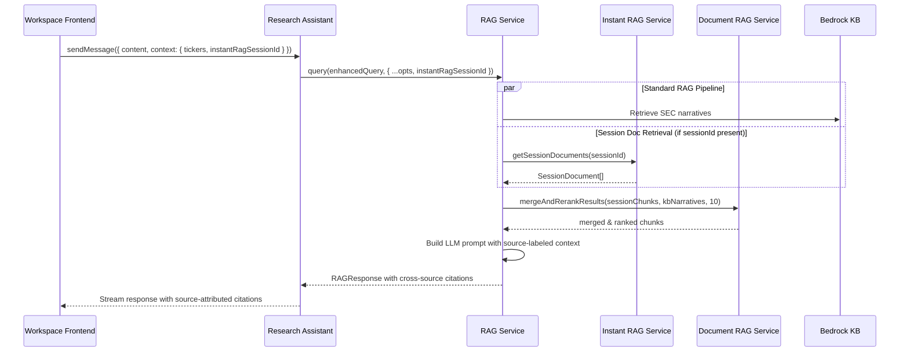

# Design Document: Hybrid RAG Cross-Source Retrieval

## Overview

This design fixes the hard fork in the workspace query routing where Instant RAG session queries and Research Assistant queries are mutually exclusive paths. The fix is surgical: three touch points, zero new services, zero new endpoints.

**Current flow (broken):**
```
User query → Frontend checks session active?
  YES → POST /api/instant-rag/session/:id/query (session docs only, no full RAG)
  NO  → POST /api/research/conversations/:id/messages (full RAG, no session docs)
```

**Fixed flow:**
```
User query → Always POST /api/research/conversations/:id/messages
  → Research Assistant passes sessionId to RAG_Service.query()
  → RAG_Service retrieves session docs (in-memory, ~5ms)
  → RAG_Service merges session chunks with Bedrock KB narratives via existing mergeAndRerankResults()
  → LLM gets full context with source labels → response with proper citations
```

**Latency impact:** ~5-10ms added (one DB query to `instant_rag_documents` table for session docs). No new network calls, no new LLM invocations.

## Architecture



## Components and Interfaces

### 1. Frontend Change: `workspace.html` — `sendResearchMessage()`

**Current behavior:** Hard fork — if `this.instantRagSession` is active, calls `sendInstantRagQuery()` which hits the Instant RAG endpoint.

**New behavior:** Always go through the Research Assistant endpoint. Pass `instantRagSessionId` in the context object when a session is active.

```typescript
// In sendResearchMessage() — remove the early return fork
// Before:
if (this.instantRagSession && this.instantRagSession.status === 'active') {
    await this.sendInstantRagQuery();
    return;
}

// After: Remove the above block. Instead, include sessionId in context:
body: JSON.stringify({
    content: messageContent,
    systemPrompt: this.getEffectiveSystemPrompt(),
    context: {
        tickers: [this.dealInfo.ticker],
        provocationsMode: this.provocationsMode || undefined,
        instantRagSessionId: this.instantRagSession?.status === 'active' 
            ? this.instantRagSession.sessionId 
            : undefined,
    }
})
```

Note: `sendInstantRagQuery()` remains available for the dedicated Instant RAG chat panel if needed, but the main research flow no longer forks to it.

### 2. Backend Change: `research-assistant.service.ts` — `sendMessage()`

**Change:** Extract `instantRagSessionId` from `dto.context` and pass it to `ragService.query()`.

```typescript
// In SendMessageDto interface — extend context:
export interface SendMessageDto {
  content: string;
  systemPrompt?: string;
  context?: {
    tickers?: string[];
    sectors?: string[];
    fiscalPeriod?: string;
    instantRagSessionId?: string; // NEW
  };
}

// In sendMessage() — pass sessionId to RAG:
const ragResult = await this.ragService.query(enhancedQuery, {
    includeNarrative: true,
    includeCitations: true,
    systemPrompt: dto.systemPrompt,
    tenantId,
    ticker: primaryTicker,
    tickers: tickers.length > 1 ? tickers : undefined,
    instantRagSessionId: dto.context?.instantRagSessionId, // NEW
});
```

### 3. Backend Change: `rag.service.ts` — `query()`

**Change:** Add `instantRagSessionId` to query options. After the existing user documents merge step, add session document retrieval and merge.

```typescript
// Extend query options:
options?: {
    includeNarrative?: boolean;
    includeCitations?: boolean;
    systemPrompt?: string;
    tenantId?: string;
    ticker?: string;
    tickers?: string[];
    instantRagSessionId?: string; // NEW
}

// After the existing USER DOCUMENTS PATH block (~line 270), add:
// INSTANT RAG SESSION PATH: Merge session documents if session is active
if (options?.instantRagSessionId) {
    try {
        const sessionDocs = await this.instantRAGService.getSessionDocuments(
            options.instantRagSessionId
        );
        
        if (sessionDocs.length > 0) {
            const sessionChunks = sessionDocs
                .filter(doc => doc.extractedText)
                .map((doc, idx) => ({
                    id: `session-${idx}`,
                    documentId: doc.id,
                    content: doc.extractedText.substring(0, 2000), // Limit chunk size
                    pageNumber: null,
                    ticker: null,
                    filename: doc.fileName,
                    score: 0.85, // Default relevance for session docs (user explicitly uploaded)
                }));
            
            const mergedNarratives = this.documentRAG.mergeAndRerankResults(
                sessionChunks,
                narratives,
                10,
            );
            narratives = mergedNarratives;
        }
    } catch (error) {
        this.logger.warn(`Session doc retrieval failed for ${options.instantRagSessionId}: ${error.message}`);
        // Graceful degradation — continue with KB results only
    }
}
```

**Dependency injection:** `InstantRAGService` needs to be injected into `RAGService`. Since both are NestJS services in the same application, this is a standard `@Inject()` addition to the constructor. To avoid circular dependencies, we use `forwardRef()` if needed, or inject only the `SessionManagerService` + `PrismaService` directly to query session documents without depending on the full `InstantRAGService`.

**Preferred approach:** Inject `InstantRAGService` directly since it has no dependency on `RAGService` (no circular dependency risk).

### 4. Context Labeling for LLM Prompt

The existing `buildHybridAnswer()` and `buildSemanticAnswer()` methods in `rag.service.ts` already format narratives into the LLM prompt. Session document chunks merged via `mergeAndRerankResults()` will carry `source: 'user_document'` and `sourceType: 'USER_UPLOAD'`. We extend the prompt formatting to include source labels:

```typescript
// In the narrative formatting section of buildHybridAnswer/buildSemanticAnswer:
const sourceLabel = chunk.sourceType === 'USER_UPLOAD' 
    ? `[Uploaded Document: ${chunk.filename}]`
    : `[SEC Filing: ${chunk.ticker} ${chunk.filingType}]`;
```

This ensures the LLM can produce accurate source attributions in its response.

## Data Models

### Extended `SendMessageDto.context`

```typescript
interface SendMessageContext {
    tickers?: string[];
    sectors?: string[];
    fiscalPeriod?: string;
    instantRagSessionId?: string; // UUID of active Instant RAG session
}
```

### Extended `RAGService.query()` options

```typescript
interface RAGQueryOptions {
    includeNarrative?: boolean;
    includeCitations?: boolean;
    systemPrompt?: string;
    tenantId?: string;
    ticker?: string;
    tickers?: string[];
    instantRagSessionId?: string; // UUID of active Instant RAG session
}
```

### Session Document Chunk (adapter format)

Session documents from `InstantRAGService.getSessionDocuments()` return `SessionDocument[]` with shape:
```typescript
interface SessionDocument {
    id: string;
    fileName: string;
    fileType: string;
    fileSizeBytes: number;
    contentHash: string;
    pageCount: number;
    processingStatus: string;
    processingError: string | null;
    extractedText: string | null;
    createdAt: Date;
}
```

These are converted to the `UserDocumentChunk` format expected by `mergeAndRerankResults()`:
```typescript
interface UserDocumentChunk {
    id: string;
    documentId: string;
    content: string;
    pageNumber: number | null;
    ticker: string | null;
    filename: string;
    score: number;
}
```

No new database tables or migrations are needed. All data already exists in the `instant_rag_documents` and `instant_rag_sessions` tables.


## Correctness Properties

*A property is a characteristic or behavior that should hold true across all valid executions of a system — essentially, a formal statement about what the system should do. Properties serve as the bridge between human-readable specifications and machine-verifiable correctness guarantees.*

### Property 1: Session ID context propagation

*For any* workspace research query where the Instant RAG session state is "active", the request context sent to the Research Assistant SHALL include the session ID. *For any* query where the session state is not "active" (expired, ended, or null), the request context SHALL NOT include a session ID.

**Validates: Requirements 1.2, 1.3**

### Property 2: Session ID pass-through to RAG Service

*For any* `SendMessageDto` where `context.instantRagSessionId` is a non-empty string, the `ragService.query()` call SHALL receive that same session ID in its options. *For any* `SendMessageDto` where `context.instantRagSessionId` is undefined or empty, the `ragService.query()` options SHALL NOT include a session ID.

**Validates: Requirements 2.1**

### Property 3: Cross-source merge completeness

*For any* RAG query with a valid session ID that resolves to N session documents with non-empty extracted text, and M Bedrock KB narrative chunks, the merged result SHALL contain chunks originating from both session documents and KB narratives (when both are non-empty). The merged result length SHALL be at most K (default 10), and all chunks SHALL be sorted by score in descending order.

**Validates: Requirements 2.3, 3.1, 3.2**

### Property 4: Source type labeling correctness

*For any* merged chunk array produced by `mergeAndRerankResults()`, every chunk originating from a session document SHALL have `source` set to `"user_document"` and `sourceType` set to `"USER_UPLOAD"`, and every chunk originating from Bedrock KB SHALL have `source` set to `"sec_filing"` and `sourceType` set to `"SEC_FILING"`. No chunk SHALL have an unlabeled or incorrect source type.

**Validates: Requirements 3.1, 3.2**

### Property 5: Graceful degradation preserves pipeline output

*For any* RAG query where the session ID is invalid, the session has expired, the document retrieval throws an error, or session documents are empty, the RAG pipeline SHALL still return a valid `RAGResponse` (not throw), and the response metadata SHALL include a flag indicating session documents were unavailable.

**Validates: Requirements 4.1, 4.2, 4.3, 4.4**

## Error Handling

| Scenario | Handling | User Impact |
|---|---|---|
| Session ID provided but session not found | Log warning, skip session doc merge, continue with KB results | None — user gets KB-only response |
| Session ID provided but session expired | Log warning, skip session doc merge, continue with KB results | None — user gets KB-only response |
| `getSessionDocuments()` throws error | Catch error, log, skip session doc merge, continue with KB results | None — user gets KB-only response |
| Session documents have empty `extractedText` | Filter out empty docs, if all empty skip merge | None — user gets KB-only response |
| `mergeAndRerankResults()` receives empty session chunks | Returns KB narratives unchanged (existing behavior) | None |
| Circular dependency between RAG module and Instant RAG module | Use `forwardRef()` in NestJS module imports, or inject only `PrismaService` to query session docs directly | Build-time error if not handled |

All error paths result in graceful degradation to the standard KB-only RAG flow. No user-facing errors are introduced.

## Testing Strategy

### Property-Based Tests

Use `fast-check` (already available in the project's test dependencies) for property-based testing. Each property test runs a minimum of 100 iterations.

- **Property 1** — Generate random session states (active, expired, ended, null) and verify the context object shape matches the expected session ID presence/absence.
- **Property 2** — Generate random `SendMessageDto` objects with and without `instantRagSessionId`, mock `ragService.query()`, and verify the options passed match.
- **Property 3** — Generate random arrays of session document chunks and KB narrative chunks with random scores, call `mergeAndRerankResults()`, and verify the output contains chunks from both sources, is sorted by score descending, and respects the topK limit.
- **Property 4** — Generate random chunks, run them through `mergeAndRerankResults()`, and verify every chunk has the correct `source` and `sourceType` labels.
- **Property 5** — Generate random error conditions (invalid session ID, thrown errors, empty docs), run the RAG query, and verify it returns a valid response with the degradation metadata flag.

### Unit Tests

- Test that `sendResearchMessage()` no longer forks to `sendInstantRagQuery()` when a session is active (example test)
- Test citation metadata includes source type and filename for session doc citations (example test)
- Test the session document to `UserDocumentChunk` adapter conversion with edge cases (empty text, very long text, special characters)

### Integration Tests

- End-to-end test: upload a document via Instant RAG, then send a research query through the Research Assistant, verify the response includes content from both the uploaded document and Bedrock KB
- Test that the Instant RAG dedicated Q&A endpoint (`/api/instant-rag/session/:id/query`) still works independently for the Instant RAG chat panel

### Test Configuration

- Property-based testing library: `fast-check`
- Minimum iterations per property: 100
- Each property test tagged with: **Feature: hybrid-rag-cross-source-retrieval, Property {N}: {title}**
