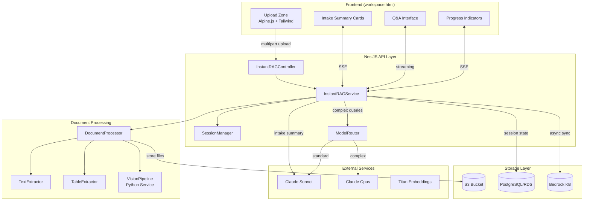
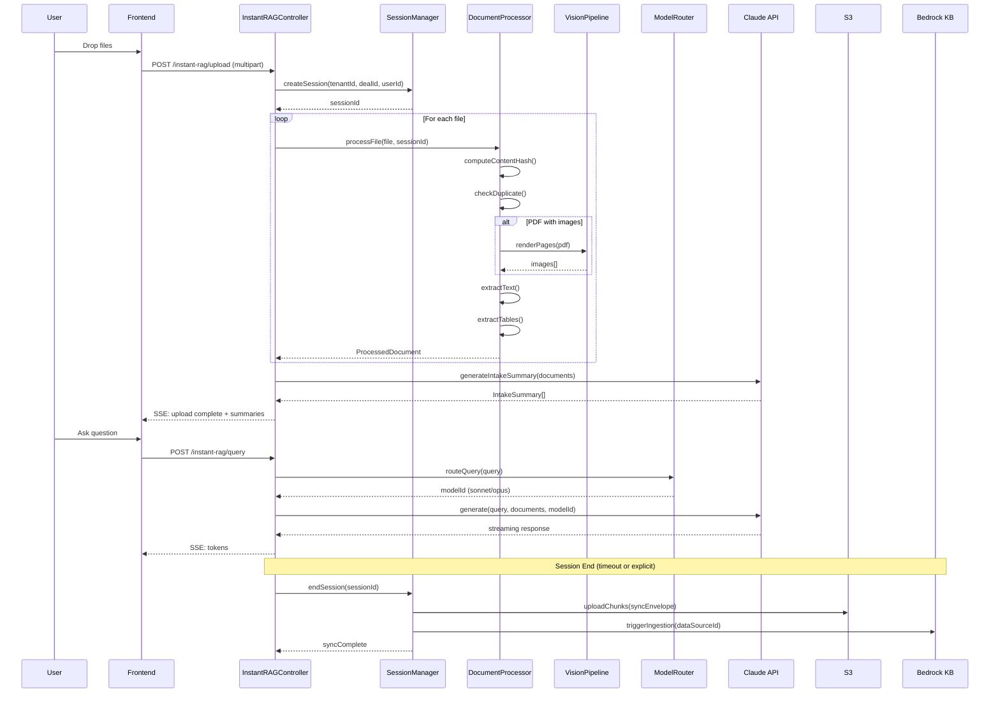

# Design Document: Instant RAG Document Processing

## Overview

The Instant RAG Document Processing system enables equity research analysts to upload up to 5 financial documents per session and immediately ask questions about them without waiting for Bedrock Knowledge Base synchronization. The system provides multi-modal extraction (text, tables, charts, images), intelligent model routing (Sonnet for standard queries, Opus for complex cross-document analysis), and async persistence of session artifacts for long-term retrieval.

### Key Design Decisions

1. **Instant Q&A via Direct Context Injection**: Rather than waiting for KB sync, we pass full document content directly to Claude's context window (up to 200K tokens). This enables immediate Q&A while async sync handles long-term persistence.

2. **Session-Based Architecture**: Each upload session is a first-class entity with its own state, timeout, and sync envelope. This enables partial failure recovery and clean resource management.

3. **Hybrid Extraction Pipeline**: Text extraction uses existing libraries (pdf-parse, mammoth, xlsx), while visual content uses a Python microservice (pdf2image, Pillow) for rendering before Claude vision analysis.

4. **Cost-Aware Model Routing**: Keyword-based routing to Opus for complex queries with a hard cap (5 calls/session) prevents runaway costs while enabling powerful analysis when needed.

5. **Embedding Model Consistency**: Using `amazon.titan-embed-text-v2:0` to match the existing Bedrock KB configuration, ensuring consistent retrieval after sync.

## Architecture



### Request Flow



## Components and Interfaces

### InstantRAGController

```typescript
@Controller('instant-rag')
@UseGuards(TenantGuard)
export class InstantRAGController {
  
  @Post('upload')
  @UseInterceptors(FilesInterceptor('files', 5))
  async uploadDocuments(
    @UploadedFiles() files: Express.Multer.File[],
    @Body('dealId') dealId: string,
  ): Promise<UploadResponse>;

  @Post('query')
  async query(
    @Body() dto: InstantRAGQueryDto,
  ): Promise<void>; // SSE streaming

  @Get('session/:sessionId')
  async getSession(
    @Param('sessionId') sessionId: string,
  ): Promise<SessionState>;

  @Post('session/:sessionId/end')
  async endSession(
    @Param('sessionId') sessionId: string,
  ): Promise<SyncEnvelopeResult>;

  @Get('session/:sessionId/status')
  async getSessionStatus(
    @Param('sessionId') sessionId: string,
  ): Promise<SessionStatus>; // SSE for progress
}
```

### InstantRAGService

```typescript
@Injectable()
export class InstantRAGService {
  
  async createSession(
    tenantId: string,
    dealId: string,
    userId: string,
  ): Promise<Session>;

  async processDocuments(
    sessionId: string,
    files: Express.Multer.File[],
  ): Promise<ProcessingResult>;

  async generateIntakeSummaries(
    sessionId: string,
  ): Promise<IntakeSummary[]>;

  async query(
    sessionId: string,
    query: string,
    options?: QueryOptions,
  ): AsyncGenerator<StreamChunk>;

  async endSession(
    sessionId: string,
  ): Promise<SyncEnvelope>;

  async getSessionState(
    sessionId: string,
  ): Promise<SessionState>;
}
```

### SessionManager

```typescript
@Injectable()
export class SessionManager {
  private sessions: Map<string, SessionState> = new Map();
  
  async createSession(params: CreateSessionParams): Promise<Session>;
  async getSession(sessionId: string): Promise<SessionState | null>;
  async updateSession(sessionId: string, updates: Partial<SessionState>): Promise<void>;
  async endSession(sessionId: string): Promise<SyncEnvelope>;
  async enforceRateLimits(tenantId: string, userId: string, dealId: string): Promise<void>;
  async extendTimeout(sessionId: string): Promise<void>;
  async cleanupExpiredSessions(): Promise<void>;
}
```

### DocumentProcessor

```typescript
@Injectable()
export class DocumentProcessor {
  
  async processFile(
    file: Express.Multer.File,
    sessionId: string,
  ): Promise<ProcessedDocument>;

  async extractText(file: Express.Multer.File): Promise<ExtractedText>;
  async extractTables(file: Express.Multer.File): Promise<ExtractedTable[]>;
  async computeContentHash(buffer: Buffer): Promise<string>;
  async checkDuplicate(hash: string, tenantId: string, dealId: string): Promise<Document | null>;
  
  // File-type specific extractors
  async extractPDF(buffer: Buffer): Promise<PDFExtraction>;
  async extractDOCX(buffer: Buffer): Promise<DOCXExtraction>;
  async extractXLSX(buffer: Buffer): Promise<XLSXExtraction>;
  async extractCSV(buffer: Buffer): Promise<CSVExtraction>;
  async extractPPTX(buffer: Buffer): Promise<PPTXExtraction>;
}
```

### VisionPipeline (Python Service)

```python
# api_server.py additions
@app.post("/vision/render-pdf")
async def render_pdf(file: UploadFile, dpi: int = 150) -> List[str]:
    """Render PDF pages to base64 images"""
    pass

@app.post("/vision/render-pptx")
async def render_pptx(file: UploadFile, dpi: int = 150) -> List[str]:
    """Render PPTX slides to base64 images"""
    pass
```

### ModelRouter

```typescript
@Injectable()
export class ModelRouter {
  private readonly opusTriggers = [
    'cross-reference', 'compare', 'contradict', 'provocation',
    'why would', "doesn't match", 'inconsistent', "what's missing",
    "devil's advocate"
  ];
  
  async routeQuery(
    query: string,
    sessionId: string,
  ): Promise<ModelSelection>;

  async trackUsage(
    sessionId: string,
    modelId: string,
    tokens: TokenUsage,
  ): Promise<void>;

  async checkOpusBudget(sessionId: string): Promise<boolean>;
}
```

### SyncEnvelopeGenerator

```typescript
@Injectable()
export class SyncEnvelopeGenerator {
  
  async generateEnvelope(session: SessionState): Promise<SyncEnvelope>;
  async uploadToS3(envelope: SyncEnvelope): Promise<S3UploadResult>;
  async triggerKBIngestion(envelope: SyncEnvelope): Promise<void>;
  async persistToRDS(envelope: SyncEnvelope): Promise<void>;
}
```

## Data Models

### Session State

```typescript
interface SessionState {
  sessionId: string;
  tenantId: string;
  dealId: string;
  userId: string;
  ticker: string;
  status: 'active' | 'processing' | 'ended' | 'expired';
  createdAt: Date;
  lastActivityAt: Date;
  expiresAt: Date;
  
  documents: ProcessedDocument[];
  intakeSummaries: IntakeSummary[];
  qaLog: QALogEntry[];
  
  modelUsage: {
    sonnetCalls: number;
    opusCalls: number;
    totalInputTokens: number;
    totalOutputTokens: number;
  };
  
  processingStatus: {
    filesTotal: number;
    filesProcessed: number;
    filesFailed: number;
    errors: ProcessingError[];
  };
}
```

### Processed Document

```typescript
interface ProcessedDocument {
  documentId: string;
  uploadId: string;
  fileName: string;
  fileType: 'pdf' | 'docx' | 'xlsx' | 'csv' | 'pptx' | 'txt' | 'png' | 'jpg';
  fileSizeMb: number;
  contentHash: string;
  
  extractedText: string;
  extractedTables: ExtractedTable[];
  pageCount: number;
  pageImages?: string[]; // base64 for vision
  
  processingStatus: 'pending' | 'processing' | 'complete' | 'failed';
  processingError?: string;
  processingDurationMs: number;
}
```

### Intake Summary

```typescript
interface IntakeSummary {
  documentIndex: number;
  fileName: string;
  documentType: DocumentCategory;
  reportingEntity: string;
  periodCovered: string;
  pageCount: number;
  keySectionsIdentified: string[];
  headlineMetrics: HeadlineMetric[];
  notableItems: string[];
  extractionConfidence: 'high' | 'medium' | 'low';
  extractionNotes: string;
}

type DocumentCategory = 
  | '10-K' | '10-Q' | '8-K' 
  | 'earnings_transcript' | 'investor_presentation'
  | 'CIM' | 'pitch_deck' | 'due_diligence_report'
  | 'financial_model' | 'other';

interface HeadlineMetric {
  metric: string;
  value: string;
  period: string;
}
```

### Sync Envelope

```typescript
interface SyncEnvelope {
  tenantId: string;
  workspaceId: string;
  dealId: string;
  ticker: string;
  sessionId: string;
  userId: string;
  createdAt: string; // ISO timestamp
  
  artifacts: SyncArtifact[];
  
  syncInstructions: {
    priority: 'normal' | 'high';
    rdsSync: {
      upsertStrategy: 'merge_on_composite_key';
      conflictResolution: 'latest_session_wins';
      keys: Record<string, string[]>;
    };
    s3KbSync: {
      trigger: 'post_session' | 'cron_15min';
      kbIngestionScope: 'tenant_deal_datasource';
      embeddingConsistency: 'titan_text_v2_only';
    };
  };
}

type SyncArtifact = 
  | StructuredMetricsArtifact
  | DocumentChunksArtifact
  | SessionQALogArtifact
  | ProvocationsArtifact;

interface StructuredMetricsArtifact {
  artifactType: 'structured_metrics';
  syncTarget: 'rds';
  table: 'deal_metrics';
  data: ExtractedMetric[];
}

interface DocumentChunksArtifact {
  artifactType: 'document_chunks';
  syncTarget: 's3_then_kb';
  s3Path: string;
  kbDataSourceId: string;
  chunks: DocumentChunk[];
}

interface SessionQALogArtifact {
  artifactType: 'session_qa_log';
  syncTarget: 'rds';
  table: 'research_sessions';
  data: {
    sessionId: string;
    dealId: string;
    documentsProcessed: string[];
    questionsAsked: number;
    provocationsGenerated: number;
    durationMinutes: number;
    summary: string;
  };
}
```

### Database Schema Additions

```sql
-- Instant RAG Sessions
CREATE TABLE instant_rag_sessions (
  id UUID PRIMARY KEY DEFAULT gen_random_uuid(),
  tenant_id UUID NOT NULL REFERENCES tenants(id),
  deal_id UUID NOT NULL REFERENCES deals(id),
  user_id UUID NOT NULL REFERENCES users(id),
  ticker VARCHAR(10) NOT NULL,
  status VARCHAR(20) NOT NULL DEFAULT 'active',
  created_at TIMESTAMP WITH TIME ZONE DEFAULT NOW(),
  last_activity_at TIMESTAMP WITH TIME ZONE DEFAULT NOW(),
  expires_at TIMESTAMP WITH TIME ZONE NOT NULL,
  
  -- Model usage tracking
  sonnet_calls INTEGER DEFAULT 0,
  opus_calls INTEGER DEFAULT 0,
  total_input_tokens INTEGER DEFAULT 0,
  total_output_tokens INTEGER DEFAULT 0,
  
  -- Processing status
  files_total INTEGER DEFAULT 0,
  files_processed INTEGER DEFAULT 0,
  files_failed INTEGER DEFAULT 0,
  
  CONSTRAINT unique_active_session UNIQUE (tenant_id, deal_id, user_id, status)
    WHERE status = 'active'
);

-- Session Documents
CREATE TABLE instant_rag_documents (
  id UUID PRIMARY KEY DEFAULT gen_random_uuid(),
  session_id UUID NOT NULL REFERENCES instant_rag_sessions(id) ON DELETE CASCADE,
  tenant_id UUID NOT NULL,
  file_name VARCHAR(255) NOT NULL,
  file_type VARCHAR(20) NOT NULL,
  file_size_bytes BIGINT NOT NULL,
  content_hash VARCHAR(64) NOT NULL,
  s3_key VARCHAR(500) NOT NULL,
  
  extracted_text TEXT,
  page_count INTEGER,
  processing_status VARCHAR(20) DEFAULT 'pending',
  processing_error TEXT,
  processing_duration_ms INTEGER,
  
  created_at TIMESTAMP WITH TIME ZONE DEFAULT NOW(),
  
  INDEX idx_content_hash (tenant_id, content_hash)
);

-- Session Q&A Log
CREATE TABLE instant_rag_qa_log (
  id UUID PRIMARY KEY DEFAULT gen_random_uuid(),
  session_id UUID NOT NULL REFERENCES instant_rag_sessions(id) ON DELETE CASCADE,
  role VARCHAR(20) NOT NULL, -- 'user' | 'assistant'
  content TEXT NOT NULL,
  model_used VARCHAR(100),
  input_tokens INTEGER,
  output_tokens INTEGER,
  citations JSONB,
  created_at TIMESTAMP WITH TIME ZONE DEFAULT NOW()
);

-- Intake Summaries
CREATE TABLE instant_rag_intake_summaries (
  id UUID PRIMARY KEY DEFAULT gen_random_uuid(),
  document_id UUID NOT NULL REFERENCES instant_rag_documents(id) ON DELETE CASCADE,
  document_type VARCHAR(50),
  reporting_entity VARCHAR(255),
  period_covered VARCHAR(100),
  key_sections JSONB,
  headline_metrics JSONB,
  notable_items JSONB,
  extraction_confidence VARCHAR(20),
  extraction_notes TEXT,
  created_at TIMESTAMP WITH TIME ZONE DEFAULT NOW()
);

-- Rate Limiting
CREATE TABLE instant_rag_rate_limits (
  id UUID PRIMARY KEY DEFAULT gen_random_uuid(),
  tenant_id UUID NOT NULL,
  user_id UUID,
  deal_id UUID,
  limit_type VARCHAR(50) NOT NULL, -- 'tenant_sessions' | 'user_deal_session'
  current_count INTEGER DEFAULT 0,
  max_count INTEGER NOT NULL,
  window_start TIMESTAMP WITH TIME ZONE DEFAULT NOW(),
  window_duration_seconds INTEGER NOT NULL,
  
  UNIQUE (tenant_id, user_id, deal_id, limit_type)
);
```


## Correctness Properties

*A property is a characteristic or behavior that should hold true across all valid executions of a system—essentially, a formal statement about what the system should do. Properties serve as the bridge between human-readable specifications and machine-verifiable correctness guarantees.*

### Property 1: Batch Upload File Count Validation

*For any* batch upload request with N files where N > 5, the Upload_Zone SHALL reject the batch and return an error indicating the maximum file count has been exceeded.

**Validates: Requirements 1.1**

### Property 2: Individual File Size Validation

*For any* file in a batch upload with size S where S > 50MB, the Document_Processor SHALL reject that specific file while continuing to process files with size ≤ 50MB.

**Validates: Requirements 1.2**

### Property 3: Aggregate Batch Size Validation

*For any* batch upload with total size T where T > 150MB, the Upload_Zone SHALL reject the entire batch before processing any files.

**Validates: Requirements 1.3**

### Property 4: File Type Validation

*For any* file with extension E not in {pdf, docx, xlsx, csv, pptx, txt, png, jpg, jpeg}, the Document_Processor SHALL reject that file with a descriptive error message.

**Validates: Requirements 1.4**

### Property 5: Partial Upload Success

*For any* batch upload containing both valid and invalid files, the Instant_RAG_Service SHALL process all valid files and return a response containing both successful document references and error details for failed files.

**Validates: Requirements 1.5**

### Property 6: Rate Limit Enforcement

*For any* tenant with N active sessions where N ≥ 3, attempting to create a new session SHALL return a 429 status with retry-after header. *For any* user+deal combination with an active session, attempting to create another session for the same deal SHALL return a 429 status.

**Validates: Requirements 1.8, 1.9, 13.1, 13.2, 13.3**

### Property 7: XLSX Sheet Extraction Limit

*For any* XLSX file with S sheets where S > 10, the Document_Processor SHALL extract exactly 10 sheets and log a warning about truncation.

**Validates: Requirements 2.2**

### Property 8: XLSX Formula Value Extraction

*For any* XLSX cell containing a formula, the Document_Processor SHALL extract the calculated value, not the formula text string.

**Validates: Requirements 2.3**

### Property 9: PPTX Slide Limit

*For any* PPTX file with S slides where S > 100, the Vision_Pipeline SHALL render exactly 100 slides and log a warning about truncation.

**Validates: Requirements 2.6**

### Property 10: JPEG/JPG Equivalence

*For any* image file, processing a .jpeg file SHALL produce identical results to processing the same content with a .jpg extension.

**Validates: Requirements 2.8**

### Property 11: Intake Summary Completeness

*For any* processed document, the generated Intake_Summary SHALL contain all required fields: document_type, reporting_entity, period_covered, page_count, key_sections_identified, headline_metrics, notable_items, extraction_confidence, and extraction_notes.

**Validates: Requirements 3.2, 3.3, 3.4, 3.5, 3.6, 3.7, 3.8, 3.9, 3.10**

### Property 12: Instant Q&A Independence from KB

*For any* query in an active session, the Instant_RAG_Service SHALL return a response using only the session's uploaded document content, without requiring Bedrock KB to be synced or available.

**Validates: Requirements 4.1, 4.2**

### Property 13: Metric Extraction Precision

*For any* numeric value V extracted from a source document, the extracted value SHALL preserve the same precision (decimal places) as the source unless the user explicitly requests rounding.

**Validates: Requirements 4.9**

### Property 14: Table Extraction Completeness

*For any* table in a source document with R rows and C columns, the extracted table SHALL contain exactly R rows and C columns.

**Validates: Requirements 4.11**

### Property 15: PDF Vision Rendering

*For any* uploaded PDF file, the Vision_Pipeline SHALL render each page to an image at 150 DPI resolution.

**Validates: Requirements 5.1**

### Property 16: Model Routing Default

*For any* query Q that does not contain any trigger keywords, the Model_Router SHALL route to Claude Sonnet.

**Validates: Requirements 6.1**

### Property 17: Model Routing Triggers

*For any* query Q containing at least one trigger keyword from {cross-reference, compare, contradict, provocation, why would, doesn't match, inconsistent, what's missing, devil's advocate}, the Model_Router SHALL route to Claude Opus (if budget allows).

**Validates: Requirements 6.2**

### Property 18: Opus Budget Enforcement

*For any* session with O Opus calls where O ≥ 5, subsequent queries that would trigger Opus SHALL instead be routed to Sonnet with a notification to the user.

**Validates: Requirements 6.3, 6.4**

### Property 19: Sync Envelope Completeness

*For any* ended session, the generated Sync_Envelope SHALL contain all required fields: tenant_id, workspace_id, deal_id, ticker, session_id, user_id, created_at, and at least one artifact.

**Validates: Requirements 7.1, 7.2, 7.3, 7.4, 7.5, 7.6, 7.7, 7.8**

### Property 20: S3 Path Structure

*For any* sync operation, the S3 path SHALL match the pattern `s3://fundlens-{env}/kb-ready/{tenant_id}/{deal_id}/{session_id}/`.

**Validates: Requirements 7.9, 9.3**

### Property 21: Embedding Model Consistency

*For any* document chunk being synced to KB, the embedding SHALL be generated using model `amazon.titan-embed-text-v2:0`.

**Validates: Requirements 8.3**

### Property 22: KB Ingestion Retry

*For any* KB ingestion failure, the Instant_RAG_Service SHALL retry up to 3 times before marking the sync as failed.

**Validates: Requirements 8.5**

### Property 23: Async Sync Non-Blocking

*For any* session end operation, the user SHALL receive a response before the S3 upload and KB ingestion complete.

**Validates: Requirements 8.6**

### Property 24: Tenant Isolation

*For any* KB query with tenant_id T1, the results SHALL NOT contain any documents uploaded by tenant T2 where T1 ≠ T2.

**Validates: Requirements 9.4, 9.5**

### Property 25: Content Hash Duplicate Detection Round-Trip

*For any* file F uploaded twice to the same tenant+deal, the second upload SHALL return a reference to the existing document without reprocessing, and the content_hash stored in the database SHALL match SHA-256(F.content).

**Validates: Requirements 10.1, 10.2, 10.3, 10.4**

### Property 26: Session Timeout Enforcement

*For any* session with last_activity_at timestamp T, if current_time > T + 600 seconds, the session SHALL be marked as expired and a sync envelope SHALL be generated.

**Validates: Requirements 11.1, 11.2, 11.3**

### Property 27: Session Timeout Extension

*For any* user activity (query or upload) in a session, the session's expires_at timestamp SHALL be extended by 600 seconds from the activity time.

**Validates: Requirements 11.4**

### Property 28: Progress Event Streaming

*For any* document being processed, the Upload_Zone SHALL receive SSE events for each processing phase: uploading, extracting_text, extracting_tables, generating_embeddings, complete.

**Validates: Requirements 12.1, 12.2**

### Property 29: Usage Tracking Completeness

*For any* session, the usage tracking SHALL record: sonnet_calls, opus_calls, total_input_tokens, total_output_tokens, and these values SHALL be persisted to the database.

**Validates: Requirements 14.1, 14.2, 6.5, 6.6**

## Error Handling

### Upload Errors

| Error Condition | HTTP Status | Error Code | User Message |
|----------------|-------------|------------|--------------|
| File count > 5 | 400 | BATCH_SIZE_EXCEEDED | Maximum 5 files per upload |
| File size > 50MB | 400 | FILE_TOO_LARGE | File exceeds 50MB limit |
| Total size > 150MB | 400 | BATCH_TOO_LARGE | Total upload exceeds 150MB |
| Unsupported file type | 400 | UNSUPPORTED_FILE_TYPE | File type not supported |
| Password-protected PDF | 400 | PROTECTED_FILE | Cannot process password-protected files |
| Encrypted DOCX | 400 | ENCRYPTED_FILE | Cannot process encrypted files |
| S3 upload failure | 500 | STORAGE_ERROR | Upload failed, please retry |

### Session Errors

| Error Condition | HTTP Status | Error Code | User Message |
|----------------|-------------|------------|--------------|
| Session not found | 404 | SESSION_NOT_FOUND | Session not found or expired |
| Session expired | 410 | SESSION_EXPIRED | Session has expired |
| Rate limit exceeded | 429 | RATE_LIMIT_EXCEEDED | Too many active sessions |
| Concurrent session exists | 409 | SESSION_CONFLICT | Active session already exists for this deal |

### Processing Errors

| Error Condition | HTTP Status | Error Code | User Message |
|----------------|-------------|------------|--------------|
| Text extraction failed | 500 | EXTRACTION_FAILED | Failed to extract text from document |
| Vision rendering failed | 500 | VISION_FAILED | Failed to render document for analysis |
| Claude API error | 502 | LLM_ERROR | AI service temporarily unavailable |
| KB sync failed | 500 | SYNC_FAILED | Failed to sync session data |

### Error Recovery Strategies

1. **Partial Upload Failure**: Continue processing valid files, return detailed error report for failed files, allow retry of individual files.

2. **Session Timeout**: Auto-generate sync envelope, persist session state, allow session recovery within 5 minutes of timeout.

3. **Claude API Failure**: Retry with exponential backoff (3 attempts), fall back to cached response if available, notify user of degraded service.

4. **KB Sync Failure**: Queue for retry, continue user operations, alert operations team after 3 failures.

## Testing Strategy

### Unit Tests

Unit tests focus on specific examples, edge cases, and error conditions:

1. **File Validation Tests**
   - Test exact boundary conditions (50MB, 150MB, 5 files)
   - Test each supported file type
   - Test error messages for unsupported types

2. **Hash Computation Tests**
   - Test SHA-256 computation correctness
   - Test hash consistency across identical content

3. **Model Router Tests**
   - Test each trigger keyword
   - Test case insensitivity
   - Test budget tracking

4. **Session Manager Tests**
   - Test session creation and retrieval
   - Test timeout calculation
   - Test rate limit enforcement

### Property-Based Tests

Property-based tests verify universal properties across all inputs. Each test runs minimum 100 iterations.

**Configuration**: Use `fast-check` library for TypeScript property-based testing.

1. **Feature: instant-rag-document-processing, Property 1: Batch Upload File Count Validation**
   - Generate random file counts (1-10)
   - Verify counts ≤5 accepted, >5 rejected

2. **Feature: instant-rag-document-processing, Property 2: Individual File Size Validation**
   - Generate random file sizes (1KB - 100MB)
   - Verify files ≤50MB accepted, >50MB rejected

3. **Feature: instant-rag-document-processing, Property 6: Rate Limit Enforcement**
   - Generate random session creation sequences
   - Verify limits enforced at boundaries

4. **Feature: instant-rag-document-processing, Property 18: Opus Budget Enforcement**
   - Generate random query sequences with trigger keywords
   - Verify Opus calls capped at 5

5. **Feature: instant-rag-document-processing, Property 24: Tenant Isolation**
   - Generate random tenant/document combinations
   - Verify cross-tenant queries return empty

6. **Feature: instant-rag-document-processing, Property 25: Content Hash Duplicate Detection Round-Trip**
   - Generate random file content
   - Upload twice, verify deduplication

7. **Feature: instant-rag-document-processing, Property 26: Session Timeout Enforcement**
   - Generate random activity timestamps
   - Verify timeout at 600 seconds

### Integration Tests

1. **End-to-End Upload Flow**
   - Upload multiple files
   - Verify intake summaries generated
   - Verify session state persisted

2. **Q&A Flow**
   - Upload documents
   - Ask questions
   - Verify responses include citations

3. **Sync Envelope Flow**
   - End session
   - Verify S3 upload
   - Verify KB ingestion triggered

### E2E Tests

1. **Frontend Upload Zone**
   - Test drag-and-drop
   - Test progress indicators
   - Test error display

2. **Session Lifecycle**
   - Create session
   - Upload files
   - Ask questions
   - End session
   - Verify sync complete
