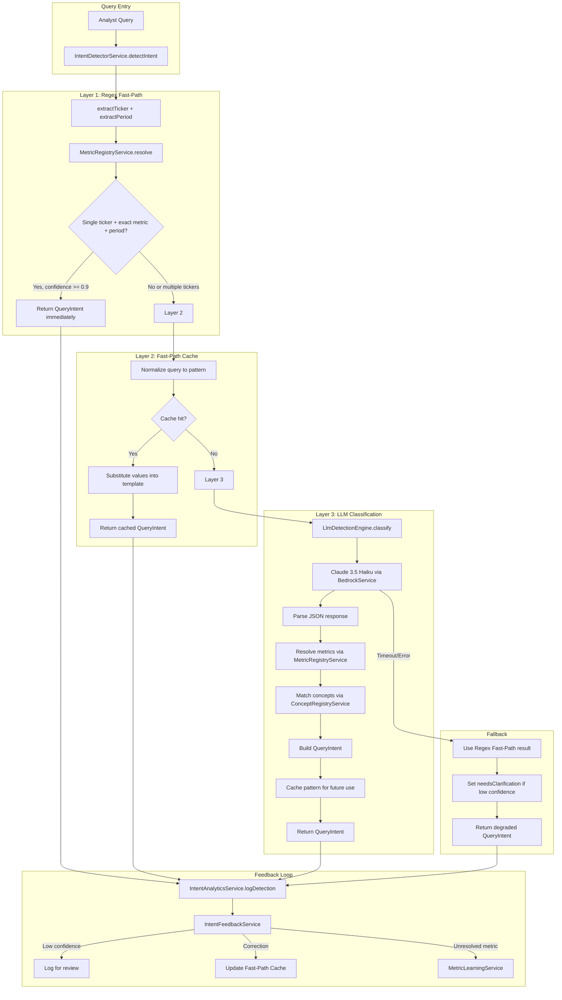

# Design Document: Intelligent Intent Detection System

## Overview

This design replaces FundLens's 1,306-line IntentDetectorService — built on hundreds of hardcoded regex patterns and keyword lists — with a three-layer intelligent detection architecture that uses Claude 3.5 Haiku as the classification engine while keeping costs under control.

The architecture is:

1. **Layer 1 — Regex Fast-Path** ($0/query, <10ms): Deterministic detection for simple queries where a single ticker, an exact-match metric from MetricRegistryService, and an explicit period are all present. Covers ~60% of analyst queries. Uses the preserved `extractTicker()`, `extractPeriod()`, and `MetricRegistryService.resolve()` methods.

2. **Layer 2 — Fast-Path Cache** ($0/query, <5ms): An LRU cache (5,000 entries) of normalized query patterns from previous successful LLM detections. Query patterns like "{TICKER} revenue {PERIOD}" are cached so that "AAPL revenue FY2024" and "MSFT revenue FY2023" share the same cached classification. The cache grows over time, reducing LLM invocation rate.

3. **Layer 3 — LLM Classification via Claude 3.5 Haiku** (~$0.0002/query, 200-500ms): For queries that don't match Layer 1 or Layer 2, Claude 3.5 Haiku classifies the query. The LLM extracts entities (tickers, raw metric phrases, periods) and classifies intent (query type, boolean flags). It does NOT resolve metrics — that's always delegated to MetricRegistryService. It does NOT match concepts — that's always delegated to ConceptRegistryService.

The key design principle: **the LLM is a classifier, not a resolver**. The existing metric-resolution-architecture (MetricRegistryService with inverted synonym index, ConceptRegistryService with concept triggers, FormulaResolutionService with DAG-based dependency resolution) remains the single source of truth for metric resolution. The intent detector sits ABOVE these services — it determines WHAT the user wants, then delegates HOW to resolve it.

### What Gets Deleted

- `needsComparison()` — hardcoded comparison keyword list
- `needsPeerComparison()` — hardcoded peer comparison keyword list
- `needsTrend()` — hardcoded trend keyword list
- `needsComputation()` — hardcoded computation keyword list
- `needsNarrative()` / `hasNarrativeKeywords()` — hardcoded narrative keyword list
- `identifyItem1Subsection()`, `identifyItem7Subsection()`, `identifyItem8Subsection()`, `identifyItem1ASubsection()` — hardcoded subsection identification
- `detectWithRegex()` — replaced by `regexFastPath()`
- `detectWithLLM()` — replaced by `LlmDetectionEngine.classify()`
- `detectGenericWithRegexFallback()` — replaced by graceful degradation in the main flow
- `determineQueryType()` — replaced by LLM classification + fast-path component analysis
- `extractMetrics()` / `extractMetricCandidates()` — metric extraction now handled by LLM + MetricRegistryService
- `isAmbiguous()` — replaced by LLM ambiguity detection
- `calculateConfidence()` — replaced by layer-specific confidence calculation
- Hardcoded `companyMap` in `extractTickersFromQuery()` — replaced by dynamic Company_Ticker_Map

### What Gets Preserved

- `extractTicker()` / `extractTickersFromQuery()` — ticker extraction regex (used by fast-path)
- `extractPeriod()` — period extraction logic (used by both fast-path and post-LLM)
- `determinePeriodType()` — period type classification (used by both fast-path and post-LLM)
- `detectIntent()` method signature — the public API contract
- Integration with `IntentAnalyticsService` — extended with new detection methods
- Integration with `MetricRegistryService` — used for metric resolution in both fast-path and post-LLM
- Integration with `ConceptRegistryService` — used for concept matching post-LLM

### What Gets Created

- `LlmDetectionEngine` — internal class/module that constructs prompts, invokes Claude 3.5 Haiku, parses structured JSON responses
- `FastPathCache` — LRU cache with query pattern normalization and template substitution
- `CompanyTickerMapService` — dynamically loaded company-to-ticker mapping from database/S3
- `IntentFeedbackService` — closed feedback loop that logs corrections and updates cache
- Extended `IntentAnalyticsService` — new detection methods (regex_fast_path, cache_hit, llm, fallback) and aggregate metrics

## Architecture



## Components and Interfaces

### IntentDetectorService (Refactored)

The main service class. Preserves the existing public API but replaces the internal detection logic.

```typescript
@Injectable()
export class IntentDetectorService {
  constructor(
    private readonly bedrock: BedrockService,
    private readonly analytics: IntentAnalyticsService,
    private readonly metricRegistry: MetricRegistryService,
    private readonly conceptRegistry: ConceptRegistryService,
    private readonly companyTickerMap: CompanyTickerMapService,
    private readonly feedbackService: IntentFeedbackService,
    private readonly fastPathCache: FastPathCache,
  ) {}

  // Public API — signature preserved
  async detectIntent(
    query: string,
    tenantId?: string,
    contextTicker?: string,
  ): Promise<QueryIntent> { ... }

  // Preserved methods
  private extractTicker(query: string, contextTicker?: string): string | string[] | undefined { ... }
  private extractTickersFromQuery(query: string): string[] { ... }
  private extractPeriod(query: string): PeriodExtractionResult { ... }
  private determinePeriodType(period?: string): PeriodType | undefined { ... }
}
```

### Detection Flow (detectIntent)

```typescript
async detectIntent(query: string, tenantId?: string, contextTicker?: string): Promise<QueryIntent> {
  const startTime = Date.now();

  // Layer 1: Regex Fast-Path
  const fastPathResult = this.regexFastPath(query, contextTicker);
  if (fastPathResult.confidence >= 0.9) {
    await this.logAndReturn(fastPathResult, 'regex_fast_path', tenantId, startTime);
    return fastPathResult;
  }

  // Layer 2: Fast-Path Cache
  const cacheResult = this.fastPathCache.lookup(query, fastPathResult);
  if (cacheResult) {
    await this.logAndReturn(cacheResult, 'cache_hit', tenantId, startTime);
    return cacheResult;
  }

  // Layer 3: LLM Classification
  try {
    const llmResult = await this.llmClassify(query, contextTicker);
    // Cache the successful LLM result
    if (llmResult.confidence >= 0.8) {
      this.fastPathCache.store(query, llmResult);
    }
    await this.logAndReturn(llmResult, 'llm', tenantId, startTime);
    return llmResult;
  } catch (error) {
    // Fallback: use regex result with degraded confidence
    const fallback = this.buildFallbackIntent(query, fastPathResult);
    await this.logAndReturn(fallback, 'fallback', tenantId, startTime, error.message);
    return fallback;
  }
}
```

### LlmDetectionEngine

Internal module responsible for constructing prompts, invoking Claude, and parsing responses. Not a separate NestJS service — it's a set of private methods on IntentDetectorService or a plain class instantiated by the service.

```typescript
class LlmDetectionEngine {
  private cachedSystemPrompt: string | null = null;
  private promptVersion: number = 0;

  constructor(
    private readonly bedrock: BedrockService,
    private readonly metricRegistry: MetricRegistryService,
    private readonly conceptRegistry: ConceptRegistryService,
  ) {}

  async classify(query: string, contextTicker?: string): Promise<LlmClassificationResult> {
    const systemPrompt = this.getSystemPrompt();
    const userPrompt = this.buildUserPrompt(query, contextTicker);

    const response = await this.bedrock.invokeClaude({
      prompt: `${systemPrompt}\n\n${userPrompt}`,
      modelId: 'us.anthropic.claude-3-5-haiku-20241022-v1:0',
      max_tokens: 500,
    });

    return this.parseResponse(response, query);
  }

  // Rebuild prompt when registry changes
  invalidatePromptCache(): void {
    this.cachedSystemPrompt = null;
  }

  private getSystemPrompt(): string {
    if (this.cachedSystemPrompt) return this.cachedSystemPrompt;
    this.cachedSystemPrompt = this.buildSystemPrompt();
    return this.cachedSystemPrompt;
  }

  private buildSystemPrompt(): string { ... }
  private buildUserPrompt(query: string, contextTicker?: string): string { ... }
  private parseResponse(response: string, originalQuery: string): LlmClassificationResult { ... }
}

interface LlmClassificationResult {
  tickers: string[];
  rawMetricPhrases: string[];  // As the user wrote them — NOT canonical IDs
  queryType: 'structured' | 'semantic' | 'hybrid';
  period?: string;
  periodStart?: string;
  periodEnd?: string;
  documentTypes?: string[];
  sectionTypes?: string[];
  subsectionName?: string;
  needsNarrative: boolean;
  needsComparison: boolean;
  needsComputation: boolean;
  needsTrend: boolean;
  needsPeerComparison: boolean;
  needsClarification: boolean;
  ambiguityReason?: string;
  conceptMatch?: string;  // Concept trigger phrase if detected
  confidence: number;
}
```

### FastPathCache

LRU cache with query pattern normalization and template substitution.

```typescript
class FastPathCache {
  private cache: LRUCache<string, CachedIntent>;  // Using lru-cache npm package
  private readonly MAX_SIZE = 5000;

  constructor() {
    this.cache = new LRUCache({ max: this.MAX_SIZE });
  }

  lookup(query: string, fastPathResult: Partial<QueryIntent>): QueryIntent | null {
    const pattern = this.normalizeToPattern(query);
    const cached = this.cache.get(pattern);
    if (!cached) return null;

    // Substitute actual values from current query into cached template
    return this.substituteValues(cached, fastPathResult, query);
  }

  store(query: string, intent: QueryIntent): void {
    const pattern = this.normalizeToPattern(query);
    this.cache.set(pattern, {
      template: intent,
      storedAt: Date.now(),
      hitCount: 0,
    });
  }

  invalidate(query: string): void {
    const pattern = this.normalizeToPattern(query);
    this.cache.delete(pattern);
  }

  /**
   * Normalize query to a pattern by replacing specific values with placeholders.
   * "AAPL revenue FY2024" → "{TICKER} revenue {PERIOD}"
   * "Compare NVDA and MSFT gross margin Q4-2024" → "compare {TICKER} and {TICKER} gross margin {PERIOD}"
   */
  private normalizeToPattern(query: string): string {
    let pattern = query.toLowerCase();
    // Replace ticker symbols (1-5 uppercase letters)
    pattern = pattern.replace(/\b[a-z]{1,5}\b/g, (match) => {
      // Only replace if it looks like a ticker (check against known tickers)
      return this.isKnownTicker(match.toUpperCase()) ? '{TICKER}' : match;
    });
    // Replace fiscal periods
    pattern = pattern.replace(/\b(?:fy|q[1-4][-\s]?)?\d{4}\b/gi, '{PERIOD}');
    pattern = pattern.replace(/\b(?:q[1-4])\b/gi, '{PERIOD}');
    return pattern.trim();
  }

  private substituteValues(
    cached: CachedIntent,
    fastPathResult: Partial<QueryIntent>,
    originalQuery: string,
  ): QueryIntent { ... }
}

interface CachedIntent {
  template: QueryIntent;
  storedAt: number;
  hitCount: number;
}
```

### CompanyTickerMapService

Dynamically loaded company-to-ticker mapping. Replaces the hardcoded `companyMap` object.

```typescript
@Injectable()
export class CompanyTickerMapService {
  private companyMap: Map<string, string> = new Map();
  private lastRefresh: number = 0;
  private readonly REFRESH_INTERVAL_MS = 3600000; // 1 hour

  constructor(private readonly prisma: PrismaService) {}

  async onModuleInit(): Promise<void> {
    await this.refresh();
  }

  resolve(companyName: string): string | undefined {
    return this.companyMap.get(companyName.toLowerCase());
  }

  resolveAll(query: string): string[] {
    const found: string[] = [];
    for (const [name, ticker] of this.companyMap) {
      if (query.toLowerCase().includes(name)) {
        found.push(ticker);
      }
    }
    return found;
  }

  async refresh(): Promise<void> {
    // Load from database: tenant tracked tickers + base reference list
    const tenantTickers = await this.loadTenantTickers();
    const baseList = await this.loadBaseReferenceList();
    this.companyMap = new Map([...baseList, ...tenantTickers]);
    this.lastRefresh = Date.now();
  }

  private async loadTenantTickers(): Promise<Map<string, string>> { ... }
  private async loadBaseReferenceList(): Promise<Map<string, string>> { ... }
}
```

### IntentFeedbackService

Closed feedback loop that logs corrections and updates the cache.

```typescript
@Injectable()
export class IntentFeedbackService {
  constructor(
    private readonly analytics: IntentAnalyticsService,
    private readonly metricLearning: MetricLearningService,
    private readonly fastPathCache: FastPathCache,
  ) {}

  async logLowConfidence(params: {
    query: string;
    intent: QueryIntent;
    confidence: number;
    method: string;
    tenantId: string;
  }): Promise<void> { ... }

  async logCorrection(params: {
    originalQuery: string;
    correctedQuery: string;
    sessionId: string;
    tenantId: string;
  }): Promise<void> {
    // Invalidate the old cache entry
    this.fastPathCache.invalidate(params.originalQuery);
    // Log the correction pair for analysis
    await this.analytics.logDetection({ ... });
  }

  async logMetricSuggestionSelected(params: {
    originalQuery: string;
    selectedMetric: string;
    tenantId: string;
  }): Promise<void> {
    // Log to MetricLearningService for the learning loop
    await this.metricLearning.logUnrecognizedMetric({ ... });
    // Invalidate cache for this pattern
    this.fastPathCache.invalidate(params.originalQuery);
  }

  async logUnresolvedMetric(params: {
    rawPhrase: string;
    query: string;
    tenantId: string;
    ticker: string;
  }): Promise<void> {
    await this.metricLearning.logUnrecognizedMetric({
      tenantId: params.tenantId,
      ticker: params.ticker,
      query: params.query,
      requestedMetric: params.rawPhrase,
      failureReason: 'LLM detected metric phrase not in MetricRegistryService',
      userMessage: '',
    });
  }
}
```

### LLM System Prompt Design

The system prompt is the most critical piece of the LLM detection engine. It must be concise (to minimize input tokens and cost) while providing enough context for accurate classification.

```
You are a financial query classifier for an equity research platform.
Given a user query, extract structured intent as JSON.

RULES:
- Extract ticker symbols (e.g., AAPL, MSFT) or company names → tickers
- Extract metric phrases AS THE USER WROTE THEM (do NOT canonicalize) → rawMetricPhrases
- Classify query type: "structured" (numeric data), "semantic" (narrative/qualitative), "hybrid" (both)
- Detect comparison: multiple tickers = needsComparison: true
- Detect peer comparison: "peers", "competitors", "vs", "versus", "compared to" with multiple tickers = needsPeerComparison: true
- Detect trends: "over time", "year over year", multi-period = needsTrend: true
- Detect computation: margins, ratios, growth rates = needsComputation: true
- Detect narrative: risk factors, management discussion, accounting policies = needsNarrative: true
- If query is vague or ambiguous, set needsClarification: true with ambiguityReason

KNOWN METRICS (for reference, extract user's phrasing not these IDs):
{metricDisplayNames}

KNOWN CONCEPTS (analytical question triggers):
{conceptTriggers}

VALID SECTION TYPES: item_1, item_1a, item_2, item_3, item_7, item_8
VALID PERIOD FORMATS: FY2024, Q4-2024, latest, TTM

Return ONLY valid JSON:
{
  "tickers": ["AAPL"],
  "rawMetricPhrases": ["revenue", "gross margin"],
  "queryType": "structured",
  "period": "FY2024",
  "periodStart": null,
  "periodEnd": null,
  "documentTypes": [],
  "sectionTypes": [],
  "subsectionName": null,
  "needsNarrative": false,
  "needsComparison": false,
  "needsComputation": false,
  "needsTrend": false,
  "needsPeerComparison": false,
  "needsClarification": false,
  "ambiguityReason": null,
  "conceptMatch": null,
  "confidence": 0.95
}

EXAMPLES:
Query: "AAPL revenue FY2024"
→ {"tickers":["AAPL"],"rawMetricPhrases":["revenue"],"queryType":"structured","period":"FY2024","needsNarrative":false,"needsComparison":false,"needsComputation":false,"needsTrend":false,"needsPeerComparison":false,"needsClarification":false,"confidence":0.95}

Query: "Compare NVDA and MSFT gross margin"
→ {"tickers":["NVDA","MSFT"],"rawMetricPhrases":["gross margin"],"queryType":"structured","needsNarrative":false,"needsComparison":true,"needsComputation":true,"needsTrend":false,"needsPeerComparison":true,"needsClarification":false,"confidence":0.9}

Query: "How levered is Apple?"
→ {"tickers":["AAPL"],"rawMetricPhrases":[],"queryType":"hybrid","needsNarrative":true,"needsComparison":false,"needsComputation":true,"needsTrend":false,"needsPeerComparison":false,"needsClarification":false,"conceptMatch":"leverage_profile","confidence":0.9}

Query: "What are AMZN's risk factors?"
→ {"tickers":["AMZN"],"rawMetricPhrases":[],"queryType":"semantic","sectionTypes":["item_1a"],"needsNarrative":true,"needsComparison":false,"needsComputation":false,"needsTrend":false,"needsPeerComparison":false,"needsClarification":false,"confidence":0.9}

Query: "NVDA revenue trend over the last 5 years"
→ {"tickers":["NVDA"],"rawMetricPhrases":["revenue"],"queryType":"structured","periodStart":"FY2020","periodEnd":"FY2024","needsNarrative":false,"needsComparison":false,"needsComputation":false,"needsTrend":true,"needsPeerComparison":false,"needsClarification":false,"confidence":0.9}

Query: "Tell me about Tesla"
→ {"tickers":["TSLA"],"rawMetricPhrases":[],"queryType":"semantic","needsNarrative":true,"needsComparison":false,"needsComputation":false,"needsTrend":false,"needsPeerComparison":false,"needsClarification":true,"ambiguityReason":"Query mentions a company but does not specify what information is needed","confidence":0.5}
```

### Post-LLM Resolution Pipeline

After the LLM returns its classification, the Intent_Detector runs a resolution pipeline:

```typescript
private async resolveFromLlmResult(
  llmResult: LlmClassificationResult,
  query: string,
  contextTicker?: string,
): Promise<QueryIntent> {
  // 1. Resolve tickers (merge with contextTicker if present)
  let tickers = llmResult.tickers;
  if (contextTicker) {
    const ctUpper = contextTicker.toUpperCase();
    tickers = [...new Set([ctUpper, ...tickers])];
  }

  // 2. Resolve metrics through MetricRegistryService
  const resolvedMetrics: string[] = [];
  for (const phrase of llmResult.rawMetricPhrases) {
    const resolution = this.metricRegistry.resolve(phrase);
    if (resolution && resolution.confidence !== 'unresolved') {
      resolvedMetrics.push(resolution.db_column || resolution.canonical_id);
    } else {
      // Log unresolved metric to learning service
      await this.feedbackService.logUnresolvedMetric({
        rawPhrase: phrase,
        query,
        tenantId: '', // filled by caller
        ticker: tickers[0] || '',
      });
    }
  }

  // 3. Match concepts through ConceptRegistryService
  if (llmResult.conceptMatch) {
    const conceptMatch = this.conceptRegistry.matchConcept(query);
    if (conceptMatch) {
      const bundle = this.conceptRegistry.getMetricBundle(conceptMatch.conceptId);
      if (bundle) {
        for (const metricId of [...bundle.primaryMetrics, ...bundle.secondaryMetrics]) {
          if (!resolvedMetrics.includes(metricId)) {
            resolvedMetrics.push(metricId);
          }
        }
      }
    }
  }

  // 4. Resolve period (use preserved extractPeriod logic)
  const periodResult = this.extractPeriod(query);
  const period = llmResult.period || periodResult.period;
  const periodType = this.determinePeriodType(period);

  // 5. Structural comparison detection
  const needsComparison = tickers.length > 1 || llmResult.needsComparison;
  const needsPeerComparison = llmResult.needsPeerComparison || 
    (tickers.length > 1 && this.hasComparisonConnectors(query));

  // 6. Build QueryIntent
  return {
    type: llmResult.queryType,
    ticker: tickers.length === 1 ? tickers[0] : tickers.length > 1 ? tickers : undefined,
    metrics: resolvedMetrics.length > 0 ? resolvedMetrics : undefined,
    period,
    periodType,
    periodStart: llmResult.periodStart || periodResult.periodStart,
    periodEnd: llmResult.periodEnd || periodResult.periodEnd,
    documentTypes: llmResult.documentTypes as any,
    sectionTypes: llmResult.sectionTypes as any,
    subsectionName: llmResult.subsectionName,
    needsNarrative: llmResult.needsNarrative,
    needsComparison,
    needsComputation: llmResult.needsComputation,
    needsTrend: llmResult.needsTrend,
    needsPeerComparison,
    needsClarification: llmResult.needsClarification,
    ambiguityReason: llmResult.ambiguityReason,
    confidence: llmResult.confidence,
    originalQuery: query,
  };
}
```

### Regex Fast-Path Logic

```typescript
private regexFastPath(query: string, contextTicker?: string): QueryIntent {
  const normalizedQuery = query.toLowerCase();

  // Extract components using preserved methods
  const ticker = this.extractTicker(normalizedQuery, contextTicker);
  const periodResult = this.extractPeriod(normalizedQuery);

  // Resolve metrics through MetricRegistryService (exact match only)
  const metricCandidates = this.extractMetricCandidatesSimple(normalizedQuery);
  const exactMetrics: string[] = [];
  for (const candidate of metricCandidates) {
    const resolution = this.metricRegistry.resolve(candidate);
    if (resolution && resolution.confidence === 'exact') {
      exactMetrics.push(resolution.db_column || resolution.canonical_id);
    }
  }

  // Check fast-path qualification
  const isSingleTicker = typeof ticker === 'string';
  const hasExactMetric = exactMetrics.length > 0;
  const hasPeriod = !!periodResult.period;
  const isMultiTicker = Array.isArray(ticker) && ticker.length > 1;

  // Multi-ticker → always delegate to LLM
  if (isMultiTicker) {
    return this.buildLowConfidenceIntent(query, ticker, exactMetrics, periodResult, 0.5);
  }

  // Full fast-path: single ticker + exact metric + period
  if (isSingleTicker && hasExactMetric && hasPeriod) {
    const type = exactMetrics.length > 0 ? 'structured' : 'semantic';
    return {
      type,
      ticker,
      metrics: exactMetrics,
      period: periodResult.period,
      periodType: periodResult.periodType || this.determinePeriodType(periodResult.period),
      periodStart: periodResult.periodStart,
      periodEnd: periodResult.periodEnd,
      needsNarrative: false,
      needsComparison: false,
      needsComputation: false,
      needsTrend: false,
      needsPeerComparison: false,
      confidence: 0.95,
      originalQuery: query,
    };
  }

  // Partial match — return low confidence to trigger LLM
  const confidence = (isSingleTicker ? 0.3 : 0) + (hasExactMetric ? 0.3 : 0) + (hasPeriod ? 0.2 : 0);
  return this.buildLowConfidenceIntent(query, ticker, exactMetrics, periodResult, confidence);
}
```

## Data Models

### Extended IntentAnalyticsService Detection Methods

The existing `detectionMethod` field type needs to be extended:

```typescript
// Current: 'regex' | 'llm' | 'generic'
// New:     'regex_fast_path' | 'cache_hit' | 'llm' | 'fallback'

export interface IntentDetectionLog {
  id: string;
  tenantId: string;
  query: string;
  detectedIntent: QueryIntent;
  detectionMethod: 'regex_fast_path' | 'cache_hit' | 'llm' | 'fallback';
  confidence: number;
  success: boolean;
  errorMessage?: string;
  latencyMs: number;
  llmCostUsd?: number;
  detectionPath?: string;  // NEW: full path e.g. "fast_path_miss → cache_miss → llm"
  createdAt: Date;
}
```

### Fast-Path Cache Data Structure

```typescript
interface CachedIntent {
  /** The QueryIntent template with placeholder values */
  template: QueryIntent;
  /** Timestamp when this entry was cached */
  storedAt: number;
  /** Number of times this cache entry has been used */
  hitCount: number;
  /** The normalized query pattern used as cache key */
  pattern: string;
}
```

### Company Ticker Map Data Source

The company-to-ticker mapping is loaded from two sources:

1. **Tenant tracked tickers** — from the `data_sources` table where the tenant has active ticker tracking
2. **Base reference list** — a static JSON/YAML file in S3 containing ~500 major public companies with common name variants

```typescript
interface CompanyTickerEntry {
  companyName: string;      // "Apple", "Apple Inc", "Apple Inc."
  ticker: string;           // "AAPL"
  source: 'tenant' | 'base';
}
```

### Feedback Correction Pair

```typescript
interface CorrectionPair {
  originalQuery: string;
  correctedQuery: string;
  sessionId: string;
  tenantId: string;
  timestamp: Date;
  originalIntent: QueryIntent;
  correctedIntent?: QueryIntent;
}
```

## Correctness Properties

*A property is a characteristic or behavior that should hold true across all valid executions of a system — essentially, a formal statement about what the system should do. Properties serve as the bridge between human-readable specifications and machine-verifiable correctness guarantees.*

### Property 1: Detection Layer Ordering

*For any* query submitted to the Intent_Detector, if the Regex_Fast_Path returns confidence >= 0.9, then the Fast_Path_Cache and LLM_Detection_Engine SHALL NOT be invoked. If the Regex_Fast_Path returns confidence < 0.9 and the Fast_Path_Cache returns a hit, then the LLM_Detection_Engine SHALL NOT be invoked. If both the Regex_Fast_Path and Fast_Path_Cache miss, then the LLM_Detection_Engine SHALL be invoked.

**Validates: Requirements 1.1, 1.2, 1.3, 1.5, 4.2**

### Property 2: Fast-Path Confidence Correctness

*For any* query, the Regex_Fast_Path SHALL return confidence >= 0.9 if and only if the query contains exactly one ticker, at least one metric resolved with "exact" confidence from MetricRegistryService, and an explicit period. If any of these three criteria is missing, confidence SHALL be < 0.9. If multiple tickers are detected, confidence SHALL be exactly 0.5. Only metrics with MetricRegistryService confidence "exact" qualify for fast-path — fuzzy matches do not.

**Validates: Requirements 2.1, 2.3, 2.5, 2.7**

### Property 3: Cache Pattern Normalization Idempotence

*For any* query string, normalizing it to a pattern and then normalizing the pattern again SHALL produce the same pattern (idempotence). Additionally, two queries that differ only in ticker symbols, period values, or metric names SHALL normalize to the same pattern (e.g., "AAPL revenue FY2024" and "MSFT revenue FY2023" produce the same pattern).

**Validates: Requirements 4.3**

### Property 4: Cache Template Substitution Correctness

*For any* cached QueryIntent template and any current query with extracted ticker, period, and metric values, substituting the current values into the template SHALL produce a QueryIntent where the ticker matches the current query's ticker, the period matches the current query's period, and the metrics match the current query's resolved metrics.

**Validates: Requirements 1.4, 4.5**

### Property 5: Cache Size Invariant

*For any* sequence of cache store operations, the Fast_Path_Cache SHALL never contain more than 5,000 entries. When the 5,001st entry is stored, the least recently used entry SHALL be evicted.

**Validates: Requirements 4.4**

### Property 6: Multi-Ticker Implies Comparison

*For any* query that results in a QueryIntent with ticker as a string array of length >= 2, the needsComparison field SHALL be true, regardless of whether comparison keywords are present in the query text.

**Validates: Requirements 3.1**

### Property 7: Peer Comparison Detection

*For any* query with multiple tickers and a comparison connector ("vs", "versus", "compared to", "relative to", "against", "stack up"), needsPeerComparison SHALL be true. *For any* query with a single ticker and a peer keyword ("peers", "competitors", "comps", "comparable companies", "industry peers"), needsPeerComparison SHALL be true and ticker SHALL remain a single string (not an array).

**Validates: Requirements 3.2, 3.4**

### Property 8: Metric Resolution Delegation

*For any* raw metric phrase returned by the LLM_Detection_Engine, the Intent_Detector SHALL pass it to MetricRegistryService.resolve(). If the resolution returns confidence "unresolved", the phrase SHALL be logged to MetricLearningService. The Intent_Detector SHALL never include a metric in QueryIntent.metrics that was not resolved through MetricRegistryService.

**Validates: Requirements 5.2, 5.4, 7.5**

### Property 9: Concept Resolution Delegation

*For any* query where the LLM_Detection_Engine identifies a concept match (e.g., "leverage_profile", "profitability_profile"), the Intent_Detector SHALL delegate to ConceptRegistryService.matchConcept() to obtain the metric bundle. The resulting QueryIntent.metrics SHALL include the concept's primary and secondary metrics as resolved by ConceptRegistryService, not by the LLM.

**Validates: Requirements 5.3**

### Property 10: LLM Response Schema Validation

*For any* string returned by Claude, the LLM response parser SHALL either produce a valid LlmClassificationResult with all required fields (tickers, rawMetricPhrases, queryType, boolean flags, confidence) populated, or throw a parse error that triggers the fallback path. The parser SHALL never produce a partial result with missing required fields.

**Validates: Requirements 5.1, 9.3**

### Property 11: QueryIntent Output Invariants

*For any* query (including empty strings, whitespace, and arbitrary text), the Intent_Detector SHALL return a non-null QueryIntent where: confidence is a number in [0.0, 1.0], ticker is either undefined, a string, or a string array, needsNarrative/needsComparison/needsComputation/needsTrend are booleans, type is one of "structured"/"semantic"/"hybrid", and originalQuery equals the input query.

**Validates: Requirements 8.1, 8.3, 8.4, 12.3**

### Property 12: Low Confidence Triggers Clarification

*For any* QueryIntent returned by the Intent_Detector with confidence < 0.7, the needsClarification field SHALL be true and ambiguityReason SHALL be a non-empty string describing what was uncertain.

**Validates: Requirements 6.5, 12.2**

### Property 13: Graceful Degradation on Total Failure

*For any* query where the LLM_Detection_Engine throws an error and the Regex_Fast_Path confidence is below 0.5, the Intent_Detector SHALL return a QueryIntent with type "semantic", needsNarrative true, and originalQuery equal to the input query.

**Validates: Requirements 12.1**

### Property 14: ContextTicker Merging

*For any* query with a contextTicker provided, if the query also mentions additional tickers, the resulting QueryIntent.ticker SHALL contain both the contextTicker and the query-mentioned tickers (deduplicated). If the query mentions no additional tickers, QueryIntent.ticker SHALL equal the contextTicker.

**Validates: Requirements 8.5**

### Property 15: High-Confidence LLM Results Are Cached

*For any* successful LLM detection with confidence >= 0.8, the Fast_Path_Cache SHALL contain an entry for the Normalized_Query_Pattern of that query after the detection completes. For LLM detections with confidence < 0.8, no cache entry SHALL be created.

**Validates: Requirements 4.1**

### Property 16: Cache Invalidation on Correction

*For any* correction event (user re-asks or selects a suggestion), the Fast_Path_Cache entry for the corresponding Normalized_Query_Pattern SHALL be removed. A subsequent lookup for the same pattern SHALL return null (cache miss). When corrections accumulate, the cache SHALL be updated with the corrected detection result.

**Validates: Requirements 4.6, 7.4**

### Property 17: Analytics Logging Completeness

*For any* detection that returns a QueryIntent, the IntentAnalyticsService SHALL receive a log entry containing: the query text, the detection method (one of regex_fast_path, cache_hit, llm, fallback), the confidence score, the latency in milliseconds, and the full detection path (e.g., "fast_path_miss → cache_miss → llm"). If the detection method is "llm", the log entry SHALL also contain llmCostUsd. When the Fast_Path_Cache evicts an entry, the eviction SHALL be logged with the query pattern and hit count.

**Validates: Requirements 10.1, 10.3, 10.5**

### Property 18: Confidence Selection Between LLM and Regex

*For any* query where both the LLM and regex produce results, the Intent_Detector SHALL return the regex result when the regex confidence exceeds 0.9 (to avoid unnecessary LLM override of correct fast-path results), and the LLM result when its confidence exceeds 0.8 and the regex confidence is below 0.9.

**Validates: Requirements 12.5**

## How This Integrates with the Existing Pipeline

### Critical: The Intent Detector is a Classification Layer, Not a Resolution Layer

The intent detector's output (QueryIntent) drives ALL downstream behavior in the RAG pipeline. Getting the classification wrong means the wrong data gets retrieved, the wrong computations run, and the analyst gets a wrong answer. Here's how each QueryIntent field maps to downstream behavior:

### Computed Metrics Flow

When an analyst asks "What's NVDA's gross margin?" or "Compare AAPL and MSFT net margin":

1. **Intent Detection**: The LLM classifies the query and extracts raw metric phrase "gross margin"
2. **Metric Resolution**: `MetricRegistryService.resolve("gross margin")` returns a MetricResolution with `type: "computed"`, `canonical_id: "gross_margin"`, `formula: "gross_profit / revenue * 100"`, `dependencies: ["gross_profit", "revenue"]`
3. **QueryIntent Output**: `metrics: ["gross_margin"]`, `needsComputation: true`, `type: "structured"`
4. **Downstream (QueryRouterService)**: Sees `needsComputation: true`, sets `structuredQuery.includeComputed = true`
5. **Downstream (RAGService)**: Calls `getComputedMetrics()` which uses `ComputedMetricsService` (and eventually `FormulaResolutionService` → Python Calculation Engine) to calculate the margin from atomic values
6. **Response**: Analyst sees "Gross Margin: 73.2% (FY2024, 10-K)" with formula and components

The intent detector MUST set `needsComputation: true` when the resolved metric has `type: "computed"`. This is done in the post-LLM resolution pipeline:

```typescript
// In resolveFromLlmResult():
for (const phrase of llmResult.rawMetricPhrases) {
  const resolution = this.metricRegistry.resolve(phrase);
  if (resolution && resolution.confidence !== 'unresolved') {
    resolvedMetrics.push(resolution.db_column || resolution.canonical_id);
    // If ANY resolved metric is computed, set needsComputation
    if (resolution.type === 'computed') {
      needsComputation = true;
    }
  }
}
```

### Hybrid Queries (Metrics + Narratives)

When an analyst asks "How levered is Apple? Show me the debt structure":

1. **Intent Detection**: LLM classifies as `queryType: "hybrid"`, `conceptMatch: "leverage_profile"`, `needsNarrative: true`, `needsComputation: true`
2. **Concept Resolution**: `ConceptRegistryService.matchConcept("How levered is Apple?")` returns concept "leverage_profile" with primary metrics `[net_debt_to_ebitda, interest_coverage_ratio, total_debt_to_equity]` and secondary metrics `[current_ratio, quick_ratio]`
3. **QueryIntent Output**: `type: "hybrid"`, `metrics: ["net_debt_to_ebitda", "interest_coverage_ratio", ...]`, `needsNarrative: true`, `needsComputation: true`, `sectionTypes: ["item_7"]` (MD&A for debt discussion)
4. **Downstream (QueryRouterService)**: Sets `plan.useStructured = true` AND `plan.useSemantic = true`
5. **Downstream (RAGService)**: Runs BOTH structured retrieval (for the computed metrics) AND semantic retrieval (for narrative context about debt structure from MD&A)
6. **Response**: Analyst sees a table of leverage ratios PLUS narrative context from the 10-K about the company's debt structure, maturity schedule, and covenants

### Multi-Ticker Comparison Flow

When an analyst asks "Compare NVDA and MSFT revenue growth":

1. **Intent Detection**: LLM returns `tickers: ["NVDA", "MSFT"]`, `rawMetricPhrases: ["revenue"]`, `needsComparison: true`, `needsTrend: true`
2. **Structural Comparison**: Multiple tickers detected → `needsComparison: true`, `needsPeerComparison: true` (comparison connectors present)
3. **QueryIntent Output**: `ticker: ["NVDA", "MSFT"]`, `metrics: ["total_revenue"]`, `needsComparison: true`, `needsPeerComparison: true`, `needsTrend: true`
4. **Downstream (RAGService)**: Detects `Array.isArray(intent.ticker)` → runs structured retrieval for BOTH tickers, then `ResponseEnrichmentService.computeFinancialsMulti()` calculates YoY growth for each
5. **Response**: Side-by-side comparison table with revenue and growth rates for both companies

### Qualitative/Narrative Flow

When an analyst asks "What are AMZN's risk factors related to AWS?":

1. **Intent Detection**: LLM returns `tickers: ["AMZN"]`, `queryType: "semantic"`, `sectionTypes: ["item_1a"]`, `subsectionName: "Cloud Computing Risks"`, `needsNarrative: true`
2. **QueryIntent Output**: `type: "semantic"`, `sectionTypes: ["item_1a"]`, `subsectionName: "Cloud Computing Risks"`, `needsNarrative: true`
3. **Downstream (QueryRouterService)**: Sets `plan.useSemantic = true`, `plan.semanticQuery.sectionTypes = ["item_1a"]`
4. **Downstream (SemanticRetrieverService)**: Searches Bedrock KB with section filter for Item 1A, returns relevant risk factor chunks
5. **Response**: Comprehensive narrative about AWS-related risks from the 10-K

### Why Accuracy Matters for Smart Analysts

Equity analysts at hedge funds and asset managers are the most demanding users. They:
- Know exactly what metrics they want and expect precise answers
- Will immediately notice if "gross margin" returns "gross profit" instead
- Need computed metrics (margins, ratios, growth rates) calculated correctly from atomic values
- Ask complex hybrid questions that require both numbers and narrative context
- Compare companies and expect side-by-side data with consistent periods
- Ask qualitative questions about specific sections and subsections of filings

The intent detector must get the classification RIGHT because:
- Wrong `type` → wrong retrieval path (structured vs semantic vs hybrid)
- Wrong `metrics` → wrong data retrieved from PostgreSQL
- Wrong `needsComputation` → computed metrics not calculated
- Wrong `needsComparison` → single-ticker response instead of comparison
- Wrong `sectionTypes` → wrong section of the filing searched
- Wrong `needsTrend` → no YoY growth calculation

The LLM-first approach ensures that natural language understanding handles the classification, while the existing registries (MetricRegistryService, ConceptRegistryService, FormulaResolutionService) handle the resolution with deterministic accuracy.

## Error Handling

### LLM Timeout/Failure

When the LLM invocation fails (timeout after 3 seconds, API error, rate limit):
1. Log the error to IntentAnalyticsService with detection method "fallback"
2. Use the Regex_Fast_Path result as the fallback
3. If the regex confidence is below 0.5, return a semantic fallback intent (type: "semantic", needsNarrative: true)
4. Set needsClarification to true if confidence < 0.7
5. Total detection time must not exceed 5 seconds including fallback processing

### Malformed LLM Response

When the LLM returns invalid JSON or missing required fields:
1. Attempt to extract partial data from the response (e.g., tickers may be parseable even if other fields are missing)
2. Fall back to the Regex_Fast_Path result for any fields that couldn't be parsed
3. Log the malformed response for debugging
4. Set confidence to max(0.5, regex confidence) to reflect the degraded detection

### MetricRegistryService Unavailable

When MetricRegistryService.resolve() throws an error:
1. Skip metric resolution for the affected phrase
2. Include the raw metric phrase in the QueryIntent.metrics as-is (downstream services can handle raw strings)
3. Log the error but do not fail the entire detection
4. Reduce confidence by 0.1 to reflect the degraded resolution

### Empty/Garbage Input

When the query is empty, whitespace-only, or clearly not a financial query:
1. Return a QueryIntent with type "semantic", confidence 0.3, needsClarification true
2. Set ambiguityReason to describe the issue (e.g., "Query is empty" or "Query does not appear to be a financial question")
3. Never return null or throw an exception

### Fast-Path Cache Corruption

When a cached entry produces an invalid QueryIntent after substitution:
1. Evict the corrupted entry from the cache
2. Fall through to the LLM detection layer
3. Log the corruption event for debugging

## Testing Strategy

### Testing Framework

- **Unit tests**: Vitest
- **Property-based tests**: fast-check (via Vitest)
- **Mocking**: Vitest mocks for BedrockService, MetricRegistryService, ConceptRegistryService, PrismaService

### Unit Tests

Unit tests cover specific examples and edge cases:

- Regex fast-path correctly identifies simple queries (AAPL revenue FY2024)
- Regex fast-path rejects multi-ticker queries
- Regex fast-path rejects queries without explicit periods
- LLM response parser handles valid JSON responses
- LLM response parser handles malformed JSON gracefully
- Cache pattern normalization produces expected patterns for known queries
- Cache template substitution produces correct QueryIntent for known templates
- Company ticker map resolves known company names
- Feedback service logs corrections to IntentAnalyticsService
- Feedback service invalidates cache entries on correction
- Graceful degradation returns semantic intent on total failure
- ContextTicker merging produces correct ticker arrays

### Property-Based Tests

Property tests verify universal properties across generated inputs. Each test runs minimum 100 iterations using fast-check.

- **Feature: intelligent-intent-detection-system, Property 1**: Detection layer ordering — generate random queries and mock layer responses at various confidence levels, verify the correct layer's result is returned and later layers are not invoked when an earlier layer succeeds
- **Feature: intelligent-intent-detection-system, Property 2**: Fast-path confidence correctness — generate random (ticker, metric, period) combinations with varying MetricRegistryService confidence levels, verify confidence >= 0.9 iff single ticker + exact metric + period; confidence = 0.5 for multi-ticker
- **Feature: intelligent-intent-detection-system, Property 3**: Cache normalization idempotence — generate random query strings with tickers and periods, verify normalize(normalize(q)) === normalize(q) and that queries differing only in ticker/period/metric normalize to the same pattern
- **Feature: intelligent-intent-detection-system, Property 4**: Cache template substitution — generate random cached templates and current query values, verify substituted intent has the correct current ticker, period, and metrics
- **Feature: intelligent-intent-detection-system, Property 5**: Cache size invariant — generate sequences of store operations exceeding 5,000, verify cache size never exceeds 5,000 and LRU eviction occurs
- **Feature: intelligent-intent-detection-system, Property 6**: Multi-ticker implies comparison — generate queries with 2+ tickers, verify needsComparison is always true regardless of keyword presence
- **Feature: intelligent-intent-detection-system, Property 7**: Peer comparison detection — generate queries with (multiple tickers + connectors) and (single ticker + peer keywords), verify needsPeerComparison is true and ticker type is correct
- **Feature: intelligent-intent-detection-system, Property 8**: Metric resolution delegation — generate random LLM results with raw metric phrases, verify all metrics in QueryIntent.metrics were resolved through MetricRegistryService and unresolved phrases are logged to MetricLearningService
- **Feature: intelligent-intent-detection-system, Property 9**: Concept resolution delegation — generate queries with concept matches, verify ConceptRegistryService.matchConcept() is called and resulting metrics come from the concept bundle
- **Feature: intelligent-intent-detection-system, Property 10**: LLM response schema validation — generate random JSON strings (valid and invalid), verify parser produces valid LlmClassificationResult or throws a parse error
- **Feature: intelligent-intent-detection-system, Property 11**: QueryIntent output invariants — generate arbitrary strings (including empty, whitespace, unicode), verify returned QueryIntent has valid confidence [0,1], correct ticker type, boolean flags, valid type, and originalQuery equals input
- **Feature: intelligent-intent-detection-system, Property 12**: Low confidence triggers clarification — generate detection results with confidence < 0.7, verify needsClarification is true and ambiguityReason is a non-empty string
- **Feature: intelligent-intent-detection-system, Property 13**: Graceful degradation — generate queries where LLM throws and regex confidence < 0.5, verify result has type "semantic", needsNarrative true, and originalQuery preserved
- **Feature: intelligent-intent-detection-system, Property 14**: ContextTicker merging — generate random (query, contextTicker) pairs, verify ticker field contains both contextTicker and query-mentioned tickers (deduplicated)
- **Feature: intelligent-intent-detection-system, Property 15**: High-confidence LLM results cached — generate LLM results with varying confidence, verify cache contains entry iff confidence >= 0.8
- **Feature: intelligent-intent-detection-system, Property 16**: Cache invalidation on correction — generate correction events, verify cache entry is removed and subsequent lookups return null
- **Feature: intelligent-intent-detection-system, Property 17**: Analytics logging completeness — generate detection sequences, verify every detection produces a log entry with all required fields including detection path and LLM cost when applicable
- **Feature: intelligent-intent-detection-system, Property 18**: Confidence selection between LLM and regex — generate queries with both LLM and regex results at various confidence levels, verify regex result preferred when regex confidence > 0.9, LLM result preferred when LLM confidence > 0.8 and regex < 0.9

### Integration Tests

Integration tests verify the full detection flow with mocked LLM responses:

- End-to-end detection for each query type (metric, comparison, trend, qualitative, concept, ambiguous)
- Cache warming: first query invokes LLM, second identical query hits cache
- Feedback loop: correction invalidates cache, next query re-invokes LLM
- Multi-ticker comparison detection for various phrasings
- Company name resolution through dynamic map
- Graceful degradation when LLM times out
