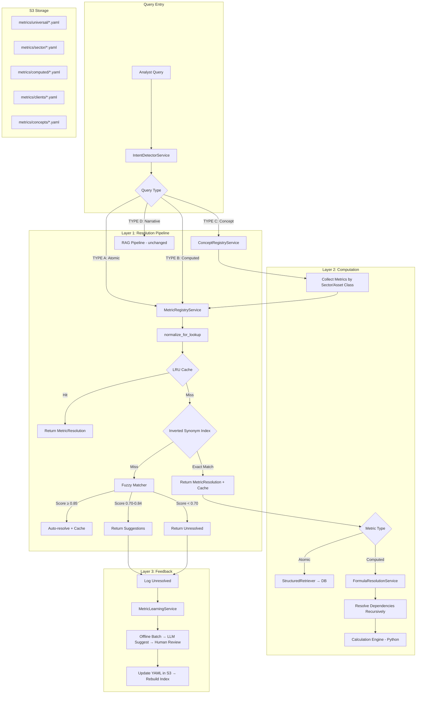

# Design Document: Metric Resolution Architecture

## Overview

This design replaces FundLens's broken metric resolution system — two parallel synonym maps, a normalize() that only strips underscores, silent fallback to raw keys, and SLM-based matching that produces confident wrong answers — with a three-layer deterministic resolution stack.

The architecture is:

1. **Layer 1 — Canonical Metric Registry + Inverted Synonym Index**: YAML files in S3 define every metric (atomic and computed). At startup, all synonyms are normalized and indexed into an in-memory hash map. Resolution is O(1) exact match → fuzzy fallback → suggestions. An LRU cache (10K entries) wraps the pipeline for sub-ms repeated queries.

2. **Layer 2 — Formula Registry + Concept Registry + Python Calculation Bridge**: Computed metrics are YAML-defined formulas with recursive dependency resolution. The TypeScript `FormulaResolutionService` acts as a dispatcher — it resolves the dependency DAG, fetches all atomic values from the DB in a single batch query, and packages `{ formula, inputs, output_format }` as a JSON payload to the Python Calculation Engine via HTTP POST `/calculate`. Python evaluates ALL formulas using `simpleeval` (safe expression evaluator) for inline expressions and named Python functions for complex calculations (CAGR, IRR, waterfall). Analytical concepts map questions like "How levered is this company?" to sector-filtered metric bundles. An Admin Formula UI allows operators to create, test, and submit new formulas for human review before production deployment.

3. **Layer 3 — Graceful Degradation + Learning Loop**: No silent failures. Unresolved queries always produce suggestions. Analyst corrections and cache misses feed an offline batch process that proposes new synonyms for human review.

The existing `extractPeriod()`, `extractTicker()`, `determinePeriodType()`, tenantId flow, and contextTicker flow are preserved as-is. The Python Calculation Engine (`financial_calculator.py`) is extended with a generic `/calculate` endpoint to serve as the SINGLE execution environment for ALL formula evaluation.

### PE Extensibility

The architecture is designed from day one to support both public equity and private equity asset classes. Every metric definition carries an `asset_class` array (`[public_equity, private_equity]` or a subset). The YAML directory structure includes a dedicated `pe_specific/` folder for PE-only metrics (IRR, MOIC, DPI, TVPI, fund-level metrics, credit metrics, operating metrics). The Concept Registry filters metric bundles by asset class — a "leverage" concept query for a PE portfolio company returns `net_debt_to_ltm_ebitda` and `total_leverage_ratio` instead of the public equity defaults. Client overlays also support PE firms with their own terminology (e.g., "distributable cash" → free_cash_flow). When the PE module is built, it plugs into this registry by adding YAML files — no code changes required.

### What Gets Deleted

- `extractMetrics()` regex map in `IntentDetectorService` (entire `metricPatterns` object)
- `MetricMappingService` class and `metric_mapping_enhanced.yaml`
- `normalize()` function in `MetricMappingService`
- `resolveMetricsWithSLM()` and `extractCandidatePhrases()` in `IntentDetectorService`
- `getComputedMetrics()` hardcoded if/else chain in `RAGService`
- Silent fallback in `QueryRouterService.normalizeMetrics()` that uses raw metric keys

### What Gets Created

- `MetricRegistryService` — loads YAML from S3, builds inverted index, owns resolution pipeline
- `FormulaResolutionService` — dispatcher: resolves dependency DAG, fetches atomic values, packages payload for Python calculation bridge (does NOT evaluate formulas itself)
- `ConceptRegistryService` — maps analytical questions to metric bundles
- `MetricLearningService` (enhanced) — logs unresolved queries, processes corrections, writes to S3
- `POST /calculate` endpoint in `financial_calculator.py` — generic formula evaluation using `simpleeval` + named functions, with `decimal` precision and audit trail
- Admin Formula Management API — CRUD for pending formulas, validation via Python, approval workflow, S3 write + index rebuild
- `pending_formulas` DB model — stores submitted formulas awaiting human review

### Pre-Built YAML Registry (User-Provided)

The complete metric and concept registry has been authored and is ready for deployment. Located in `.kiro/specs/metric-resolution-architecture/`:

| Category | File(s) | Count |
|---|---|---|
| Universal atomic metrics | `income_statement.yaml`, `balance_sheet.yaml`, `cash_flow.yaml`, `equity_statement.yaml` | 122 |
| Sector-specific metrics (GICS) | `revenue_by_industry.yaml`, `energy.yaml`, `materials.yaml`, `industrials.yaml`, `consumer_discretionary.yaml`, `consumer_staples.yaml`, `healthcare.yaml`, `financials.yaml`, `info_tech.yaml`, `communication_services.yaml`, `utilities.yaml`, `real_estate.yaml` | 71 |
| PE-specific metrics | `return_and_fund_metrics.yaml` | 14 |
| Computed/derived metrics | `all_computed_metrics.yaml` | 45 |
| Analytical concepts | `analytical_concepts.yaml` | 10 |
| Client overlay (example) | `third_avenue.yaml` | — |
| **Totals** | **20 YAML files** | **252 metrics, 1,209 synonyms** |

These files are uploaded to S3 at startup. Task 1.4 copies them into the S3 directory structure rather than generating them from scratch.

## Architecture



### Request Flow (Detailed)

1. Analyst query enters `IntentDetectorService.detectIntent()`
2. `extractTicker()`, `extractPeriod()`, `determinePeriodType()` run as-is (preserved)
3. Instead of `extractMetrics()` regex map, the query is passed to `MetricRegistryService.resolve()`
4. Resolution pipeline: normalize → LRU check → exact index lookup → fuzzy → suggestions
5. `QueryRouterService.route()` receives `MetricResolution[]` instead of `string[]`
6. `StructuredQuery.metrics` carries `MetricResolution[]` objects
7. `StructuredRetrieverService` uses `resolution.db_column` for WHERE clauses
8. For computed metrics, `FormulaResolutionService` resolves the dependency DAG, batch-fetches atomic values from DB, packages `{ formula, inputs, output_format }`, and dispatches to Python `/calculate` endpoint. Python evaluates the formula and returns `{ result, audit_trail }`.
9. `ResponseEnrichmentService.buildMarkdownTable()` uses `resolution.display_name` and wires `interpretation` thresholds to output (e.g., "Net Debt/EBITDA: 2.3x — Moderate")
10. Unresolved metrics are logged to `MetricLearningService` for offline processing

## Components and Interfaces

### MetricRegistryService

```typescript
@Injectable()
export class MetricRegistryService implements OnModuleInit {
  // In-memory structures
  private synonymIndex: Map<string, string>;           // normalized_synonym → canonical_id
  private metricsById: Map<string, MetricDefinition>;  // canonical_id → full definition
  private originalSynonyms: Map<string, string>;       // normalized_synonym → original text
  private lruCache: LRUCache<string, MetricResolution>;
  private dependencyGraph: Map<string, string[]>;      // canonical_id → dependency ids
  
  // S3 configuration
  private readonly s3Bucket: string;
  private readonly s3Prefix: string;

  async onModuleInit(): Promise<void>;                 // Load from S3, build index, validate
  
  // Core resolution
  resolve(query: string, tenantId?: string): MetricResolution;
  resolveMultiple(queries: string[], tenantId?: string): MetricResolution[];
  
  // Index management
  async rebuildIndex(): Promise<IndexBuildResult>;      // Reload from S3, rebuild
  
  // Tenant overlay
  private async loadClientOverlay(tenantId: string): Map<string, string>;
  
  // Monitoring
  getStats(): RegistryStats;
}
```

### MetricDefinition (YAML Schema → TypeScript)

```typescript
interface MetricDefinition {
  canonical_id: string;          // e.g., "cash_and_cash_equivalents"
  display_name: string;          // e.g., "Cash and Cash Equivalents"
  type: 'atomic' | 'computed';
  statement: 'income_statement' | 'balance_sheet' | 'cash_flow' | 'equity_statement' | 'supplemental' | null;
  category: string;
  asset_class: string[];
  industry: string;              // "all" | sector name (e.g., "banking", "saas_software", "energy")
  synonyms: string[];
  xbrl_tags: string[];
  db_column?: string;            // Derived at load time for atomic metrics; null for supplemental/PE metrics
  formula?: string;              // Required for computed (e.g., "gross_profit / revenue * 100")
  dependencies?: string[];       // Required for computed (canonical_ids of dependencies)
  output_format?: string;        // "percentage" | "currency" | "ratio" | "days" | "currency_per_share"
  output_suffix?: string;        // "%" | "x" | " days"
  interpretation?: Record<string, string>;  // e.g., { strong: "> 15%", adequate: "10% - 15%" }
  calculation_notes?: string;
}
```

### MetricResolution (Resolution Output)

```typescript
interface MetricResolution {
  canonical_id: string;
  display_name: string;
  type: 'atomic' | 'computed';
  confidence: 'exact' | 'fuzzy_auto' | 'unresolved';
  fuzzy_score: number | null;
  original_query: string;
  match_source: string;          // Which synonym or method matched
  suggestions: MetricSuggestion[] | null;
  db_column?: string;            // For atomic metrics
  formula?: string;              // For computed metrics
  dependencies?: string[];       // For computed metrics
}

interface MetricSuggestion {
  canonical_id: string;
  display_name: string;
  fuzzy_score: number;
}
```

### FormulaResolutionService (Dispatcher Pattern)

The FormulaResolutionService does NOT evaluate formulas. It is a dispatcher that:
1. Resolves the dependency DAG (which metrics are needed, in what order)
2. Fetches all atomic values from the DB in a single batch query
3. Packages `{ formula, inputs, output_format }` as a JSON payload
4. Sends to Python calculator via HTTP POST `/calculate`
5. Gets back `{ result, audit_trail }`
6. Caches resolved dependency values per (ticker, period) to avoid redundant DB hits

```typescript
@Injectable()
export class FormulaResolutionService {
  private resolutionCache: Map<string, ResolvedValue>; // key: `${ticker}:${period}:${metricId}`

  constructor(
    private readonly registry: MetricRegistryService,
    private readonly prisma: PrismaService,
    private readonly calculator: FinancialCalculatorService,
  ) {}

  // Resolve a computed metric — dispatches to Python for evaluation
  async resolveComputed(
    resolution: MetricResolution,
    ticker: string,
    period?: string,
  ): Promise<ComputedMetricResult>;

  // Recursive dependency resolution (builds input map, does NOT evaluate)
  private async resolveDependency(
    metricId: string,
    ticker: string,
    period?: string,
    visited?: Set<string>,
  ): Promise<ResolvedValue>;

  // Batch fetch all atomic dependencies from DB in one query
  private async batchFetchAtomicValues(
    metricIds: string[],
    ticker: string,
    period?: string,
  ): Promise<Map<string, ResolvedValue>>;

  // Package and dispatch to Python /calculate endpoint
  private async dispatchToPython(
    formula: string,
    inputs: Record<string, number>,
    outputFormat: string,
  ): Promise<PythonCalculationResult>;
}

interface ComputedMetricResult {
  canonical_id: string;
  display_name: string;
  value: number | null;
  formula: string;
  resolved_inputs: Record<string, ResolvedValue>;
  explanation: string | null;    // Non-null when value is null (missing dependency)
  audit_trail: AuditTrail | null; // From Python calculation engine
  interpretation: string | null;  // e.g., "Moderate (2.0x - 4.0x)" from YAML thresholds
}

interface ResolvedValue {
  metric_id: string;
  display_name: string;
  value: number | null;
  source: string;                // "database" | "computed" | "cache"
  period: string;
  filing_type?: string;
}

interface PythonCalculationResult {
  result: number;
  audit_trail: AuditTrail;
}

interface AuditTrail {
  formula: string;
  inputs: Record<string, number>;
  intermediate_steps: string[];
  result: number;
  execution_time_ms: number;
}
```

### Python `/calculate` Endpoint Contract

```python
# POST /calculate
# Request:
{
  "formula": "gross_profit / revenue * 100",   # inline expression
  "inputs": {
    "gross_profit": 45000000000,
    "revenue": 120000000000
  },
  "output_format": "percentage"
}

# OR named function:
{
  "formula": "cagr(revenue, 3)",
  "inputs": {
    "revenue": [80000000000, 90000000000, 100000000000, 120000000000]  # 4 values for 3-year CAGR
  },
  "output_format": "percentage"
}

# Response:
{
  "result": 37.5,
  "audit_trail": {
    "formula": "gross_profit / revenue * 100",
    "inputs": {"gross_profit": 45000000000, "revenue": 120000000000},
    "intermediate_steps": ["45000000000 / 120000000000 = 0.375", "0.375 * 100 = 37.5"],
    "result": 37.5,
    "execution_time_ms": 2
  }
}

# Error Response:
{
  "error": "Missing variable 'gross_profit' in inputs",
  "formula": "gross_profit / revenue * 100",
  "provided_inputs": ["revenue"]
}
```

### Two Formula Modes

1. **Inline expressions** (simple arithmetic): `gross_profit / revenue * 100`, `total_debt - cash_and_cash_equivalents`
   - Evaluated by `simpleeval` (safe Python expression evaluator, NOT `eval()`)
   - Variables are substituted from the `inputs` dict
   - Supports: `+`, `-`, `*`, `/`, `**`, `()`, comparison operators

2. **Named functions** (complex multi-period): `cagr(revenue, 3)`, `irr(cash_flows)`, `compound_growth(start, end, periods)`
   - Registered as safe functions in the `simpleeval` evaluator
   - Handle multi-period data, iterative calculations, special financial math
   - `cagr(values, periods)` — compound annual growth rate
   - `irr(cash_flows)` — internal rate of return (Newton's method)
   - `compound_growth(start, end, periods)` — simple compound growth

### Admin Formula Management Flow

```
Admin UI → POST /api/admin/formulas
  ├── Validate: send test payload to Python /calculate
  │   ├── Success → Save to pending_formulas (status: pending_review)
  │   └── Failure → Return error to admin (syntax error, missing var, etc.)
  │
  ├── GET /api/admin/formulas/pending → List pending formulas
  │
  ├── POST /api/admin/formulas/{id}/approve
  │   ├── Write to S3 YAML (metrics/computed/all_computed_metrics.yaml or new file)
  │   ├── Trigger MetricRegistryService.rebuildIndex()
  │   └── Update pending_formulas status → approved
  │
  └── POST /api/admin/formulas/{id}/reject
      └── Update pending_formulas status → rejected, store reason
```

### ConceptRegistryService

```typescript
@Injectable()
export class ConceptRegistryService implements OnModuleInit {
  private concepts: Map<string, ConceptDefinition>;
  private triggerIndex: Map<string, string>;  // normalized trigger → concept_id

  async onModuleInit(): Promise<void>;

  matchConcept(query: string): ConceptMatch | null;
  
  getMetricBundle(
    conceptId: string,
    sector: string,
    assetClass: string,
  ): MetricBundle;
}

interface ConceptDefinition {
  id: string;
  display_name: string;
  description: string;
  triggers: string[];
  primary_metrics: Record<string, string[]>;   // sector → metric_ids
  secondary_metrics: Record<string, string[]>; // sector → metric_ids
  context_prompt?: string;
  presentation: {
    layout: 'profile' | 'single_value' | 'comparison';
    include_peer_comparison: boolean;
    include_historical_trend: boolean;
  };
}

interface MetricBundle {
  primary: string[];    // canonical_ids
  secondary: string[];  // canonical_ids
  context_prompt?: string;
}

// Asset class filtering example:
// For public equity "leverage" query → net_debt_to_ebitda, debt_to_equity
// For private equity "leverage" query → net_debt_to_ltm_ebitda, total_leverage_ratio, fixed_charge_coverage
// The same concept definition serves both — the asset_class filter on each metric
// and the sector/asset_class keys in the concept YAML handle the routing.
```

### Updated StructuredQuery

```typescript
interface StructuredQuery {
  tickers: string[];
  metrics: MetricResolution[];    // Changed from string[]
  period?: string;
  periodType?: PeriodType;
  filingTypes: DocumentType[];
  includeComputed: boolean;
}
```

### Updated QueryRouterService Integration

```typescript
// In QueryRouterService — replaces normalizeMetrics()
private async resolveMetrics(
  metrics: string[],
  tenantId?: string,
): Promise<MetricResolution[]> {
  return this.metricRegistry.resolveMultiple(metrics, tenantId);
}
```

### normalize_for_lookup

```typescript
function normalizeForLookup(text: string): string {
  return text.toLowerCase().replace(/[^a-z0-9]/g, '');
}
```

### S3 YAML Directory Structure

S3 bucket: `fundlens-documents-dev` (existing, from `S3_BUCKET_NAME` env var).
S3 prefix: `metrics/` (configured via `METRIC_REGISTRY_S3_PREFIX` env var).

Source YAML files are located in `.kiro/specs/metric-resolution-architecture/` and uploaded to S3 in this structure:

```
s3://fundlens-documents-dev/metrics/
  universal/
    income_statement.yaml          # 28 metrics (Revenue → EBIT, EBITDA, Adj Net Income)
    balance_sheet.yaml             # 30 metrics (Cash → Total Equity)
    cash_flow.yaml                 # 28 metrics (CFO → FCF)
    equity_statement.yaml          # 22 metrics (Beginning → Ending balances)
  sector/
    revenue_by_industry.yaml       # 20 sector revenue variants (SaaS, Banking, Insurance, etc.)
    energy.yaml                    # 7 metrics (Reserves, Production, LOE, EBITDAX, etc.)
    materials.yaml                 # 3 metrics (Ore Grade, AISC, Tonnage)
    industrials.yaml               # 3 metrics (Backlog, Book-to-Bill, Capacity Util)
    consumer_discretionary.yaml    # 3 metrics (SSS, AUV, Store Count)
    consumer_staples.yaml          # 2 metrics (Organic Growth, Price/Mix/Volume)
    healthcare.yaml                # 3 metrics (Pipeline, Patent Cliff, MLR)
    financials.yaml                # 12 metrics (NIM, CET1, Efficiency Ratio, Combined Ratio, etc.)
    info_tech.yaml                 # 8 metrics (ARR, NRR, CAC, LTV/CAC, Rule of 40, etc.)
    communication_services.yaml    # 3 metrics (Subscribers, Churn, ARPS)
    utilities.yaml                 # 3 metrics (Rate Base, Allowed ROE, Generation Capacity)
    real_estate.yaml               # 5 metrics (FFO, NOI, Occupancy, Cap Rate, NAV)
  pe_specific/
    return_and_fund_metrics.yaml   # 14 metrics (MOIC, IRR, DPI, TVPI, Dry Powder, etc.)
  computed/
    all_computed_metrics.yaml      # 45 formulas with dependencies
  concepts/
    analytical_concepts.yaml       # 10 concepts with triggers, metrics, and RAG prompts
  clients/
    third_avenue.yaml              # Third Avenue Management terminology overlay
    {tenant_id}.yaml               # Additional client overlays
```

## Data Models

### MetricDefinition YAML Schema (Atomic)

The actual YAML schema used across all 20 registry files (see `.kiro/specs/metric-resolution-architecture/`):

```yaml
cash_and_cash_equivalents:
  display_name: "Cash and Cash Equivalents"
  type: atomic
  statement: balance_sheet
  category: current_assets
  asset_class: [public_equity, private_equity]
  industry: all
  synonyms:
    - Cash
    - Cash on Hand
    - Cash Equivalents
    - Marketable Securities
    - Short-term Investments
  xbrl_tags:
    - us-gaap:CashAndCashEquivalentsAtCarryingValue
    - ifrs-full:CashAndCashEquivalents
  calculation_notes: "Highly liquid assets usually convertible to cash within 3 months"
```

Note: The `db_column` field from the MetricDefinition TypeScript interface is NOT in the YAML files. It must be derived at load time by mapping `canonical_id` to the actual PostgreSQL column name in the `financialMetric` table. For universal metrics (income_statement, balance_sheet, cash_flow, equity_statement), the canonical_id typically matches the db column. For sector-specific and PE metrics, `db_column` may be null (supplemental KPIs not stored in the standard table).

### MetricDefinition YAML Schema (Computed)

```yaml
net_debt:
  display_name: "Net Debt"
  type: computed
  statement: null
  category: leverage
  asset_class: [public_equity, private_equity]
  industry: all
  formula: "total_debt - cash_and_cash_equivalents"
  dependencies:
    - long_term_debt
    - short_term_debt
    - cash_and_cash_equivalents
  synonyms:
    - net debt
    - net borrowings
    - net leverage amount
    - debt net of cash
    - debt minus cash
    - net financial debt
  output_format: currency
  calculation_notes: "Total debt (short-term + long-term) minus cash and equivalents"
```

Note: Computed metrics include `output_format`, `output_suffix`, and optional `interpretation` fields for display formatting. Some computed metrics (e.g., `return_on_invested_capital`) have dependencies that differ from the formula variables — the formula uses intermediate concepts like `nopat` and `invested_capital` while dependencies list the actual atomic metrics needed.

### Concept YAML Schema

From `analytical_concepts.yaml` (10 concepts pre-built):

```yaml
leverage:
  display_name: "Leverage Analysis"
  description: "Comprehensive view of debt levels, coverage, capacity, and refinancing risk"
  triggers:
    - how levered
    - leverage
    - how much debt
    - debt load
    - gearing
    - balance sheet risk
    - how indebted
    - debt situation
    - debt profile
    - capital structure
    - debt capacity
    - borrowing capacity
    - financial risk
    - overleveraged
    - underleveraged
    - debt heavy
    - debt light
  primary_metrics:
    all:
      - net_debt_to_ebitda
      - debt_to_equity
      - interest_coverage
    energy:
      - net_debt_to_ebitda
      - debt_to_equity
      - interest_coverage
    real_estate:
      - net_debt_to_ebitda
      - debt_to_equity
    banking:
      - tier_1_capital_ratio
      - loan_to_deposit_ratio
    private_equity:
      - net_debt_to_ebitda
      - interest_coverage
      - leverage_at_entry
  secondary_metrics:
    all:
      - total_debt
      - net_debt
      - debt_to_total_assets
      - debt_to_ebitda
    private_equity:
      - equity_contribution
  context_prompt: >
    From the most recent 10-K, 10-Q, and earnings call transcripts,
    summarize management discussion of leverage targets, debt covenants,
    refinancing plans, debt maturity schedule, and any commentary on
    ability to service debt. Note any covenant compliance issues,
    upcoming maturities, or changes in credit ratings mentioned.
  presentation:
    layout: profile
    include_peer_comparison: true
    include_historical_trend: true
```

### Client Overlay YAML Schema

From `third_avenue.yaml` (pre-built example):

```yaml
client: third_avenue_management
notes: >
  Third Avenue is a deep value fund. They emphasize balance sheet protection,
  margin of safety, and management alignment. Terminology reflects Marty Whitman
  value investing philosophy.
overrides:
  net_income:
    additional_synonyms:
      - owner earnings
      - real economic earnings
      - Whitman earnings
  ebitda:
    additional_synonyms:
      - cash operating profit
      - operating cash earnings
  free_cash_flow:
    additional_synonyms:
      - distributable cash
      - true free cash flow
      - owner free cash flow
  price_to_book:
    additional_synonyms:
      - discount to NAV
      - book value discount
      - asset discount
  net_debt_to_ebitda:
    additional_synonyms:
      - leverage safety
      - debt coverage
      - debt safety ratio
```

### Unresolved Query Log (Database)

```prisma
model MetricResolutionLog {
  id          String   @id @default(uuid())
  tenantId    String
  rawQuery    String
  confidence  String   // "exact" | "fuzzy_auto" | "unresolved"
  resolvedTo  String?  // canonical_id if resolved
  suggestions String[] // canonical_ids offered
  userChoice  String?  // canonical_id if user clicked a suggestion
  timestamp   DateTime @default(now())
  
  @@index([tenantId, timestamp])
  @@index([confidence, timestamp])
}
```

### Pending Formula (Database)

```prisma
model PendingFormula {
  id              String   @id @default(uuid())
  canonicalId     String   // proposed canonical_id (e.g., "custom_leverage_ratio")
  displayName     String
  formula         String   // e.g., "net_debt / ebitda * 100"
  dependencies    Json     // JSON array of canonical_ids: ["net_debt", "ebitda"]
  outputFormat    String   // "percentage" | "currency" | "ratio" | "days" | "currency_per_share"
  category        String   // "profitability" | "leverage" | "liquidity" | etc.
  industry        String   @default("all")
  assetClass      Json     @default("[\"public_equity\"]") // JSON array
  interpretation  Json?    // optional: { "strong": "> 15%", "adequate": "10% - 15%" }
  synonyms        Json?    // optional: JSON array of synonym strings
  calculationNotes String?
  submittedBy     String
  reviewedBy      String?
  status          String   @default("pending_review") // "pending_review" | "approved" | "rejected"
  rejectionReason String?
  submittedAt     DateTime @default(now())
  reviewedAt      DateTime?
  
  @@index([status])
  @@index([submittedAt])
}
```

### Dependency Graph Validation

At startup, the dependency graph is built from all computed metrics and validated as a DAG using topological sort. If a cycle is detected, the service logs the cycle path and excludes those metrics from the registry.

```
Example valid DAG:
  net_debt_to_ebitda → [net_debt, ebitda]
  net_debt → [total_debt, cash_and_cash_equivalents]
  ebitda → [operating_income, depreciation_amortization]
  
  Topological order: total_debt, cash_and_cash_equivalents, operating_income,
                     depreciation_amortization, net_debt, ebitda, net_debt_to_ebitda
```


## Correctness Properties

*A property is a characteristic or behavior that should hold true across all valid executions of a system — essentially, a formal statement about what the system should do. Properties serve as the bridge between human-readable specifications and machine-verifiable correctness guarantees.*

### Property 1: Synonym Resolution Completeness

*For any* metric in the registry and *for any* of its synonyms (canonical_id, display_name, synonym list entries, XBRL tag labels), resolving that synonym through the Resolution_Pipeline should return a MetricResolution with the correct canonical_id and confidence "exact".

**Validates: Requirements 1.4, 3.4**

### Property 2: Resolution Idempotence

*For any* query string, resolving it through the Resolution_Pipeline twice should return MetricResolution objects with identical canonical_id, confidence, and display_name fields.

**Validates: Requirements 3.1, 3.2**

### Property 3: normalize_for_lookup Output Invariant

*For any* input string, the output of normalize_for_lookup should contain only lowercase alphanumeric characters (a-z, 0-9) and nothing else. Additionally, normalize_for_lookup should be idempotent: normalizing an already-normalized string should return the same string.

**Validates: Requirements 2.1**

### Property 4: Fuzzy Threshold Classification

*For any* fuzzy match result with a numeric score, the confidence classification should be deterministic: score >= 0.85 produces confidence "fuzzy_auto", score in [0.70, 0.85) produces confidence "unresolved" with non-empty suggestions, and score < 0.70 produces confidence "unresolved" with empty or null suggestions.

**Validates: Requirements 4.2, 4.3, 4.4**

### Property 5: MetricResolution Structural Completeness

*For any* query string (including empty strings, random text, and valid metric names), the Resolution_Pipeline should return a MetricResolution object with all required fields populated: canonical_id (or empty for unresolved), display_name (or empty for unresolved), type, confidence, original_query matching the input, and match_source.

**Validates: Requirements 5.1, 5.2**

### Property 6: Resolved Metric Type-Specific Fields

*For any* MetricResolution with confidence "exact" or "fuzzy_auto", if the metric type is "atomic" then db_column must be non-null, and if the metric type is "computed" then formula and dependencies must be non-null.

**Validates: Requirements 5.3**

### Property 7: Unresolved Suggestions Bounded

*For any* MetricResolution with confidence "unresolved" and non-null suggestions, the suggestions array should contain at most 3 entries, and each entry should have a valid canonical_id, display_name, and fuzzy_score.

**Validates: Requirements 5.4**

### Property 8: Client Overlay Additive Merge

*For any* universal synonym that resolves to a metric before a client overlay is applied, that same synonym should still resolve to the same metric after the overlay is applied. The overlay should only add new resolution paths, never remove existing ones.

**Validates: Requirements 6.2**

### Property 9: Tenant Isolation

*For any* two distinct tenantIds with different client overlays, a synonym that exists only in tenant A's overlay should resolve successfully for tenant A but should NOT resolve (or should resolve differently) for tenant B.

**Validates: Requirements 6.3**

### Property 10: Display Name in User-Facing Output

*For any* MetricResolution used to build a markdown table or user-facing response, the output text should contain the display_name and should NOT contain the canonical_id (snake_case format) as visible text.

**Validates: Requirements 7.4, 9.4**

### Property 11: No Empty Results Without Explanation

*For any* query that produces zero metric results from the database, the response should contain a non-empty explanation string (either suggestions or a "not mapped" message). The response should never be an empty table with no accompanying text.

**Validates: Requirements 9.3**

### Property 12: DAG Validation Correctness

*For any* set of computed metric definitions, if the dependency graph contains a cycle then the DAG validator should detect it and report the cycle. If the dependency graph has no cycles, the validator should accept it.

**Validates: Requirements 10.2, 10.3**

### Property 13: Computed Metric Dependency Resolution (Python Bridge)

*For any* computed metric where all atomic dependencies have non-null values in the database, the FormulaResolutionService should dispatch to the Python `/calculate` endpoint and return a non-null computed value with all resolved_inputs populated and a non-null audit_trail.

**Validates: Requirements 10.4, 16.1**

### Property 14: Missing Dependency Returns Null With Explanation (No Python Call)

*For any* computed metric where at least one atomic dependency has a null value, the FormulaResolutionService should return a null value with a non-empty explanation string that identifies the missing dependency by display_name. The result should never be 0. The request should NOT be dispatched to Python.

**Validates: Requirements 10.5, 10.6**

### Property 15: Computed Metric Transparency (With Audit Trail)

*For any* successfully computed metric result (non-null value), the result should include the formula string, all resolved input values with their sources, the final computed value, and a non-null audit_trail from the Python engine containing execution_time_ms. The number of resolved_inputs should equal the number of dependencies in the metric definition.

**Validates: Requirements 10.7, 16.5**

### Property 16: Concept Trigger Matching

*For any* concept in the Concept_Registry and *for any* of its trigger phrases, matching that trigger against the registry should return the correct concept.

**Validates: Requirements 11.2**

### Property 17: Concept Metric Collection by Sector

*For any* concept and *for any* sector, the collected metric bundle should include all metrics from the "all" key plus all metrics from the sector-specific key. The primary and secondary metric lists should not contain duplicates.

**Validates: Requirements 11.3**

### Property 18: Atomic Metric db_column Validation

*For any* metric in the registry with type "atomic", the db_column field should be non-null and non-empty.

**Validates: Requirements 1.6**

### Property 19: Python Formula Evaluation Safety

*For any* formula string and inputs dict sent to the Python `/calculate` endpoint, the endpoint should NEVER execute arbitrary Python code. Only `simpleeval`-safe expressions and registered named functions should be evaluated. Attempting to call `os.system`, `import`, `exec`, `eval`, or access `__builtins__` should return an error, not execute.

**Validates: Requirements 16.3**

### Property 20: Formula Variable Completeness

*For any* formula string sent to the Python `/calculate` endpoint, if the formula references a variable not present in the inputs dict, the endpoint should return an error identifying the missing variable. It should never silently substitute 0 or None for missing variables.

**Validates: Requirements 16.6**

### Property 21: Admin Formula Validation Before Persistence

*For any* formula submitted via the Admin Formula API, the formula MUST be validated against the Python `/calculate` endpoint with test inputs BEFORE being saved to the `pending_formulas` table. A formula that fails Python validation should never reach `pending_review` status.

**Validates: Requirements 17.2, 17.3**

## Error Handling

### Startup Errors

| Error | Handling | Impact |
|-------|----------|--------|
| S3 bucket unreachable | Retry 3x with exponential backoff, then fail startup with clear error | Application does not start — metric resolution requires the registry |
| YAML parse error in one file | Log error with file path and line number, skip file, continue loading others | Partial registry — metrics from that file unavailable |
| Schema validation failure | Log metric ID and missing/invalid fields, skip entry, continue | Individual metric unavailable |
| Synonym collision | Log warning with both metric IDs and colliding synonym, keep first | Second metric's synonym not indexed via that path (other synonyms still work) |
| Circular dependency detected | Log cycle path, exclude all metrics in the cycle from registry | Computed metrics in cycle unavailable |
| db_column validation failure | Log warning with metric ID and missing column, keep metric in registry | Metric resolves but DB lookup may fail — caught at query time |

### Runtime Errors

| Error | Handling | Impact |
|-------|----------|--------|
| Resolution pipeline exception | Catch, log, return MetricResolution with confidence "unresolved" and error in match_source | Analyst sees suggestions, never a crash |
| Fuzzy matcher timeout (>50ms) | Return whatever candidates found so far, log timeout | Partial suggestions, degraded but functional |
| S3 unreachable during overlay load | Use universal registry only, log warning | Tenant-specific synonyms unavailable for this request |
| DB value missing for atomic metric | Return null with explanation in ComputedMetricResult | Analyst sees "Missing: [metric] for [period]" |
| Calculation Engine (Python) unreachable | Return null with explanation, log error, set circuit breaker | Computed metrics unavailable, atomic metrics still work |
| Python `/calculate` formula error | Return null with Python error message in explanation | Individual computed metric fails, others unaffected |
| Admin formula validation failure | Return validation error to admin UI, do not save | Formula not submitted — admin corrects and retries |
| Index rebuild failure | Keep existing index, log error, return failure status via API | No disruption — old index continues serving |

### Invariants

1. The Resolution_Pipeline never throws an unhandled exception to the caller — all errors are caught and returned as MetricResolution objects with appropriate confidence and explanation.
2. The system never returns 0 for a missing value — always null with explanation.
3. The system never displays a canonical_id in user-facing text — always display_name.
4. The system never produces an empty result set without an explanation.

## Testing Strategy

### Dual Testing Approach

This feature requires both unit tests and property-based tests working together:

- **Unit tests**: Verify specific examples (known metric synonyms → expected resolutions), edge cases (empty strings, SQL injection attempts, Unicode), integration points (S3 loading, DB column validation), and error conditions (missing files, malformed YAML).
- **Property tests**: Verify universal properties across randomly generated inputs — normalization invariants, resolution completeness, tenant isolation, DAG validation, fuzzy threshold classification.

### Property-Based Testing Configuration

- **Library**: fast-check (already in project dependencies)
- **Minimum iterations**: 100 per property test
- **Test runner**: Jest (`npx jest --config test/jest-unit.json`)
- **Tag format**: `Feature: metric-resolution-architecture, Property {N}: {title}`

Each correctness property (Properties 1-21) maps to a single property-based test. Properties are tagged with their design document reference for traceability.

### Unit Test Focus Areas

- Specific synonym → metric resolution examples from the architecture doc (e.g., "cash" → cash_and_cash_equivalents, "lev ratio" → net_debt_to_ebitda)
- YAML parsing with known valid and invalid files
- S3 loading mock integration
- Client overlay merge with known overlay files
- Computed metric formulas with known inputs and expected outputs
- Concept trigger matching with known queries
- Error conditions: empty input, null input, extremely long strings, special characters

### Test File Organization

```
test/
  unit/
    metric-registry.service.spec.ts          # Unit tests for MetricRegistryService
    formula-resolution.service.spec.ts       # Unit tests for FormulaResolutionService
    concept-registry.service.spec.ts         # Unit tests for ConceptRegistryService
    normalize-for-lookup.spec.ts             # Unit tests for normalization function
    formula-management.service.spec.ts       # Unit tests for Admin Formula Management
  properties/
    metric-resolution.property.spec.ts       # Properties 1-11, 18
    dag-validation.property.spec.ts          # Property 12
    formula-resolution.property.spec.ts      # Properties 13-15
    concept-registry.property.spec.ts        # Properties 16-17
    python-formula-safety.property.spec.ts   # Properties 19-20
    admin-formula-validation.property.spec.ts # Property 21
```

### Resolution Accuracy Test Suite

Per the architecture document, build a test set of 500+ query → expected_metric_id pairs covering:
- Exact canonical names (all 252 metrics)
- Common synonyms and abbreviations (sampled from the 1,209 pre-built synonyms)
- Analyst shorthand (e.g., "lev ratio" → net_debt_to_ebitda, "GM%" → gross_margin_pct)
- Ambiguous terms that should resolve correctly
- Terms that should NOT match (e.g., "revenue" should not match "cost of revenue")
- Edge cases: empty strings, nonsense input, special characters
- Cross-file duplicate handling (e.g., "net income" appears in income_statement, cash_flow, equity_statement — should resolve consistently)
