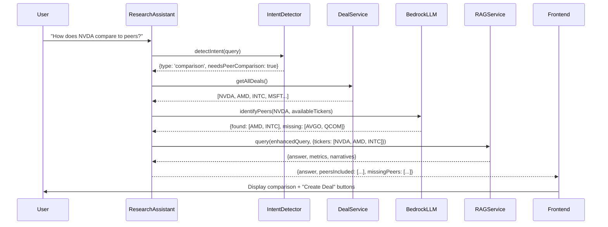

# Design Document: Multi-Ticker Peer Comparison

## Overview

This feature extends the existing research assistant to handle peer comparison queries. The implementation is minimal - we add peer detection to the existing intent detector, leverage `getAllDeals()` to find available peers, and expand the RAG query to include multiple tickers when peers are available.

Key principle: **Leverage existing services, add minimal new code.**

## Architecture



## Components and Interfaces

### 1. Intent Detector Enhancement (intent-detector.service.ts)

Add `needsPeerComparison` flag to existing `QueryIntent` interface:

```typescript
// Add to existing QueryIntent interface
interface QueryIntent {
  // ... existing fields
  needsPeerComparison?: boolean;  // NEW: true when query asks about peers/competitors
}
```

Extend `needsComparison()` method to detect peer-specific keywords:

```typescript
// Add peer keywords to existing comparison detection
private needsPeerComparison(query: string): boolean {
  const peerKeywords = ['peers', 'competitors', 'peer group', 'comparable', 'comps'];
  return peerKeywords.some(kw => query.toLowerCase().includes(kw));
}
```

### 2. Research Assistant Enhancement (research-assistant.service.ts)

Add peer comparison handling to `sendMessage()`:

```typescript
// New method to identify peers from tenant's deals
private async identifyPeersFromDeals(
  primaryTicker: string,
  tenantId: string
): Promise<{ found: string[]; missing: string[]; rationale: string }> {
  // 1. Get tenant's available deals
  const deals = await this.dealService.getAllDeals();
  const availableTickers = deals
    .filter(d => d.ticker && d.status !== 'error')
    .map(d => d.ticker.toUpperCase());
  
  // 2. Use LLM to identify which are relevant peers
  const prompt = `Given ${primaryTicker}, identify relevant peer companies from this list: ${availableTickers.join(', ')}.
Also suggest 2-3 peers NOT in the list that would be valuable to add.
Return JSON: {"found": ["ticker1"], "missing": ["ticker2"], "rationale": "brief explanation"}`;
  
  const response = await this.bedrock.invokeClaude({ prompt, max_tokens: 300 });
  return JSON.parse(response);
}
```

### 3. RAG Service Enhancement (rag.service.ts)

The RAG service already supports ticker arrays in `structuredQuery.tickers`. We just need to pass multiple tickers:

```typescript
// In query router, expand tickers when peer comparison detected
if (intent.needsPeerComparison && peerTickers.length > 0) {
  const allTickers = [primaryTicker, ...peerTickers].slice(0, 5); // Max 5
  plan.structuredQuery.tickers = allTickers;
}
```

### 4. Response Format Enhancement

Add peer metadata to RAG response:

```typescript
interface RAGResponse {
  // ... existing fields
  peerComparison?: {
    primaryTicker: string;
    peersIncluded: string[];
    missingPeers: { ticker: string; reason: string }[];
  };
}
```

### 5. Frontend Enhancement (workspace.html)

Render "Create Deal" buttons when missing peers are returned:

```html
<!-- In research message template -->
<template x-if="message.peerComparison?.missingPeers?.length > 0">
  <div class="mt-3 p-3 bg-amber-50 rounded-lg">
    <p class="text-sm text-amber-800 mb-2">
      Add these peers for complete comparison:
    </p>
    <div class="flex flex-wrap gap-2">
      <template x-for="peer in message.peerComparison.missingPeers">
        <button @click="createDealForTicker(peer.ticker)"
                class="px-3 py-1 bg-amber-100 hover:bg-amber-200 rounded text-sm">
          + <span x-text="peer.ticker"></span>
        </button>
      </template>
    </div>
  </div>
</template>
```

## Data Models

No new database tables required. We leverage existing:
- `deals` table (via `getAllDeals()`)
- `financial_metrics` table (via RAG structured retrieval)
- `narrative_chunks` table (via RAG semantic retrieval)

## Correctness Properties

*A property is a characteristic or behavior that should hold true across all valid executions of a system-essentially, a formal statement about what the system should do. Properties serve as the bridge between human-readable specifications and machine-verifiable correctness guarantees.*

Property 1: Peer intent detection with ticker extraction
*For any* query containing peer comparison keywords (peers, competitors, compare, vs), the intent detector SHALL return `needsPeerComparison: true` AND extract the primary ticker from the query.
**Validates: Requirements 1.1, 1.2**

Property 2: Peer identification returns valid subset
*For any* primary ticker and list of available tickers, the LLM peer identification SHALL return only tickers that exist in the available list for `found` and only tickers NOT in the available list for `missing`.
**Validates: Requirements 2.2**

Property 3: Multi-ticker query bounded to 5
*For any* peer comparison query with N identified peers, the RAG query SHALL include at most 5 tickers (primary + up to 4 peers).
**Validates: Requirements 3.1**

Property 4: Response attribution completeness
*For any* multi-ticker RAG response, every metric and narrative in the response SHALL have a ticker attribution that matches one of the queried tickers.
**Validates: Requirements 3.2**

Property 5: Fallback response structure
*For any* peer comparison query where no peers exist in tenant deals, the response SHALL contain both single-ticker analysis AND a `missingPeers` array with at least one suggested peer ticker.
**Validates: Requirements 4.1, 4.2**

## Error Handling

1. **LLM peer identification fails**: Fall back to returning empty `found` array and suggest common industry peers based on ticker sector
2. **No tenant deals available**: Return single-ticker analysis with generic peer suggestions
3. **RAG query fails for some tickers**: Continue with available data, note gaps in response
4. **Invalid ticker format**: Validate tickers before LLM call, reject malformed inputs

## Testing Strategy

**Unit Tests:**
- Intent detector peer keyword detection
- Peer identification response parsing
- Ticker count limiting logic
- Response metadata structure validation

**Property Tests (using fast-check):**
- Property 1: Generate queries with/without peer keywords, verify detection
- Property 2: Generate ticker lists, verify found/missing partition
- Property 3: Generate peer lists of varying sizes, verify max 5 limit
- Property 4: Generate multi-ticker responses, verify attribution
- Property 5: Generate fallback scenarios, verify response structure

**Integration Tests:**
- End-to-end peer comparison flow with mock deals
- Frontend "Create Deal" button rendering

