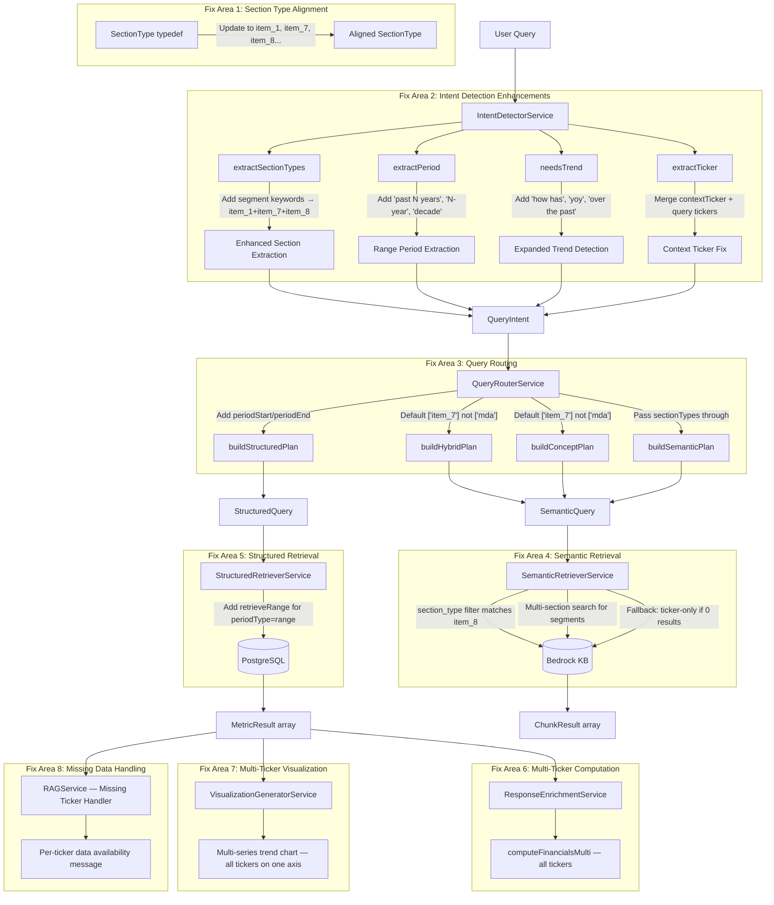

# Design Document: RAG Query Robustness — Disclosure, Segment, and Multi-Ticker Trend Fixes

## Overview

This design addresses four categories of broken analyst queries in FundLens's RAG pipeline:

1. **Qualitative disclosure queries returning nothing** (stock-based compensation, leases, ASC 842) — caused by a `SectionType` mismatch where the type definition uses `'mda'` but Bedrock KB metadata uses `'item_7'`, and the hybrid/concept plan defaults to `['mda']` which matches nothing.
2. **Segment queries returning weak answers** — caused by `extractSectionTypes()` only detecting `item_1` for "business" keyword, missing the segment disclosures in Item 7 (MD&A) and Item 8 (Notes).
3. **Multi-ticker trend comparison queries broken** — caused by `extractPeriod()` not understanding "past N years", `needsTrend()` missing common phrases, `computeFinancials()` only processing the first ticker, `generateVisualization()` being mutually exclusive between trend and comparison, and `extractTicker()` suppressing query tickers when contextTicker is present.
4. **Missing ticker data producing unhelpful fallback** — no identification of which tickers lack data.

The approach is surgical: modify existing services with minimal blast radius. No new services are created. The existing `MetricRegistryService`, `ConceptRegistryService`, and `FormulaResolutionService` architecture is preserved and leveraged.

## Architecture



## Components and Interfaces

### 1. SectionType Type Alignment

The `SectionType` type in `src/rag/types/query-intent.ts` currently defines:
```typescript
export type SectionType = 'mda' | 'risk_factors' | 'business' | 'notes' | 'financial_statements';
```

But the database, chunk exporter, and `extractSectionTypes()` all use `item_*` values. The Bedrock KB `buildFilter()` sends `section_type` metadata with whatever value is in `sectionTypes[]`. When `buildHybridPlan()` defaults to `['mda']`, the Bedrock KB filter searches for `section_type = 'mda'` which matches zero chunks (they're labeled `item_7`).

**Fix**: Update the type to match reality:
```typescript
export type SectionType = 'item_1' | 'item_1a' | 'item_2' | 'item_3' | 'item_7' | 'item_8';
```

### 2. QueryRouterService — Default Section Type Fixes

**`buildHybridPlan()`** — Change default from `['mda']` to `['item_7']`:
```typescript
sectionTypes: intent.sectionTypes || ['item_7'],
```

**`buildConceptPlan()`** — Same fix:
```typescript
sectionTypes: ['item_7'],  // was ['mda']
```

**`buildSemanticPlan()`** — Already passes `intent.sectionTypes` through without a default. No change needed. This is correct because pure semantic queries should search all sections when no specific section is detected.

**`buildStructuredPlan()`** — Add `periodStart` and `periodEnd` propagation:
```typescript
const structuredQuery: StructuredQuery = {
  tickers,
  metrics: normalizedMetrics,
  period: intent.period,
  periodType: intent.periodType,
  periodStart: intent.periodStart,
  periodEnd: intent.periodEnd,
  filingTypes: intent.periodType === 'range' ? ['10-K'] : this.determineFilingTypes(intent),
  includeComputed: intent.needsComputation,
};
```

**`buildHybridPlan()`** — Also propagate range fields to StructuredQuery and set SemanticQuery period string for ranges:
```typescript
// In the structuredQuery:
periodStart: intent.periodStart,
periodEnd: intent.periodEnd,
filingTypes: intent.periodType === 'range' ? ['10-K'] : this.determineFilingTypes(intent),

// In the semanticQuery:
period: intent.periodType === 'range' 
  ? `${intent.periodStart}-${intent.periodEnd}` 
  : intent.period,
```

### 3. IntentDetectorService — `extractSectionTypes()` Segment Enhancement

Add segment-specific keyword detection that routes to all three relevant sections:

```typescript
// Segment queries need Item 1 (definitions) + Item 7 (MD&A discussion) + Item 8 (Notes breakdowns)
if (query.match(/\b(segment|segments|business segment|operating segment|reportable segment)\b/i)) {
  if (!sections.includes('item_1')) sections.push('item_1');
  if (!sections.includes('item_7')) sections.push('item_7');
  if (!sections.includes('item_8')) sections.push('item_8');
}
```

This ensures that "How many business segments does the company report?" triggers search across all three sections where segment information appears in a 10-K filing.

### 4. IntentDetectorService — `determineQueryType()` Segment Classification

Segment queries that ask about counts or structure should be classified as `hybrid` to get both structured data (segment revenue/profit numbers) and narrative (segment definitions). The existing `determineQueryType()` classifies queries with no metrics and sections as `semantic`. For segment queries, we add a check:

```typescript
// In determineQueryType():
// Segment queries are hybrid — they need both structured numbers and narrative definitions
if (sectionTypes.includes('item_1') && sectionTypes.includes('item_7') && sectionTypes.includes('item_8')) {
  if (query.match(/\b(how many|number of|count|report)\b/i)) {
    return 'hybrid';
  }
}
```

### 5. IntentDetectorService — `extractPeriod()` Multi-Year Enhancement

Current `extractPeriod()` returns `string | undefined`. To support ranges without breaking callers, we change the return type to `PeriodExtractionResult` and update `detectWithRegex()` to destructure it:

```typescript
private extractPeriod(query: string): PeriodExtractionResult {
  // Check multi-year patterns FIRST (before single-year patterns that would match "2024" in "past 5 years")
  
  // "past N years", "last N years", "over the past N years"
  const multiYearMatch = query.match(/\b(?:past|last|over the (?:past|last))\s+(\d+)\s+years?\b/i);
  if (multiYearMatch) {
    const n = Math.min(parseInt(multiYearMatch[1]), 30); // Cap at 30
    const currentYear = new Date().getFullYear();
    return {
      periodType: 'range',
      periodStart: `FY${currentYear - n}`,
      periodEnd: `FY${currentYear}`,
    };
  }

  // "N-year" or "N year" (e.g., "5-year trend")
  const nYearMatch = query.match(/\b(\d+)[\s-]year\b/i);
  if (nYearMatch) {
    const n = Math.min(parseInt(nYearMatch[1]), 30);
    const currentYear = new Date().getFullYear();
    return {
      periodType: 'range',
      periodStart: `FY${currentYear - n}`,
      periodEnd: `FY${currentYear}`,
    };
  }

  // "decade"
  if (query.match(/\b(?:past|last|over the (?:past|last))\s+decade\b/i)) {
    const currentYear = new Date().getFullYear();
    return {
      periodType: 'range',
      periodStart: `FY${currentYear - 10}`,
      periodEnd: `FY${currentYear}`,
    };
  }

  // "year over year" / "yoy" → at least 2 years
  if (query.match(/\b(?:year over year|yoy)\b/i)) {
    const currentYear = new Date().getFullYear();
    return {
      periodType: 'range',
      periodStart: `FY${currentYear - 2}`,
      periodEnd: `FY${currentYear}`,
    };
  }

  // Existing single-period patterns...
  if (query.match(/\b(latest|most recent|current)\b/i)) {
    return { period: 'latest' };
  }
  const fyMatch = query.match(/\b(?:fy|fiscal year)\s*(\d{4})\b/i);
  if (fyMatch) return { period: `FY${fyMatch[1]}` };
  const yearMatch = query.match(/\b(20\d{2})\b/);
  if (yearMatch) return { period: `FY${yearMatch[1]}` };
  const quarterMatch = query.match(/\bq([1-4])[\s-]*(20\d{2})\b/i);
  if (quarterMatch) return { period: `Q${quarterMatch[1]}-${quarterMatch[2]}` };

  return {};
}
```

**`detectWithRegex()` update** — Destructure the richer result:
```typescript
const periodResult = this.extractPeriod(normalizedQuery);
const period = periodResult.period;
const periodType = periodResult.periodType || this.determinePeriodType(period);
const periodStart = periodResult.periodStart;
const periodEnd = periodResult.periodEnd;

// ... later in the intent object:
const intent: QueryIntent = {
  // ...
  period,
  periodType,
  periodStart,
  periodEnd,
  // ...
};
```

### 6. IntentDetectorService — `needsTrend()` Expansion

Add missing trend keywords and regex patterns:

```typescript
private needsTrend(query: string): boolean {
  const trendKeywords = [
    'trend', 'over time', 'historical', 'growth', 'change',
    'evolution', 'trajectory',
    // New keywords
    'how has', 'how have', 'year over year', 'yoy',
    'multi-year', 'multi year', 'over the past', 'over the last',
  ];

  if (trendKeywords.some(kw => query.includes(kw))) return true;

  // Regex patterns for "past N years", "last N years", "N-year"
  if (query.match(/\b(?:past|last)\s+\d+\s+years?\b/i)) return true;
  if (query.match(/\b\d+[\s-]year\b/i)) return true;
  if (query.match(/\bpast\s+decade\b/i)) return true;

  return false;
}
```

### 7. IntentDetectorService — `extractTicker()` Context Ticker Fix

The current method short-circuits when `contextTicker` is provided. Fix: always extract tickers from the query, then merge with contextTicker:

```typescript
private extractTicker(query: string, contextTicker?: string): string | string[] | undefined {
  // Always extract tickers from the query text
  const queryTickers = this.extractTickersFromQuery(query);
  
  if (contextTicker) {
    const ctUpper = contextTicker.toUpperCase();
    const allTickers = new Set<string>([ctUpper, ...queryTickers]);
    const arr = Array.from(allTickers);
    return arr.length === 1 ? arr[0] : arr;
  }
  
  if (queryTickers.length === 0) return undefined;
  return queryTickers.length === 1 ? queryTickers[0] : queryTickers;
}

// Refactored from existing extractTicker body
private extractTickersFromQuery(query: string): string[] {
  // ... existing regex + company name map logic, returns string[]
}
```

### 8. StructuredRetrieverService — Range Retrieval

Add range-based retrieval when `periodType === 'range'`:

```typescript
// In retrieve():
if (query.periodType === 'range' && query.periodStart && query.periodEnd) {
  return this.retrieveRange(query);
}

private async retrieveRange(query: StructuredQuery): Promise<MetricResult[]> {
  const startYear = parseInt(query.periodStart!.replace('FY', ''));
  const endYear = parseInt(query.periodEnd!.replace('FY', ''));
  
  // Build WHERE clause: fiscalPeriod BETWEEN 'FY{start}' AND 'FY{end}', filingType = '10-K'
  const results = await this.prisma.financialMetric.findMany({
    where: {
      ticker: { in: query.tickers.map(t => t.toUpperCase()) },
      normalizedMetric: { in: query.metrics.map(m => m.canonical_id) },
      filingType: '10-K',
      fiscalPeriod: {
        gte: `FY${startYear}`,
        lte: `FY${endYear}`,
      },
    },
    orderBy: [{ ticker: 'asc' }, { fiscalPeriod: 'asc' }],
  });
  
  return this.mapToMetricResults(results, query.metrics);
}
```

The `StructuredQuery` interface needs `periodStart` and `periodEnd` fields added.

### 9. VisualizationGeneratorService — Multi-Ticker Trend

Replace the mutually-exclusive trend/comparison logic:

```typescript
// CURRENT (broken):
if (needsComparison && tickers.length > 1) → comparison chart
else if (needsTrend) → trend chart for tickers[0] ONLY

// NEW:
if (needsTrend && tickers.length > 1) → multi-series trend chart (all tickers)
else if (needsTrend) → single-ticker trend chart (existing)
else if (needsComparison && tickers.length > 1) → comparison chart (existing)
```

New method `buildMultiTickerTrendChart()`:
```typescript
private buildMultiTickerTrendChart(
  tickers: string[],
  metrics: MetricResult[],
): VisualizationPayload {
  const allPeriods = [...new Set(metrics.map(m => m.fiscalPeriod))].sort();
  const metricLabel = metrics[0]?.displayName || this.formatMetricLabel(metrics[0]?.normalizedMetric ?? 'Metric');
  
  const datasets = tickers.map(ticker => {
    const tickerMetrics = metrics.filter(m => m.ticker.toUpperCase() === ticker.toUpperCase());
    const valueByPeriod = new Map(tickerMetrics.map(m => [m.fiscalPeriod, m.value]));
    return {
      label: ticker.toUpperCase(),
      data: allPeriods.map(p => valueByPeriod.get(p) ?? null),
    };
  });
  
  return {
    chartType: 'line',
    title: `${metricLabel} Trend — ${tickers.map(t => t.toUpperCase()).join(' vs ')}`,
    labels: allPeriods,
    datasets,
    options: { currency: CURRENCY_METRICS.has(metrics[0]?.normalizedMetric), percentage: PERCENTAGE_METRICS.has(metrics[0]?.normalizedMetric) },
  };
}
```

### 10. ResponseEnrichmentService — Multi-Ticker Computation

Replace single-ticker `computeFinancials()` with multi-ticker version:

```typescript
async computeFinancialsMulti(
  intent: QueryIntent,
  metrics: MetricResult[],
): Promise<MetricsSummary[]> {
  const tickers = Array.isArray(intent.ticker) ? intent.ticker : intent.ticker ? [intent.ticker] : [];
  const summaries: MetricsSummary[] = [];
  
  for (const ticker of tickers) {
    try {
      const summary = await this.financialCalculator.getMetricsSummary(ticker);
      summaries.push(summary);
    } catch (error) {
      this.logger.warn(`Failed to compute financials for ${ticker}: ${error?.message}`);
    }
  }
  
  return summaries;
}
```

### 11. RAGService — Missing Ticker Data Handling

After structured retrieval, partition by ticker and build per-ticker availability messages:

```typescript
const tickersWithData = requestedTickers.filter(t => 
  metrics.some(m => m.ticker.toUpperCase() === t.toUpperCase())
);
const tickersWithoutData = requestedTickers.filter(t => 
  !metrics.some(m => m.ticker.toUpperCase() === t.toUpperCase())
);

if (tickersWithoutData.length > 0 && tickersWithData.length > 0) {
  const msg = `Data available for ${tickersWithData.join(', ')}. ` +
    `No data found for ${tickersWithoutData.join(', ')} — please ingest their SEC filings.`;
  // Append to LLM context
}

if (tickersWithoutData.length === requestedTickers.length) {
  return { answer: `No data found for ${requestedTickers.join(', ')}. Please ingest their SEC filings first.`, ... };
}
```

## Data Models

### PeriodExtractionResult (new internal type)

```typescript
interface PeriodExtractionResult {
  period?: string;          // Single period (e.g., "FY2024") or undefined for ranges
  periodType?: PeriodType;  // 'annual' | 'quarterly' | 'latest' | 'range'
  periodStart?: string;     // Start of range (e.g., "FY2020")
  periodEnd?: string;       // End of range (e.g., "FY2024")
}
```

### SectionType (updated)

```typescript
export type SectionType = 'item_1' | 'item_1a' | 'item_2' | 'item_3' | 'item_7' | 'item_8';
```

### StructuredQuery (extended)

```typescript
export interface StructuredQuery {
  tickers: string[];
  metrics: MetricResolution[];
  period?: string;
  periodType?: PeriodType;
  periodStart?: string;     // NEW — for range queries
  periodEnd?: string;       // NEW — for range queries
  filingTypes: DocumentType[];
  includeComputed: boolean;
}
```

### SemanticQuery (unchanged)

The existing `SemanticQuery` interface already has `sectionTypes?: SectionType[]`. Once `SectionType` is updated to use `item_*` values, the semantic query will carry the correct filter values to Bedrock KB.

### VisualizationPayload.datasets (unchanged)

The existing `datasets` array already supports multiple series. Each dataset has `{ label: string, data: number[] }`. The multi-ticker trend chart uses one dataset per ticker.


## Correctness Properties

*A property is a characteristic or behavior that should hold true across all valid executions of a system — essentially, a formal statement about what the system should do. Properties serve as the bridge between human-readable specifications and machine-verifiable correctness guarantees.*

### Property 1: Hybrid and concept plan default section types are valid Bedrock KB values

*For any* QueryIntent with `sectionTypes` undefined, when routed through `buildHybridPlan()` or `buildConceptPlan()`, the resulting `SemanticQuery.sectionTypes` should be `['item_7']` and should never contain the value `'mda'`.

**Validates: Requirements 1.2, 1.3**

### Property 2: Section types flow unchanged from intent through router to Bedrock KB filter

*For any* QueryIntent with `sectionTypes` set to a non-empty array of valid `item_*` values, the resulting `SemanticQuery.sectionTypes` should contain exactly the same values, and the Bedrock KB metadata filter should use `section_type` equal to each of those values.

**Validates: Requirements 1.4, 2.2, 2.4, 3.4**

### Property 3: Disclosure keywords produce item_8 section type

*For any* query string containing one of the disclosure keywords ("stock-based compensation", "lease", "leases", "income tax", "fair value", "footnotes", "notes"), `extractSectionTypes()` should return an array containing `'item_8'`.

**Validates: Requirements 2.1**

### Property 4: Segment keywords produce multi-section routing

*For any* query string containing one of the segment keywords ("segment", "segments", "business segment", "operating segment", "reportable segment"), `extractSectionTypes()` should return an array containing all three of `'item_1'`, `'item_7'`, and `'item_8'`.

**Validates: Requirements 3.1**

### Property 5: Segment count queries classified as hybrid

*For any* query string containing a segment keyword AND a count keyword ("how many", "number of", "count", "report"), `determineQueryType()` should return `'hybrid'`.

**Validates: Requirements 3.2**

### Property 6: Multi-year phrases produce valid period ranges

*For any* N between 1 and 30, and any multi-year phrase pattern ("past N years", "last N years", "over the past N years", "N-year", "N year"), `extractPeriod()` should return `periodType === 'range'`, `periodStart === 'FY{currentYear - N}'`, and `periodEnd === 'FY{currentYear}'`.

**Validates: Requirements 4.1, 4.2**

### Property 7: Specific fiscal year takes precedence over multi-year phrase

*For any* query string containing both a multi-year phrase and a specific fiscal year reference (e.g., "FY2023"), `extractPeriod()` should return the specific fiscal year as `period`, not a range.

**Validates: Requirements 4.5**

### Property 8: Expanded trend keywords trigger needsTrend

*For any* query string containing one of the expanded trend keywords ("past N years", "last N years", "how has", "how have", "year over year", "yoy", "N-year", "multi-year", "over the past", "over the last", "trend", "historical", "growth", "change"), `needsTrend()` should return true.

**Validates: Requirements 5.1, 5.2**

### Property 9: Range retrieval returns only in-range annual metrics

*For any* StructuredQuery with `periodType === 'range'`, `periodStart`, `periodEnd`, and any number of tickers, all returned MetricResult objects should have `fiscalPeriod` between `periodStart` and `periodEnd` (inclusive), `filingType === '10-K'`, and `ticker` matching one of the requested tickers.

**Validates: Requirements 6.1, 6.2**

### Property 10: Query router propagates range fields correctly

*For any* QueryIntent with `periodType === 'range'`, `periodStart`, and `periodEnd`, the resulting StructuredQuery should have matching `periodStart` and `periodEnd` values, `filingTypes` should contain `'10-K'`, and the SemanticQuery `period` field should be a string containing both the start and end fiscal years (e.g., "FY2020-FY2024").

**Validates: Requirements 6.3, 10.1, 10.2, 10.3**

### Property 11: Multi-ticker trend chart includes all tickers with labels

*For any* intent with `needsTrend === true` and N tickers (N > 1), and a non-empty MetricResult array covering those tickers, `generateVisualization()` should return a chart with `chartType === 'line'` and exactly N datasets, where each dataset's `label` matches one of the ticker symbols.

**Validates: Requirements 7.1, 7.2, 7.4**

### Property 12: Single-ticker trend chart backward compatibility

*For any* intent with `needsTrend === true` and exactly one ticker, `generateVisualization()` should return a chart with `chartType === 'line'` and exactly one primary dataset.

**Validates: Requirements 7.3**

### Property 13: Multi-ticker financial computation covers all tickers

*For any* QueryIntent with N tickers (N >= 1) and `needsTrend === true` or `needsComputation === true`, `computeFinancialsMulti()` should return a MetricsSummary array with one entry per ticker that has available data.

**Validates: Requirements 8.1, 8.2**

### Property 14: Financial computation resilience on partial failure

*For any* set of tickers where at least one ticker's computation succeeds and at least one fails, `computeFinancialsMulti()` should return partial results containing summaries for the successful tickers only, without throwing an error.

**Validates: Requirements 8.3**

### Property 15: Missing ticker identification and partial analysis

*For any* multi-ticker query where at least one ticker returns zero metrics and at least one returns data, the response should correctly identify which tickers have data and which do not, include a message naming the missing tickers with an ingestion suggestion, and still contain metrics and visualization for the tickers that have data.

**Validates: Requirements 9.1, 9.2, 9.3**

### Property 16: Context ticker merges with query tickers

*For any* contextTicker and query string, `extractTicker()` should return: (a) the union of contextTicker and query-mentioned tickers when both exist, (b) only contextTicker when the query mentions no additional tickers, and (c) deduplicated results when contextTicker appears in the query.

**Validates: Requirements 11.1, 11.2, 11.3**

## Error Handling

| Scenario | Handling | Requirement |
|---|---|---|
| `extractPeriod()` encounters unparseable N in "past N years" | Return empty result, fall through to existing single-period patterns | 4.1 |
| `retrieveRange()` finds zero metrics for all tickers | Return empty array; RAG_Orchestrator builds no-data message | 9.4 |
| `computeFinancialsMulti()` fails for one ticker | Log warning, continue with remaining tickers, return partial results | 8.3 |
| `computeFinancialsMulti()` fails for all tickers | Return empty array; pipeline continues without computed summaries | 8.3 |
| `periodStart` > `periodEnd` (invalid range) | Swap values to ensure start <= end | 4.1 |
| Range query with N > 30 years | Cap at 30 years to prevent excessive DB queries | 4.1 |
| Visualization receives empty metrics for a ticker | Omit that ticker's dataset from the chart | 7.1 |
| Context ticker same as query ticker | Deduplicate, return single ticker | 11.3 |
| Bedrock KB section filter returns 0 results | Existing fallback chain: try broader ticker-only search | 2.3 |
| `SectionType` value not in Bedrock KB metadata | No match found; fallback chain activates | 1.1 |
| Segment query with no structured metrics detected | Classify as semantic (not hybrid) — only narrative retrieval | 3.2 |

## Testing Strategy

### Property-Based Testing

Library: `fast-check` (already used in the project for other property tests)

Each correctness property will be implemented as a single property-based test with minimum 100 iterations. Tests will be tagged with the format: `Feature: multi-ticker-trend-comparison, Property N: {title}`.

Property tests focus on:
- Section type alignment and flow through the pipeline (Properties 1, 2)
- Disclosure and segment keyword detection (Properties 3, 4, 5)
- Period extraction across all valid N values and phrasing combinations (Properties 6, 7)
- Trend keyword detection across all keyword variants (Property 8)
- Range retrieval filtering correctness (Property 9)
- Query router propagation (Property 10)
- Visualization structure for multi-ticker scenarios (Properties 11, 12)
- Multi-ticker computation coverage and resilience (Properties 13, 14)
- Missing ticker messaging (Property 15)
- Context ticker merging (Property 16)

### Unit Testing

Unit tests complement property tests for specific examples and edge cases:
- "What is disclosed about stock-based compensation programs?" → sectionTypes includes `item_8`, type is `semantic` (query #1 regression)
- "How does the company account for leases under ASC 842?" → sectionTypes includes `item_8` (query #2 regression)
- "How many business segments does the company report?" → sectionTypes includes `item_1`, `item_7`, `item_8`, type is `hybrid` (query #3 regression)
- "What are the cash and cash equivalents for NVDA and how has it changed over the past 5 years? How does it compare to AMZN?" → full pipeline regression (query #4)
- "over the past decade" → 10-year range (edge case from Req 4.3)
- "yoy" → at least 2-year range (edge case from Req 4.4)
- All tickers missing → full no-data message (edge case from Req 9.4)
- Context ticker same as query ticker → deduplicated (edge case from Req 11.3)
- Existing single-ticker trend queries still work (regression)
- Existing comparison-only queries still work (regression)
- `buildHybridPlan()` with no sectionTypes → `['item_7']` not `['mda']` (regression for queries #1-2)

### Integration Testing

End-to-end tests for each of the four failing query patterns:
1. "What is disclosed about stock-based compensation programs?" → should return Item 8 narrative content
2. "How does the company account for leases under ASC 842?" → should return Item 8 narrative content
3. "How many business segments does the company report?" → should return content from Item 1 + Item 7 + Item 8
4. "What are the cash and cash equivalents for NVDA and how has it changed over the past 5 years? How does it compare to AMZN?" → should produce multi-series trend chart, YoY for both tickers, missing ticker message if applicable
