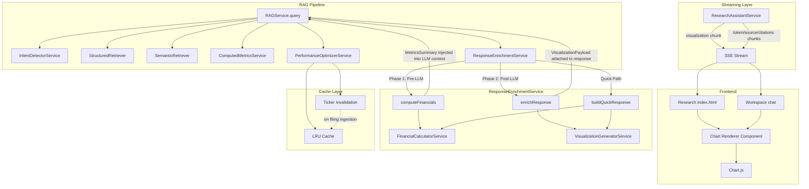

# Design Document: Multimodal Research Responses

## Overview

This feature extends the FundLens research assistant to return multi-modal responses containing inline charts, computed growth metrics, and cached quick responses. The implementation bridges three existing gaps: (1) adding a visualization layer from backend to frontend, (2) wiring the `FinancialCalculatorService` into the RAG pipeline, and (3) re-enabling the `PerformanceOptimizerService` cache with smart invalidation.

The design follows the existing architecture patterns: NestJS services on the backend, SSE streaming via `AsyncGenerator<StreamChunk>`, and Alpine.js components on the frontend with Chart.js for rendering.

### Key Architectural Decision: ResponseEnrichmentService (Two-Phase)

The `RAGService.query()` method is already ~400 lines handling 10+ concerns with 8 constructor dependencies. Rather than injecting `FinancialCalculatorService` and `VisualizationGeneratorService` directly into `RAGService` (making it 10 deps), we extract a `ResponseEnrichmentService` that encapsulates all enrichment logic. `RAGService` gets ONE new dependency instead of two.

The enrichment service operates in two phases:
- **Phase 1 (Pre-LLM): Compute** — `computeFinancials(intent, metrics)` calls `FinancialCalculatorService` and returns a `MetricsSummary`. This gets injected into the LLM context so Claude can reference exact YoY growth figures, CAGR, and margin data in its answer (Requirement 2.2).
- **Phase 2 (Post-LLM): Visualize** — `enrichResponse(ragResponse, intent, metrics, computedSummary)` generates a `VisualizationPayload` and attaches it to the response. This only needs numeric data, not LLM output.

The quick response path skips LLM entirely — it calls both compute and visualize in one shot via `buildQuickResponse()`.

### Production Cache Note

The `PerformanceOptimizerService` uses an in-memory `Map<string, CacheEntry>` — this is per-process and won't share across multiple ECS tasks. For production multi-instance deployment, this should be replaced with Redis/ElastiCache. The existing code comment already notes "can be replaced with Redis." For this iteration, we keep in-memory and note the Redis migration path.

## Architecture



### Two-Phase Flow in RAGService.query()

```
1. Intent detection + optimization decisions
2. Cache lookup (re-enabled)
3. Quick response check → if eligible, delegate to enrichmentService.buildQuickResponse()
4. Structured + Semantic retrieval (existing)
5. ── Phase 1 ── enrichmentService.computeFinancials(intent, metrics)
   └─ Returns MetricsSummary (YoY growth, CAGR, margins)
6. LLM generation (existing) — MetricsSummary injected into context
7. ── Phase 2 ── enrichmentService.enrichResponse(response, intent, metrics, summary)
   └─ Attaches VisualizationPayload to response
8. Cache storage (re-enabled)
9. Return response
```

### Key Design Decisions

1. **ResponseEnrichmentService owns FinancialCalculatorService and VisualizationGeneratorService.** RAGService only depends on ResponseEnrichmentService — keeping the god-service from growing further.

2. **Two-phase enrichment is driven by Requirement 2.2.** The LLM needs computed YoY growth data BEFORE generating its answer. Visualization only needs numeric data and can happen after.

3. **VisualizationGenerator is a standalone service** injected into ResponseEnrichmentService. This keeps visualization logic independently testable.

4. **Cache re-enablement is a code change** (uncommenting + adding invalidation), not a new service. The `PerformanceOptimizerService` already has the full implementation.

5. **Quick response path delegates to ResponseEnrichmentService.buildQuickResponse()** which calls both compute and visualize without LLM invocation.

6. **Visualization generation happens in the backend, not the frontend.** The backend has access to the full metric context and can determine the appropriate chart type. The frontend is a dumb renderer.

## Components and Interfaces

### 1. ResponseEnrichmentService (NEW)

Orchestrates financial computation and visualization generation. Owns both `FinancialCalculatorService` and `VisualizationGeneratorService` as dependencies.

```typescript
// src/rag/response-enrichment.service.ts

@Injectable()
export class ResponseEnrichmentService {
  constructor(
    private readonly financialCalculator: FinancialCalculatorService,
    private readonly visualizationGenerator: VisualizationGeneratorService,
  ) {}

  /**
   * Phase 1 (Pre-LLM): Compute financial metrics.
   * Returns MetricsSummary to be injected into LLM context.
   * Returns undefined on failure (pipeline continues with raw metrics).
   */
  async computeFinancials(
    intent: QueryIntent,
    metrics: MetricResult[],
  ): Promise<MetricsSummary | undefined>;

  /**
   * Phase 2 (Post-LLM): Attach visualization to response.
   * Generates VisualizationPayload from metrics + computed summary.
   * Mutates response by setting visualization field.
   */
  enrichResponse(
    response: RAGResponse,
    intent: QueryIntent,
    metrics: MetricResult[],
    computedSummary?: MetricsSummary,
  ): RAGResponse;

  /**
   * Quick response path: compute + visualize without LLM.
   * Formats metrics into markdown table, generates chart if applicable.
   */
  async buildQuickResponse(
    intent: QueryIntent,
    metrics: MetricResult[],
  ): Promise<RAGResponse>;

  /**
   * Check if a query is eligible for the quick response path.
   */
  isQuickResponseEligible(intent: QueryIntent): boolean;
}
```

### 2. VisualizationGeneratorService (NEW)

Responsible for converting metric data into chart-ready payloads. Owned by `ResponseEnrichmentService`.

```typescript
// src/rag/visualization-generator.service.ts

@Injectable()
export class VisualizationGeneratorService {
  
  /**
   * Generate a visualization payload from RAG query results.
   * Returns null if insufficient data for a chart.
   */
  generateVisualization(
    intent: QueryIntent,
    metrics: MetricResult[],
    computedMetrics?: MetricsSummary,
  ): VisualizationPayload | null;

  /**
   * Build a trend (line) chart from time-series metric data.
   */
  private buildTrendChart(
    ticker: string,
    metrics: MetricResult[],
    yoyGrowth?: { period: string; value: number }[],
  ): VisualizationPayload;

  /**
   * Build a comparison (grouped bar) chart from multi-ticker data.
   */
  private buildComparisonChart(
    tickers: string[],
    metrics: MetricResult[],
  ): VisualizationPayload;
}
```

### 3. VisualizationPayload Interface (NEW)

```typescript
// src/rag/types/visualization.ts

export type ChartType = 'line' | 'bar' | 'groupedBar';

export interface ChartDataset {
  label: string;          // e.g., "Revenue", "YoY Growth %"
  data: number[];         // Numeric values aligned with labels
  type?: 'line' | 'bar'; // Override for mixed charts
  yAxisID?: string;       // For dual-axis charts (e.g., value + growth %)
}

export interface VisualizationPayload {
  chartType: ChartType;
  title: string;          // e.g., "ABNB Revenue Trend (FY2020-FY2024)"
  labels: string[];       // X-axis labels, e.g., ["FY2020", "FY2021", ...]
  datasets: ChartDataset[];
  options?: {
    currency?: boolean;   // Format Y-axis as currency
    percentage?: boolean; // Format Y-axis as percentage
    dualAxis?: boolean;   // Enable secondary Y-axis for growth rates
  };
}
```

### 4. StreamChunk Extension

```typescript
// Updated in src/research/research-assistant.service.ts

export interface StreamChunk {
  type: 'token' | 'source' | 'done' | 'error' | 'citations' | 'peerComparison' | 'visualization';
  data: any;
}
```

When `type === 'visualization'`, `data` is a `VisualizationPayload`.

### 5. RAGService Modifications

```typescript
// Modifications to src/rag/rag.service.ts

class RAGService {
  constructor(
    // ... existing 8 deps unchanged
    private readonly responseEnrichment: ResponseEnrichmentService, // NEW (replaces direct FC + VG injection)
  ) {}

  async query(query: string, options?: QueryOptions): Promise<RAGResponse> {
    // ... existing intent detection, optimization decisions

    // RE-ENABLED: Cache lookup
    if (optimizationDecisions.useCache && optimizationDecisions.cacheKey) {
      const cached = this.performanceOptimizer.getCachedQuery<RAGResponse>(cacheKey);
      if (cached) return { ...cached, latency: Date.now() - startTime, processingInfo: { ...cached.processingInfo, fromCache: true } };
    }

    // NEW: Quick response path (delegates to enrichment service)
    if (this.responseEnrichment.isQuickResponseEligible(intent)) {
      return this.responseEnrichment.buildQuickResponse(intent, metrics);
    }

    // ... existing retrieval (structured + semantic + user docs)

    // NEW Phase 1: Compute financials (pre-LLM)
    let computedSummary: MetricsSummary | undefined;
    if (intent.needsTrend || intent.needsComputation) {
      computedSummary = await this.responseEnrichment.computeFinancials(intent, metrics);
      // Inject computed summary into LLM context (passed to bedrock.generate)
    }

    // ... existing LLM generation (with computedSummary in context)

    // NEW Phase 2: Enrich response with visualization (post-LLM)
    const enrichedResponse = this.responseEnrichment.enrichResponse(
      response, intent, metrics, computedSummary
    );

    // RE-ENABLED: Cache storage
    if (optimizationDecisions.useCache && cacheKey) {
      const ttl = this.performanceOptimizer.getCacheTTL(intent);
      this.performanceOptimizer.cacheQuery(cacheKey, enrichedResponse, ttl);
    }

    return enrichedResponse;
  }
}
```

### 6. RAGResponse Extension

```typescript
// Extended in src/rag/types/query-intent.ts

export interface RAGResponse {
  // ... existing fields
  visualization?: VisualizationPayload; // NEW
}
```

### 7. PerformanceOptimizerService Extension

```typescript
// Addition to src/rag/performance-optimizer.service.ts

class PerformanceOptimizerService {
  // ... existing methods

  /**
   * Invalidate all cache entries for a given ticker.
   * Called when new SEC filings are ingested.
   */
  invalidateByTicker(ticker: string): number;
}
```

### 8. Frontend Chart Renderer (Alpine.js Component)

```javascript
// Inline in public/app/research/index.html (Alpine.js component)

function chartRenderer() {
  return {
    renderChart(containerId, payload) {
      // Creates a Chart.js instance from VisualizationPayload
      // Handles line, bar, groupedBar types
      // Applies FundLens color palette
      // Configures tooltips with metric name, value, period
    },
    destroyChart(containerId) {
      // Cleanup on message removal or conversation switch
    }
  }
}
```

## Data Models

### VisualizationPayload (in-memory, not persisted)

| Field | Type | Description |
|-------|------|-------------|
| chartType | `'line' \| 'bar' \| 'groupedBar'` | Chart rendering type |
| title | `string` | Chart title displayed above the canvas |
| labels | `string[]` | X-axis labels (fiscal periods or ticker names) |
| datasets | `ChartDataset[]` | One or more data series |
| options | `object` (optional) | Rendering hints: currency, percentage, dualAxis |

### ChartDataset

| Field | Type | Description |
|-------|------|-------------|
| label | `string` | Series name shown in legend |
| data | `number[]` | Values aligned 1:1 with parent labels array |
| type | `'line' \| 'bar'` (optional) | Override chart type for mixed charts |
| yAxisID | `string` (optional) | Secondary axis identifier for dual-axis charts |

### Extended RAGResponse

The existing `RAGResponse` interface gains one optional field:

| Field | Type | Description |
|-------|------|-------------|
| visualization | `VisualizationPayload \| undefined` | Chart data when visualization is applicable |

### Cache Key Structure (existing, unchanged)

Cache keys are generated by `PerformanceOptimizerService.generateCacheKey()` using a hash of query + intent. The ticker is extractable from the key for invalidation purposes. The new `invalidateByTicker` method iterates cache entries and removes those whose key contains the target ticker.


## Correctness Properties

*A property is a characteristic or behavior that should hold true across all valid executions of a system — essentially, a formal statement about what the system should do. Properties serve as the bridge between human-readable specifications and machine-verifiable correctness guarantees.*

### Property 1: Trend visualization generation

*For any* `QueryIntent` with `needsTrend` set to true and a set of `MetricResult[]` containing two or more data points for the same metric across different fiscal periods, the `VisualizationGenerator` shall produce a `VisualizationPayload` with `chartType` equal to `'line'`, `labels` matching the fiscal periods in chronological order, and at least one dataset whose values correspond to the metric values.

**Validates: Requirements 1.1**

### Property 2: Comparison visualization generation

*For any* `QueryIntent` with `needsComparison` set to true and `MetricResult[]` spanning two or more distinct tickers, the `VisualizationGenerator` shall produce a `VisualizationPayload` with `chartType` equal to `'groupedBar'` and datasets covering each ticker present in the input metrics.

**Validates: Requirements 1.2**

### Property 3: Visualization-metric value consistency

*For any* `VisualizationPayload` produced by the `VisualizationGenerator`, every numeric value in every dataset shall be present in the input `MetricResult[]` array's `value` field or in the `MetricsSummary` computed values (YoY growth, margins). No fabricated values shall appear in the payload.

**Validates: Requirements 1.5**

### Property 4: YoY growth secondary dataset inclusion

*For any* trend query where the `FinancialCalculatorService` returns a `MetricsSummary` with a non-empty `yoyGrowth` array for the requested metric, the `VisualizationPayload` shall contain a secondary dataset with `yAxisID` set to a secondary axis identifier and values matching the YoY growth percentages.

**Validates: Requirements 2.3**

### Property 5: Visualization stream chunk ordering

*For any* streamed response from `ResearchAssistantService.sendMessage()`, if the underlying `RAGResponse` contains a `visualization` field, then the yielded chunks shall include exactly one chunk with `type === 'visualization'` and it shall appear before any chunk with `type === 'token'`. Conversely, if the `RAGResponse` has no `visualization` field, no chunk with `type === 'visualization'` shall be yielded.

**Validates: Requirements 3.2, 3.4**

### Property 6: Cache hit returns equivalent response

*For any* `RAGResponse` that has been cached by the `PerformanceOptimizerService`, a subsequent cache lookup with the same cache key shall return a response where all fields except `latency` and `timestamp` are deeply equal to the original, and `processingInfo.fromCache` shall be `true`.

**Validates: Requirements 5.2, 5.3**

### Property 7: TTL selection by query type

*For any* `QueryIntent`, the `PerformanceOptimizerService.getCacheTTL()` method shall return 3600 for intents targeting the latest period, 86400 for historical period intents, and 21600 for semantic-type intents.

**Validates: Requirements 5.4**

### Property 8: LRU eviction on max size

*For any* sequence of N cache insertions where N exceeds the configured `maxSize`, the cache size shall never exceed `maxSize`, and the evicted entry shall be the one with the oldest access timestamp (least recently used).

**Validates: Requirements 5.5**

### Property 9: Ticker-based cache invalidation

*For any* cache state containing entries for multiple tickers, calling `invalidateByTicker(ticker)` shall remove exactly those entries whose cache key contains the specified ticker, leave all other entries intact, and increment the eviction counter by the number of removed entries.

**Validates: Requirements 6.1, 6.2**

### Property 10: TTL expiration

*For any* cached entry, the `PerformanceOptimizerService` shall return the entry on lookup if the current time is within the entry's TTL, and shall return `null` (cache miss) if the current time exceeds the entry's TTL.

**Validates: Requirements 6.4**

### Property 11: Quick response eligibility

*For any* `QueryIntent` with `type === 'structured'`, `confidence > 0.85`, and `needsNarrative === false`, the `isQuickResponseEligible()` method shall return `true`. For all other intents, it shall return `false`.

**Validates: Requirements 7.1**

### Property 12: Quick response format and no-LLM

*For any* set of `MetricResult[]` processed through the quick response path, the returned `RAGResponse.answer` shall contain a markdown table with columns for ticker, metric name, value, and fiscal period, and `processingInfo.usedClaudeGeneration` shall be `false`.

**Validates: Requirements 7.2, 7.3, 7.5**

### Property 13: Quick response with trend includes visualization

*For any* `QueryIntent` that qualifies for the quick response path AND has `needsTrend` set to true with sufficient data points, the returned `RAGResponse` shall contain both a markdown table in the `answer` field and a non-null `visualization` field.

**Validates: Requirements 7.4**

### Property 14: Phase 1 computed summary injected into LLM context

*For any* query where `intent.needsTrend` or `intent.needsComputation` is true and `ResponseEnrichmentService.computeFinancials()` returns a non-undefined `MetricsSummary`, the LLM context passed to `BedrockService.generate()` shall include the computed YoY growth values from that summary.

**Validates: Requirements 2.2**

## Error Handling

| Scenario | Handling |
|----------|----------|
| `ResponseEnrichmentService.computeFinancials()` fails (FinancialCalculatorService throws or times out) | Log warning, return undefined. RAGService proceeds with raw metrics from `ComputedMetricsService`. Visualization still generated from raw data if sufficient. (Req 2.4) |
| Fewer than 2 data points for trend chart | Return `null` from `VisualizationGenerator`. No visualization chunk streamed. Text-only response. (Req 1.4) |
| Cache lookup fails (corruption, serialization error) | Log error, treat as cache miss, proceed with full pipeline. |
| Chart.js fails to render on frontend | Display fallback message "Chart could not be rendered" in the message area. Do not break the text response. |
| Quick response path produces empty metrics | Fall back to full RAG pipeline with LLM generation. |
| `invalidateByTicker` called with unknown ticker | No-op, return 0 evictions. No error thrown. |

## Testing Strategy

### Property-Based Testing

Library: **fast-check** (already used in `test/properties/`)

Each correctness property maps to a single property-based test with minimum 100 iterations. Tests are placed in `test/properties/` following existing conventions.

| Property | Test File | Tag |
|----------|-----------|-----|
| P1: Trend visualization | `visualization-generator.property.spec.ts` | Feature: multimodal-research-responses, Property 1: Trend visualization generation |
| P2: Comparison visualization | `visualization-generator.property.spec.ts` | Feature: multimodal-research-responses, Property 2: Comparison visualization generation |
| P3: Value consistency | `visualization-generator.property.spec.ts` | Feature: multimodal-research-responses, Property 3: Visualization-metric value consistency |
| P4: YoY growth dataset | `visualization-generator.property.spec.ts` | Feature: multimodal-research-responses, Property 4: YoY growth secondary dataset |
| P5: Stream chunk ordering | `research-assistant-streaming.property.spec.ts` | Feature: multimodal-research-responses, Property 5: Visualization stream chunk ordering |
| P6: Cache hit equivalence | `performance-optimizer-cache.property.spec.ts` | Feature: multimodal-research-responses, Property 6: Cache hit returns equivalent response |
| P7: TTL selection | `performance-optimizer-cache.property.spec.ts` | Feature: multimodal-research-responses, Property 7: TTL selection by query type |
| P8: LRU eviction | `performance-optimizer-cache.property.spec.ts` | Feature: multimodal-research-responses, Property 8: LRU eviction on max size |
| P9: Ticker invalidation | `performance-optimizer-cache.property.spec.ts` | Feature: multimodal-research-responses, Property 9: Ticker-based cache invalidation |
| P10: TTL expiration | `performance-optimizer-cache.property.spec.ts` | Feature: multimodal-research-responses, Property 10: TTL expiration |
| P11: Quick response eligibility | `quick-response.property.spec.ts` | Feature: multimodal-research-responses, Property 11: Quick response eligibility |
| P12: Quick response format | `quick-response.property.spec.ts` | Feature: multimodal-research-responses, Property 12: Quick response format and no-LLM |
| P13: Quick response + trend | `quick-response.property.spec.ts` | Feature: multimodal-research-responses, Property 13: Quick response with trend includes visualization |
| P14: Phase 1 context injection | `response-enrichment.property.spec.ts` | Feature: multimodal-research-responses, Property 14: Phase 1 computed summary injected into LLM context |

### Unit Testing

Unit tests complement property tests by covering specific examples, edge cases, and integration points:

- `test/unit/visualization-generator.service.spec.ts`: Edge cases (empty metrics, single data point, mixed period types), specific chart configurations
- `test/unit/response-enrichment.service.spec.ts`: Two-phase flow, quick response path, error handling when FinancialCalculatorService fails
- `test/unit/quick-response.spec.ts`: Specific query examples, markdown table formatting verification
- `test/unit/cache-invalidation.spec.ts`: Integration with ingestion pipeline trigger, concurrent invalidation

### E2E Testing

- `test/e2e/multimodal-research.e2e-spec.ts`: Full flow from query to SSE stream, verifying visualization chunks appear for trend queries and are absent for simple queries
