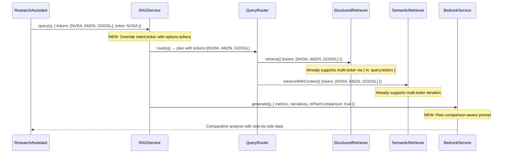

# Design Document: Peer Comparison RAG Retrieval Fix

## Overview

This is a surgical bugfix. The peer comparison feature was partially implemented — intent detection, peer discovery, and frontend badges all work. But the critical data retrieval path was never connected: `sendMessage()` builds an expanded tickers array but passes only `ticker: primaryTicker` to `ragService.query()`. The RAG service options interface doesn't even accept a tickers array.

The fix touches 3 files with ~30 lines of changes total. The downstream retrievers (structured + semantic) already support multi-ticker queries. We just need to thread the array through the middle layer.

## Architecture

The fix connects the broken link in this data flow:



## Components and Interfaces

### 1. RAG Service Query Options (rag.service.ts)

Add `tickers?: string[]` to the options parameter:

```typescript
async query(
  query: string,
  options?: {
    includeNarrative?: boolean;
    includeCitations?: boolean;
    systemPrompt?: string;
    tenantId?: string;
    ticker?: string;        // existing — single ticker for scoping
    tickers?: string[];     // NEW — multi-ticker array for peer comparison
  },
): Promise<RAGResponse>
```

Inside `query()`, after intent detection, override the intent's ticker when `tickers` is provided:

```typescript
// After: const intent = await this.queryRouter.getIntent(query, ...);
if (options?.tickers && options.tickers.length > 0) {
  intent.ticker = options.tickers;
}
```

This ensures the query router's `normalizeTickers()` receives the full array and builds retrieval plans for all tickers. No changes needed to the query router itself — it already calls `normalizeTickers(intent.ticker)` which handles both `string` and `string[]`.

### 2. Research Assistant sendMessage (research-assistant.service.ts)

Change the `ragService.query()` call to pass the expanded tickers array:

```typescript
// BEFORE (broken):
const ragResult = await this.ragService.query(enhancedQuery, {
  includeNarrative: true,
  includeCitations: true,
  systemPrompt: dto.systemPrompt,
  tenantId,
  ticker: primaryTicker,
});

// AFTER (fixed):
const ragResult = await this.ragService.query(enhancedQuery, {
  includeNarrative: true,
  includeCitations: true,
  systemPrompt: dto.systemPrompt,
  tenantId,
  ticker: primaryTicker,
  tickers: tickers.length > 1 ? tickers : undefined, // Only pass when multi-ticker
});
```

### 3. Peer-Comparison Synthesis Prompt (bedrock.service.ts)

Add a `isPeerComparison` flag to the generate context. When true, append peer comparison instructions to the user message:

```typescript
// In generate() context parameter, add:
isPeerComparison?: boolean;

// In buildUserMessage(), when isPeerComparison is true, add to INSTRUCTIONS:
if (context.isPeerComparison) {
  parts.push('9. PEER COMPARISON FORMAT:');
  parts.push('   - Present financial metrics in a comparison table across all companies');
  parts.push('   - Organize qualitative insights (risks, strategy) by company with cross-company commentary');
  parts.push('   - Note any data gaps explicitly (e.g., "No FY2024 data available for AMZN")');
  parts.push('   - End with a comparative summary highlighting key differences');
}
```

In `sendMessage()`, pass the flag:

```typescript
// In the ragService.query() call or in the bedrock generate context:
// The RAG service passes isPeerComparison through to bedrock.generate()
```

The simplest approach: in `rag.service.ts`, detect multi-ticker from the intent and pass `isPeerComparison: true` to `bedrock.generate()`:

```typescript
const isPeerComparison = Array.isArray(intent.ticker) && intent.ticker.length > 1;

const generated = await this.bedrock.generate(query, {
  metrics,
  narratives,
  systemPrompt: options?.systemPrompt,
  modelId,
  isPeerComparison,
});
```

## Data Models

No new data models, tables, or migrations. All existing data structures are sufficient.

## Correctness Properties

*A property is a characteristic or behavior that should hold true across all valid executions of a system — essentially, a formal statement about what the system should do. Properties serve as the bridge between human-readable specifications and machine-verifiable correctness guarantees.*


Property 1: Tickers array overrides intent ticker
*For any* non-empty tickers array passed in Query_Options, after intent detection the `intent.ticker` field used for routing SHALL equal the provided tickers array, not the intent detector's original extraction.
**Validates: Requirements 1.2, 3.1**

Property 2: Retrieval plan contains full tickers array
*For any* query where `intent.ticker` is an array of N tickers (N > 1), the resulting RetrievalPlan SHALL have `structuredQuery.tickers` and `semanticQuery.tickers` both containing all N tickers.
**Validates: Requirements 3.2, 3.3, 3.4**

Property 3: Single-ticker backward compatibility
*For any* query where `tickers` is not provided in Query_Options, the retrieval plan SHALL contain only the single ticker extracted by the intent detector, preserving existing behavior.
**Validates: Requirements 1.3**

Property 4: Ticker array capped at 5
*For any* set of identified peer tickers of size N, the tickers array passed to the RAG service SHALL have length at most 5 (primary + up to 4 peers).
**Validates: Requirements 2.3**

Property 5: Sources reflect all queried tickers with data
*For any* multi-ticker query where metrics or narratives exist for K of the N queried tickers, the response `sources` array SHALL contain entries attributed to all K tickers.
**Validates: Requirements 5.2**

## Error Handling

1. **Peer identification fails**: Already handled — `sendMessage()` catches errors in `identifyPeersFromDeals()` and falls back to single-ticker. No changes needed.
2. **Some peer tickers have no data**: The structured and semantic retrievers already handle this gracefully — they return empty results for tickers with no data. The synthesis prompt (Requirement 4.4) instructs the LLM to note gaps.
3. **RAG service receives empty tickers array**: Treat as no-op — fall back to intent detector's ticker extraction. Guard with `if (options?.tickers && options.tickers.length > 0)`.

## Testing Strategy

**Property-Based Tests (fast-check)**:
- Property 1: Generate random tickers arrays, mock intent detector, verify intent.ticker is overridden
- Property 2: Generate random multi-ticker intents, verify retrieval plan contains all tickers in both queries
- Property 3: Generate single-ticker queries without tickers array, verify no override occurs
- Property 4: Generate peer lists of size 1–20, verify output capped at 5
- Property 5: Generate multi-ticker metric sets, verify extractSources returns all tickers present

Each property test should run minimum 100 iterations. Tag format: **Feature: peer-comparison-rag-retrieval-fix, Property N: {title}**

**Unit Tests**:
- Verify `ragService.query()` accepts and processes the new `tickers` option
- Verify `sendMessage()` passes `tickers` only when `tickers.length > 1`
- Verify `isPeerComparison` flag is set when multiple tickers are in intent
- Verify peer comparison prompt instructions are appended when `isPeerComparison` is true

**Integration Tests**:
- End-to-end: mock deals with NVDA + AMZN + GOOGL data, send peer comparison query, verify response contains metrics for multiple tickers
- Backward compat: send single-ticker query, verify identical behavior to pre-fix
