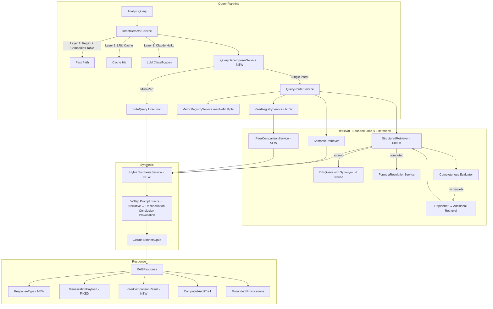
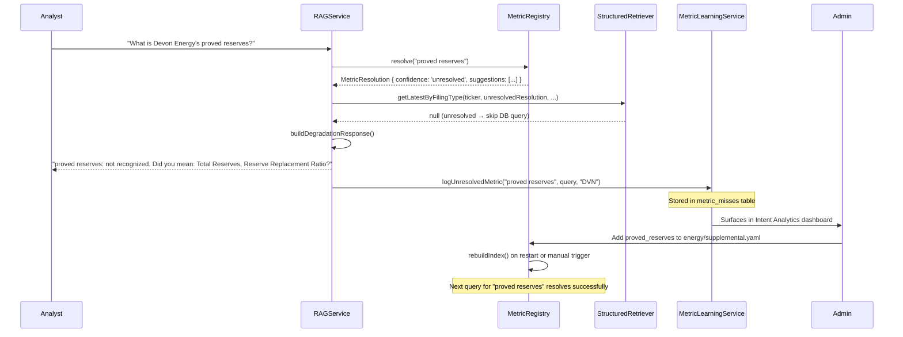

# Design Document: FundLens RAG ChatBot Master Engineering

## Overview

This design addresses the complete FundLens RAG ChatBot engineering initiative across three sprints. The core insight is that the existing architecture is sound — MetricRegistry, FormulaResolutionService, ConceptRegistry, three-layer intent detection, and parallel hybrid retrieval are all correctly designed. The problems are plumbing: type mismatches at service boundaries, missing synonym wiring, freeform synthesis without financial reasoning structure, and single-pass query planning where iterative retrieval is needed.

The design is organized into four layers:
1. **Foundation Fixes (Sprint 1)**: Fix the MetricResolution type mismatch in StructuredRetriever, harden ticker extraction, define the VisualizationPayload contract, and add post-retrieval validation
2. **Intelligence Layer (Sprint 2)**: Replace freeform LLM generation with HybridSynthesisService using a 5-step structured reasoning prompt, add ResponseType taxonomy, and wire PE tenant overlays
3. **Query Complexity (Sprint 3)**: Add QueryDecomposerService for multi-part queries, bounded agentic retrieval loop, and sub-query unified synthesis
4. **Peer Comparison (Sprint 3, concurrent)**: Add PeerComparisonService with YAML-based peer universe registry and QueryRouter integration

Technology stack: NestJS (TypeScript), Prisma ORM, AWS Bedrock (Claude models), YAML metric registries, Python calculation bridge, fast-check for property-based testing.

## Architecture



### Data Flow

1. **Intent Detection**: Query enters IntentDetectorService. Tickers extracted via universal regex + companies table validation (sub-10ms). Metrics resolved via MetricRegistryService into `MetricResolution[]` objects.
2. **Query Decomposition**: QueryDecomposerService evaluates if the query has multiple information needs. Single-intent queries skip LLM call entirely.
3. **Routing**: QueryRouterService builds structured retrieval plan. If peer comparison needed, PeerRegistryService resolves the peer universe.
4. **Retrieval**: StructuredRetriever uses `MetricResolution.db_column` and synonym-based IN clauses. Computed metrics route to FormulaResolutionService. Bounded loop (≤3 iterations) re-plans if incomplete.
5. **Synthesis**: HybridSynthesisService builds FinancialAnalysisContext and invokes Claude with 5-step structured prompt. PE tenant overlays injected when applicable.
6. **Response**: RAGResponse includes ResponseType, VisualizationPayload, PeerComparisonResult, audit trails, and grounded provocations.

## Components and Interfaces

### Sprint 1 — Foundation Fixes

#### StructuredRetrieverService (Modified)
**File:** `src/rag/structured-retriever.service.ts`

Key changes:
- `getLatestByFilingType(ticker, resolution: MetricResolution, filingType)` — accepts MetricResolution instead of string
- Routes `type === 'computed'` to `resolveComputedMetric()`
- Routes `confidence === 'unresolved'` to warning + null return
- Uses `metricRegistry.getSynonymsForDbColumn(resolution.canonical_id)` for IN clause
- `parseFiscalPeriodSortKey()` — fixed to produce `year * 10000 + quarter * 100` (FY2024 → 20240000, Q3FY2024 → 20240300, TTM → 99990000)
- `resolveComputedMetric()` — delegates to FormulaResolutionService, returns MetricResult with `statementType: 'computed'`
- `validateResult()` — post-retrieval gate: null check, confidence ≥ 0.70, parseable period, 8-K warning

```typescript
// Key interface change
private async getLatestByFilingType(
  ticker: string,
  resolution: MetricResolution,
  filingType: string,
): Promise<MetricResult | null>

// Synonym-based query
const synonyms = this.metricRegistry.getSynonymsForDbColumn(resolution.canonical_id);
const results = await this.prisma.financialMetric.findMany({
  where: {
    ticker,
    normalizedMetric: { in: synonyms, mode: 'insensitive' },
    filingType,
  },
  orderBy: { statementDate: 'desc' },
});
```

#### MetricRegistryService (Modified)
**File:** `src/rag/metric-resolution/metric-registry.service.ts`

New method:
```typescript
getSynonymsForDbColumn(canonicalId: string): string[] {
  const definition = this.getMetricById(canonicalId);
  if (!definition) return [canonicalId];
  const synonymSet = new Set<string>();
  synonymSet.add(canonicalId);
  if (definition.db_column) synonymSet.add(definition.db_column);
  for (const syn of definition.synonyms ?? []) {
    synonymSet.add(syn);
  }
  return Array.from(synonymSet);
}
```

#### IntentDetectorService (Modified)
**File:** `src/rag/intent-detector.service.ts`

Key changes:
- `knownTickers: Set<string>` loaded from `companies` table at startup
- `extractTickersFromQuery()` — universal regex `(?:^|[\s,(.])([A-Z]{1,5})(?=[\s,.)!?\n]|$)` + companies table validation
- `@Cron('0 2 * * *') refreshTickerSet()` — daily refresh

```typescript
private extractTickersFromQuery(query: string): string[] {
  const candidates = new Set<string>();
  const pattern = /(?:^|[\s,(.])([A-Z]{1,5})(?=[\s,.)!?\n]|$)/g;
  let m: RegExpExecArray | null;
  while ((m = pattern.exec(query)) !== null) {
    candidates.add(m[1]);
  }
  return Array.from(candidates).filter(c => this.knownTickers.has(c));
}
```

#### VisualizationPayload (New Type)
**File:** `src/rag/visualization.ts` (replace stub)

```typescript
export type ChartType = 'line' | 'bar' | 'grouped_bar' | 'stacked_bar' | 'waterfall' | 'table' | 'pie';

export interface VisualizationPayload {
  suggestedChartType: ChartType | null;
  data: {
    rows: Array<{
      ticker: string;
      period: string;
      filingType: string;
      metrics: Record<string, number | null>;
    }>;
    columns: Array<{
      canonical_id: string;
      display_name: string;
      format: 'currency' | 'percentage' | 'ratio' | 'integer';
      unit_scale: 'ones' | 'thousands' | 'millions' | 'billions';
    }>;
  };
  meta: {
    title: string;
    tickers: string[];
    periods: string[];
    source: string;
    freshnessWarning?: string;
  };
}
```

### Sprint 2 — Intelligence Layer

#### HybridSynthesisService (New)
**File:** `src/rag/hybrid-synthesis.service.ts`

```typescript
@Injectable()
export class HybridSynthesisService {
  constructor(
    private readonly bedrock: BedrockService,
    private readonly performanceOptimizer: PerformanceOptimizerService,
  ) {}

  async synthesize(context: FinancialAnalysisContext): Promise<SynthesisResult>;
  private buildStructuredPrompt(ctx: FinancialAnalysisContext): string;
  private buildUnifyingPrompt(ctx: FinancialAnalysisContext): string;
  private formatMetricsTable(metrics: MetricResult[], computed: ComputedMetricResult[]): string;
  private formatPeerTable(peerData: PeerComparisonResult): string;
  private parseSynthesisResponse(response: string, ctx: FinancialAnalysisContext): SynthesisResult;
}

export interface FinancialAnalysisContext {
  originalQuery: string;
  intent: QueryIntent;
  metrics: MetricResult[];
  narratives: ChunkResult[];
  computedResults: ComputedMetricResult[];
  peerData?: PeerComparisonResult;
  subQueryResults?: SubQueryResult[];
  modelTier: 'haiku' | 'sonnet' | 'opus';
  tenantId?: string;
}

export interface SynthesisResult {
  answer: string;
  usage: { inputTokens: number; outputTokens: number };
  citations: Citation[];
  responseType: ResponseType;
}
```

#### ResponseType Enum (New)
**File:** `src/rag/types/query-intent.ts` (addition)

```typescript
export type ResponseType =
  | 'STRUCTURED_ONLY'
  | 'COMPUTED_ONLY'
  | 'HYBRID_SYNTHESIS'
  | 'PEER_COMPARISON'
  | 'TIME_SERIES'
  | 'CONCEPT_ANALYSIS'
  | 'DECOMPOSED_HYBRID'
  | 'NARRATIVE_ONLY';
```

### Sprint 3 — Query Complexity + Peer Comparison

#### QueryDecomposerService (New)
**File:** `src/rag/query-decomposer.service.ts`

```typescript
@Injectable()
export class QueryDecomposerService {
  async decompose(query: string, intent: QueryIntent): Promise<DecomposedQuery>;
  private isSingleIntent(intent: QueryIntent): boolean;
  private buildDecompositionPrompt(query: string, intent: QueryIntent): string;
  private parseDecomposition(response: string, query: string): DecomposedQuery;
}

export interface DecomposedQuery {
  isDecomposed: boolean;
  subQueries: string[];
  unifyingInstruction?: string;
  originalQuery: string;
}
```

#### PeerComparisonService (New)
**File:** `src/rag/peer-comparison.service.ts`

```typescript
@Injectable()
export class PeerComparisonService {
  async compare(
    tickers: string[],
    metrics: MetricResolution[],
    period: string,
    normalizationBasis: 'FY' | 'LTM' | 'CY',
  ): Promise<PeerComparisonResult>;
  private normalizePeriods(raw: any[], basis: string): any[];
  private computeLTM(raw: any): any;
  private buildComparisonResult(normalized: any[], tickers: string[], metrics: MetricResolution[]): PeerComparisonResult;
}

export interface PeerComparisonResult {
  metric: string;
  normalizationBasis: 'FY' | 'LTM' | 'CY';
  period: string;
  rows: Array<{ ticker: string; value: number | null; rank: number }>;
  median: number;
  mean: number;
  subjectTicker?: string;
  subjectRank?: number;
  subjectVsMedianPct?: number;
  fyMismatchWarning?: string;
}
```

#### Peer Universe Registry (New YAML)
**File:** `yaml-registries/peer_universes.yaml`

```yaml
online_travel:
  display_name: Online Travel & Experiences
  members: [ABNB, BKNG, EXPE, TRIP]
  primary_metrics: [revenue, gross_profit_margin, take_rate]
  normalization_basis: LTM

us_mega_cap_tech:
  display_name: US Mega-Cap Technology
  members: [AAPL, MSFT, GOOGL, AMZN, META, NVDA]
  primary_metrics: [revenue, operating_income_margin, free_cash_flow, rd_expense]
  normalization_basis: FY
```

## Data Models

### MetricResult (Existing, Enhanced)

```typescript
interface MetricResult {
  ticker: string;
  normalizedMetric: string;
  displayName: string;
  rawLabel: string;
  value: number;
  fiscalPeriod: string;
  periodType: 'annual' | 'quarterly';
  filingType: string;
  statementType: string;          // 'income_statement' | 'balance_sheet' | 'cash_flow' | 'computed'
  statementDate: Date;
  filingDate: Date;
  confidenceScore: number;
  sourcePage?: number;
}
```

### FinancialAnalysisContext (New)

```typescript
interface FinancialAnalysisContext {
  originalQuery: string;
  intent: QueryIntent;
  metrics: MetricResult[];
  narratives: ChunkResult[];
  computedResults: ComputedMetricResult[];
  peerData?: PeerComparisonResult;
  subQueryResults?: SubQueryResult[];
  unifyingInstruction?: string;
  modelTier: 'haiku' | 'sonnet' | 'opus';
  tenantId?: string;
}
```

### SubQueryResult (New)

```typescript
interface SubQueryResult {
  subQuery: string;
  metrics: MetricResult[];
  narratives: ChunkResult[];
  computedResults: ComputedMetricResult[];
  responseType: ResponseType;
}
```

### DecomposedQuery (New)

```typescript
interface DecomposedQuery {
  isDecomposed: boolean;
  subQueries: string[];
  unifyingInstruction?: string;
  originalQuery: string;
}
```

### VisualizationPayload (New, replacing stub)

```typescript
interface VisualizationPayload {
  suggestedChartType: ChartType | null;
  data: {
    rows: Array<{
      ticker: string;
      period: string;
      filingType: string;
      metrics: Record<string, number | null>;
    }>;
    columns: Array<{
      canonical_id: string;
      display_name: string;
      format: 'currency' | 'percentage' | 'ratio' | 'integer';
      unit_scale: 'ones' | 'thousands' | 'millions' | 'billions';
    }>;
  };
  meta: {
    title: string;
    tickers: string[];
    periods: string[];
    source: string;
    freshnessWarning?: string;
  };
}
```

### PeerComparisonResult (New)

```typescript
interface PeerComparisonResult {
  metric: string;
  normalizationBasis: 'FY' | 'LTM' | 'CY';
  period: string;
  rows: Array<{ ticker: string; value: number | null; rank: number }>;
  median: number;
  mean: number;
  subjectTicker?: string;
  subjectRank?: number;
  subjectVsMedianPct?: number;
  fyMismatchWarning?: string;
}
```

### SynthesisResult (New)

```typescript
interface SynthesisResult {
  answer: string;
  usage: { inputTokens: number; outputTokens: number };
  citations: Citation[];
  responseType: ResponseType;
}
```

### Unrecognized Metric Flow (New Metric Discovery)

When an analyst queries a metric not yet in the YAML registry (e.g., "What is Devon Energy's proved reserves?"), the pipeline handles it gracefully and creates a feedback loop for future coverage:



**Key design decisions:**
1. **No silent failure**: The analyst always gets a context-aware response explaining what wasn't found and suggesting alternatives
2. **Automatic learning signal**: Every miss is logged with the raw query, ticker context, and timestamp — this feeds the MetricLearningService
3. **Admin dashboard visibility**: The Intent Analytics dashboard (`/internal/intent-analytics.html`) surfaces top unresolved metrics by frequency, enabling data-driven YAML updates
4. **No code changes needed**: Adding a new metric is a YAML-only operation — add the entry with synonyms, db_column, and XBRL tags, then restart or call `rebuildIndex()`
5. **Fuzzy suggestions**: Even when unresolved, the MetricRegistry attempts fuzzy matching and returns up to 3 suggestions so the analyst can self-correct

### Ingestion Validation Rules (Part V)

| Rule | Check | Action on Fail |
|---|---|---|
| Normalization consistency | `normalizeForStorage()` before write | Write normalized form, log original |
| Range check (>5σ) | Compare to last 8 periods same company/metric | Flag for review, write with low confidence |
| Sign convention | Check `metric.sign_convention` from YAML | Invert if needed, log correction |
| Cross-statement reconciliation | Net income IS = Net income CF ± rounding | Flag discrepancy, prefer IS value |
| XBRL tag validation | Map `us-gaap:Revenues` → `revenue` canonical_id | Store both raw tag and canonical_id |

## Correctness Properties

*A property is a characteristic or behavior that should hold true across all valid executions of a system — essentially, a formal statement about what the system should do. Properties serve as the bridge between human-readable specifications and machine-verifiable correctness guarantees.*

### Property 1: Synonym lookup completeness

*For any* canonical metric ID that exists in the MetricRegistry, calling `getSynonymsForDbColumn(canonicalId)` should return an array containing the `canonical_id`, the `db_column` (if defined), and every synonym from the YAML definition — with no normalization applied to the synonym strings.

**Validates: Requirements 2.1, 2.2, 2.4**

### Property 2: Unknown canonical ID fallback

*For any* string that does not match a canonical ID in the MetricRegistry, calling `getSynonymsForDbColumn(unknownId)` should return an array containing exactly that string.

**Validates: Requirements 2.3**

### Property 3: Computed metric routing and result shape

*For any* MetricResolution with `type === 'computed'`, calling `getLatestByFilingType()` should delegate to FormulaResolutionService and, when successful, return a MetricResult with `statementType === 'computed'` and `displayName` matching `resolution.display_name`.

**Validates: Requirements 1.2, 5.1, 5.2, 5.4**

### Property 4: Unresolved metric returns null

*For any* MetricResolution with `confidence === 'unresolved'`, calling `getLatestByFilingType()` should return null without executing a database query.

**Validates: Requirements 1.3**

### Property 5: Fiscal period sort key correctness

*For any* valid year Y (1900-2100) and quarter Q (1-4), `parseFiscalPeriodSortKey("FY" + Y)` should equal `Y * 10000`, `parseFiscalPeriodSortKey("Q" + Q + "FY" + Y)` should equal `Y * 10000 + Q * 100`, and `parseFiscalPeriodSortKey("TTM")` should equal `99990000`.

**Validates: Requirements 4.1, 4.2, 4.3**

### Property 6: Fiscal period sort ordering

*For any* list of MetricResults with distinct fiscal periods, sorting by `parseFiscalPeriodSortKey` descending should place annual periods before quarterly periods of the same year, and more recent periods before older ones.

**Validates: Requirements 4.4**

### Property 7: Ticker extraction pipeline

*For any* query string and a known ticker set, `extractTickersFromQuery()` should return only uppercase letter sequences (1-5 chars) that are bounded by whitespace/punctuation AND present in the known ticker set. No non-ticker uppercase words (EBITDA, GAAP, CEO) should appear in the result.

**Validates: Requirements 6.2, 6.3**

### Property 8: VisualizationPayload population

*For any* non-empty set of MetricResults and an intent with a non-null `suggestedChart` and non-semantic type, `buildVisualizationPayload()` should return a VisualizationPayload where every metric's ticker+period combination appears as a row, every distinct metric appears as a column, and periods are sorted ascending.

**Validates: Requirements 7.4**

### Property 9: Structured prompt completeness

*For any* FinancialAnalysisContext with non-empty metrics and narratives, `buildStructuredPrompt()` should produce a string containing all 5 step markers (STEP 1 through STEP 5), all metric ticker/value pairs from the context, and all narrative section attributions.

**Validates: Requirements 8.2, 8.3, 8.4**

### Property 10: Peer data inclusion in prompt

*For any* FinancialAnalysisContext with non-null `peerData`, `buildStructuredPrompt()` should include a peer comparison section in the output.

**Validates: Requirements 8.5**

### Property 11: ResponseType classification invariant

*For any* combination of intent type, metric count, narrative count, ticker count, and decomposition state, the RAGService should assign exactly one ResponseType from the 8-value enum.

**Validates: Requirements 9.1**

### Property 12: Tenant overlay injection

*For any* FinancialAnalysisContext with a `tenantId` that has a corresponding overlay YAML with `asset_class: 'private_equity'`, the built prompt should contain the PE-specific synthesis instructions from the overlay.

**Validates: Requirements 11.1, 11.2**

### Property 13: Single-intent fast-path

*For any* query with no compound markers (and, also, as well as, additionally, plus, both) and no mixed intent types, `QueryDecomposerService.decompose()` should return `isDecomposed: false` without invoking the LLM.

**Validates: Requirements 12.1**

### Property 14: Decomposition invariants

*For any* decomposed query result where `isDecomposed === true`, the number of sub-queries should be between 1 and 3 inclusive, and `unifyingInstruction` should be a non-empty string.

**Validates: Requirements 12.3, 12.6**

### Property 15: Retrieval loop bound

*For any* query execution through the RAGService, the retrieval loop should execute at most 3 iterations regardless of completeness evaluation results.

**Validates: Requirements 13.1**

### Property 16: Completeness evaluation

*For any* QueryIntent with requested tickers and `needsNarrative === true`, `isRetrievalComplete()` should return false when any requested ticker has no metrics OR when narratives are empty.

**Validates: Requirements 13.2**

### Property 17: Retrieval result merging

*For any* sequence of retrieval iterations, the final metrics array should be the union of all iteration results with no data loss.

**Validates: Requirements 13.5**

### Property 18: Unifying synthesis for sub-queries

*For any* FinancialAnalysisContext with non-empty `subQueryResults`, the HybridSynthesisService should use a unifying prompt template instead of the standard single-query template.

**Validates: Requirements 14.3**

### Property 19: Peer comparison parallel fetch completeness

*For any* set of N tickers and M metrics, `PeerComparisonService.compare()` should produce results covering all N × M combinations (with null values for missing data).

**Validates: Requirements 16.1**

### Property 20: LTM normalization

*For any* company with 4 consecutive quarterly values, LTM normalization should produce a value equal to the sum of those 4 quarters.

**Validates: Requirements 16.2**

### Property 21: Peer statistics correctness

*For any* set of peer comparison rows with numeric values, the computed median should equal the statistical median, the mean should equal the arithmetic mean, and ranks should be assigned in descending order of value.

**Validates: Requirements 16.3**

### Property 22: Peer universe resolution

*For any* single ticker that belongs to a defined peer universe, when `needsPeerComparison` is true, the QueryRouter should expand the ticker list to all members of that peer universe.

**Validates: Requirements 17.1**

### Property 23: Peer-grounded provocation trigger

*For any* FinancialAnalysisContext with non-null `peerData`, the synthesis prompt Step 5 should use the peer-grounded provocation template instead of the standard provocation template.

**Validates: Requirements 18.1**

### Property 24: Range check validation

*For any* metric value and a historical series of 8+ periods, if the value deviates more than 5 standard deviations from the historical mean, the ingestion pipeline should flag it with a low confidence score.

**Validates: Requirements 19.2**

### Property 25: Sign convention correction

*For any* metric with a defined `sign_convention` in the YAML registry, if the stored value has the wrong sign, the ingestion pipeline should invert it.

**Validates: Requirements 19.3**

### Property 26: Cross-statement reconciliation

*For any* pair of net income values from income statement and cash flow statement for the same ticker and period, if they differ beyond rounding tolerance, the system should flag the discrepancy and prefer the income statement value.

**Validates: Requirements 19.4**

### Property 27: XBRL tag mapping

*For any* XBRL tag that exists in the MetricRegistry's YAML definitions, the ingestion pipeline should map it to the correct canonical_id.

**Validates: Requirements 19.5**

### Property 28: Post-retrieval confidence threshold

*For any* MetricResult with `confidenceScore < 0.70`, the post-retrieval validation should exclude it from results.

**Validates: Requirements 20.2**

### Property 29: 8-K warning label

*For any* MetricResult from an 8-K filing where the metric belongs to the income statement, the `displayName` should include the warning "⚠️ (press release, unaudited)".

**Validates: Requirements 20.4**

### Property 30: Graceful degradation message

*For any* mix of resolved, missing, and unresolved MetricResolutions, the degradation response should: list found metrics, explain each missing metric with a reason, show "Did you mean" for unresolved metrics with suggestions, and suggest rephrasing for unresolved metrics without suggestions.

**Validates: Requirements 21.1, 21.2, 21.3**

## Error Handling

### StructuredRetriever Errors
- **Unresolved metric**: Log warning, return null, continue processing other metrics
- **Computed metric failure**: Log warning with ticker/metric/error, return null, do not propagate
- **Database query failure**: Log error, return empty results, include in degradation response
- **Invalid fiscal period**: Assign sort key 0, log warning, metric still included but ranked lowest

### IntentDetectorService Errors
- **Companies table load failure**: Log error, fall back to empty ticker set (all candidates rejected), retry on next cron cycle
- **Regex extraction failure**: Return empty ticker array, fall through to LLM Layer 3

### HybridSynthesisService Errors
- **Bedrock invocation failure**: Return fallback response with raw metrics table and error notice
- **Prompt too long (token limit)**: Truncate narratives (oldest first), log truncation warning
- **Parse failure on synthesis response**: Return raw LLM output as answer, log parse error

### QueryDecomposerService Errors
- **LLM call failure**: Return `isDecomposed: false`, treat as single-intent query
- **Invalid JSON response**: Return `isDecomposed: false`, log parse error
- **Sub-query count > 3**: Truncate to first 3 sub-queries, log warning

### PeerComparisonService Errors
- **Individual ticker fetch failure**: Include null value for that ticker, continue with remaining
- **All tickers fail**: Return empty PeerComparisonResult, log error
- **LTM data incomplete (< 4 quarters)**: Use available quarters, add `fyMismatchWarning`

### Retrieval Loop Errors
- **Replanner LLM failure**: Exit loop, use data collected so far
- **Iteration timeout**: Exit loop after current iteration, log timeout

### Ingestion Validation Errors
- **Range check failure**: Write with low confidence score, flag for review
- **Sign convention mismatch**: Correct and write, log correction
- **Cross-statement mismatch**: Flag discrepancy, prefer IS value, write both

## Testing Strategy

### Dual Testing Approach

This project uses both unit tests and property-based tests for comprehensive coverage:

- **Unit tests**: Verify specific examples from the Definition of Done (T1.1-T3.3), edge cases, error conditions, and integration points
- **Property tests**: Verify universal properties across randomly generated inputs using fast-check

### Property-Based Testing Configuration

- **Library**: fast-check (already in project dependencies)
- **Minimum iterations**: 100 per property test
- **Tag format**: `Feature: rag-chatbot-master-engineering, Property {N}: {title}`
- **Each correctness property maps to exactly one property-based test**

### Unit Test Coverage

Sprint 1 unit tests (from Definition of Done):
- T1.1: "What is the latest Revenue for ABNB?" → non-null MetricResult with actual dollar figure
- T1.2: "What is COIN gross margin FY2024?" → ticker COIN via regex fast-path
- T1.3: "GAAP vs non-GAAP operating income for MSFT" → only MSFT extracted
- T1.4: "What did the 10-K say about risks?" → no tickers extracted
- T1.5: Latest quarterly with FY2024/Q1-Q3FY2025 data → returns Q3FY2025
- T1.6: "ABNB EBITDA margin FY2024" → FormulaResolutionService called, statementType 'computed'

Sprint 2 unit tests:
- T2.1: Hybrid query → responseType HYBRID_SYNTHESIS, answer contains all 5 steps
- T2.2: "How levered is ABNB?" → responseType CONCEPT_ANALYSIS
- T2.3: Third Avenue PE query → tenant overlay applied

Sprint 3 unit tests:
- T3.1: Multi-part query → 2 sub-queries, responseType DECOMPOSED_HYBRID
- T3.2: Complex modeling query → 3 sub-queries, retrieval loop ≤ 3 iterations
- T3.3: Peer comparison → online_travel universe resolved, grouped_bar chart

### Latency Targets (Integration Tests)

| Query Class | p50 Target | p99 Target |
|---|---|---|
| Simple structured (T1.1) | < 800ms | < 1500ms |
| Hybrid single-intent (T2.1) | < 2500ms | < 4000ms |
| Decomposed multi-part (T3.1) | < 4000ms | < 6000ms |

All p99 targets exclude Bedrock cold start.

### Test File Organization

```
test/
  unit/
    structured-retriever-db-column.spec.ts      # T1.1, T1.5, T1.6
    fiscal-period-sort.spec.ts                   # Sort key correctness
    ticker-extraction.spec.ts                    # T1.2, T1.3, T1.4
    visualization-payload.spec.ts                # VisualizationPayload contract
    hybrid-synthesis.spec.ts                     # T2.1, T2.2, T2.3
    response-type-classification.spec.ts         # ResponseType taxonomy
    query-decomposer.spec.ts                     # T3.1, T3.2
    peer-comparison.spec.ts                      # T3.3
    post-retrieval-validation.spec.ts            # Confidence threshold, 8-K warning
    graceful-degradation.spec.ts                 # Degradation messages
  properties/
    synonym-lookup.property.spec.ts              # Properties 1, 2
    computed-routing.property.spec.ts            # Properties 3, 4
    fiscal-period-sort.property.spec.ts          # Properties 5, 6
    ticker-extraction.property.spec.ts           # Property 7
    visualization-payload.property.spec.ts       # Property 8
    structured-prompt.property.spec.ts           # Properties 9, 10
    response-type.property.spec.ts               # Property 11
    tenant-overlay.property.spec.ts              # Property 12
    query-decomposer.property.spec.ts            # Properties 13, 14
    retrieval-loop.property.spec.ts              # Properties 15, 16, 17
    synthesis-routing.property.spec.ts           # Property 18
    peer-comparison.property.spec.ts             # Properties 19, 20, 21
    peer-universe.property.spec.ts               # Property 22
    provocation.property.spec.ts                 # Property 23
    ingestion-validation.property.spec.ts        # Properties 24, 25, 26, 27
    post-retrieval.property.spec.ts              # Properties 28, 29
    graceful-degradation.property.spec.ts        # Property 30
```
