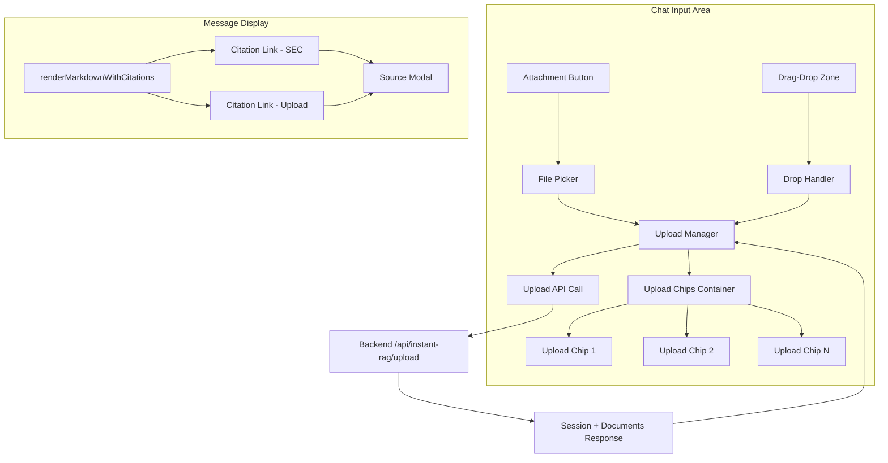

# Design Document: Upload UX & Clickable Citations

## Overview

This design transforms the workspace file upload experience from a separate dropdown-based UI into an inline chip-based system integrated directly with the chat input area, and makes all source citations (uploaded documents and SEC filings) clickable with a source text modal. The implementation is entirely frontend (Alpine.js + Tailwind CSS + vanilla JS) with no backend changes required — the backend already labels sources with `sourceType` and `filename`.

The design follows two tracks:
1. **Upload UX Redesign** — Replace the "Queued Files" dropdown with inline file chips, add drag-drop overlay, per-file progress bars, and processing status indicators.
2. **Clickable Citations** — Enhance `renderMarkdownWithCitations()` to differentiate citation types, add click handlers that open a Source Modal with the excerpt text.

## Architecture



### File Modifications

| File | Changes |
|------|---------|
| `public/app/deals/workspace.html` | Replace file queue dropdown HTML with chip container; update Alpine.js data/methods for chip rendering, drag-drop overlay, progress tracking, citation click handlers, source modal |
| `public/css/instant-rag.css` | Add styles for upload chips, drag-drop overlay, progress bars, citation link variants, source modal |

No backend changes are needed. The existing `/api/instant-rag/upload` endpoint returns document statuses, and the RAG service already provides `sourceType`, `filename`, `excerpt`, and other metadata in citations.

## Components and Interfaces

### 1. Upload Chips Container (HTML + Alpine.js)

Replaces the current "Queued Files" dropdown. Positioned above the textarea inside the chat input area.

```html
<!-- Upload Chips Container (above textarea) -->
<div x-show="instantRagFiles.length > 0"
     class="upload-chips-container">
    <template x-for="(file, index) in instantRagFiles" :key="index">
        <div class="upload-chip" :class="getChipStatusClass(file)">
            <span class="upload-chip-icon" :class="getFileIconClass(file.name)">
                <i :class="getFileIconName(file.name)"></i>
            </span>
            <div class="upload-chip-info">
                <span class="upload-chip-name" x-text="truncateFileName(file.name, 20)"></span>
                <span class="upload-chip-size" x-text="formatFileSize(file.size)"></span>
            </div>
            <!-- Progress bar (during upload/processing) -->
            <div x-show="file.status === 'processing'" class="upload-chip-progress">
                <div class="upload-chip-progress-bar" :style="'width:' + file.progress + '%'"></div>
            </div>
            <!-- Status icon -->
            <span x-show="file.status === 'complete'" class="upload-chip-status complete">
                <i class="fas fa-check-circle"></i>
            </span>
            <span x-show="file.status === 'error'" class="upload-chip-status error">
                <i class="fas fa-exclamation-circle"></i>
            </span>
            <!-- Phase label -->
            <span x-show="file.phase && file.status === 'processing'" 
                  class="upload-chip-phase" x-text="file.phase"></span>
            <!-- Remove button -->
            <button x-show="file.status !== 'processing'"
                    @click="removeInstantRagFile(index)" 
                    class="upload-chip-remove">
                <i class="fas fa-times"></i>
            </button>
        </div>
    </template>
</div>
```

### 2. Drag-Drop Overlay (HTML + Alpine.js)

Overlay that appears on the entire chat input container when files are dragged over.

```html
<!-- Drag-Drop Overlay -->
<div x-show="instantRagDragOver" 
     x-transition:enter="transition ease-out duration-200"
     x-transition:enter-start="opacity-0"
     x-transition:enter-end="opacity-100"
     x-transition:leave="transition ease-in duration-150"
     x-transition:leave-start="opacity-100"
     x-transition:leave-end="opacity-0"
     class="drag-drop-overlay">
    <div class="drag-drop-content">
        <i class="fas fa-cloud-upload-alt drag-drop-icon"></i>
        <p class="drag-drop-text">Drop files here</p>
        <p class="drag-drop-subtext">PDF, DOCX, XLSX, CSV, PPTX, TXT, Images</p>
    </div>
</div>
```

### 3. Enhanced Citation Renderer

Updates `renderMarkdownWithCitations()` to tag citation links with source type data attributes.

```javascript
renderMarkdownWithCitations(content, citations) {
    if (!citations || citations.length === 0) {
        return this.renderMarkdown(content);
    }
    this.currentCitations = citations;
    let html = this.renderMarkdown(content);

    citations.forEach(citation => {
        const citationNum = citation.number || citation.citationNumber;
        if (!citationNum) return;

        const sourceType = citation.sourceType || 'SEC_FILING';
        const cssClass = sourceType === 'USER_UPLOAD' 
            ? 'citation-link citation-upload' 
            : 'citation-link citation-sec';

        const regex = new RegExp(`\\[${citationNum}\\]`, 'g');
        html = html.replace(regex,
            `<a href="#" class="${cssClass}" data-citation-num="${citationNum}" data-source-type="${sourceType}" onclick="event.preventDefault(); document.dispatchEvent(new CustomEvent('citation-click', {detail: {num: ${citationNum}}}));">[${citationNum}]</a>`
        );
    });
    return html;
},
```

### 4. Source Modal Component

A single modal that adapts its content based on source type.

```html
<!-- Source Citation Modal -->
<div x-show="showSourceModal" 
     x-transition
     class="source-modal-backdrop"
     @click.self="showSourceModal = false"
     @keydown.escape.window="showSourceModal = false"
     role="dialog" aria-modal="true" aria-labelledby="source-modal-title">
    <div class="source-modal">
        <div class="source-modal-header">
            <h3 id="source-modal-title">
                <template x-if="sourceModal.sourceType === 'USER_UPLOAD'">
                    <span><i class="fas fa-file-alt mr-2"></i>Uploaded Document Source</span>
                </template>
                <template x-if="sourceModal.sourceType !== 'USER_UPLOAD'">
                    <span><i class="fas fa-landmark mr-2"></i>SEC Filing Source</span>
                </template>
            </h3>
            <button @click="showSourceModal = false" class="source-modal-close" x-ref="sourceModalClose">
                <i class="fas fa-times"></i>
            </button>
        </div>
        <div class="source-modal-meta">
            <!-- Uploaded doc metadata -->
            <template x-if="sourceModal.sourceType === 'USER_UPLOAD'">
                <div class="flex items-center gap-3">
                    <span class="source-badge upload"><i class="fas fa-upload mr-1"></i>Uploaded</span>
                    <span class="text-sm font-medium" x-text="sourceModal.filename"></span>
                </div>
            </template>
            <!-- SEC filing metadata -->
            <template x-if="sourceModal.sourceType !== 'USER_UPLOAD'">
                <div class="flex flex-wrap items-center gap-3">
                    <span class="source-badge sec" x-text="sourceModal.ticker"></span>
                    <span class="text-sm" x-text="sourceModal.filingType"></span>
                    <span class="text-sm text-gray-500" x-text="sourceModal.fiscalPeriod"></span>
                    <span x-show="sourceModal.section" class="text-sm text-gray-500" x-text="sourceModal.section"></span>
                    <span x-show="sourceModal.pageNumber" class="text-sm text-gray-400" x-text="'p. ' + sourceModal.pageNumber"></span>
                </div>
            </template>
            <!-- Relevance score -->
            <div x-show="sourceModal.relevanceScore" class="mt-2">
                <span class="text-xs text-gray-500">Relevance: </span>
                <span class="text-xs font-medium" 
                      :class="sourceModal.relevanceScore > 0.8 ? 'text-green-600' : sourceModal.relevanceScore > 0.5 ? 'text-yellow-600' : 'text-red-600'"
                      x-text="(sourceModal.relevanceScore * 100).toFixed(0) + '%'"></span>
            </div>
        </div>
        <div class="source-modal-excerpt">
            <div x-html="formatExcerpt(sourceModal.excerpt)"></div>
        </div>
        <div class="source-modal-actions">
            <button @click="copySourceCitation()" class="source-modal-btn primary">
                <i class="fas fa-copy mr-1"></i>Copy Citation
            </button>
            <button @click="showSourceModal = false" class="source-modal-btn">
                Close
            </button>
        </div>
    </div>
</div>
```

### 5. Alpine.js Helper Methods

```javascript
// File type icon mapping
getFileIconName(filename) {
    const ext = filename.split('.').pop().toLowerCase();
    const icons = {
        pdf: 'fas fa-file-pdf',
        docx: 'fas fa-file-word',
        xlsx: 'fas fa-file-excel',
        csv: 'fas fa-file-csv',
        pptx: 'fas fa-file-powerpoint',
        txt: 'fas fa-file-alt',
        png: 'fas fa-file-image',
        jpg: 'fas fa-file-image',
        jpeg: 'fas fa-file-image'
    };
    return icons[ext] || 'fas fa-file';
},

getFileIconClass(filename) {
    const ext = filename.split('.').pop().toLowerCase();
    return `file-icon ${ext === 'jpg' || ext === 'jpeg' || ext === 'png' ? 'image' : ext}`;
},

getChipStatusClass(file) {
    return {
        'chip-pending': file.status === 'pending',
        'chip-processing': file.status === 'processing',
        'chip-complete': file.status === 'complete',
        'chip-error': file.status === 'error'
    };
},

truncateFileName(name, maxLen) {
    if (name.length <= maxLen) return name;
    const ext = name.split('.').pop();
    const base = name.slice(0, maxLen - ext.length - 4);
    return base + '...' + ext;
},

formatFileSize(bytes) {
    if (bytes < 1024) return bytes + ' B';
    if (bytes < 1024 * 1024) return (bytes / 1024).toFixed(1) + ' KB';
    return (bytes / (1024 * 1024)).toFixed(1) + ' MB';
},

formatExcerpt(text) {
    if (!text) return '<p class="text-gray-400 italic">No excerpt available</p>';
    return text.split('\n').map(p => `<p>${p}</p>`).join('');
},
```

## Data Models

### Upload Chip File Object (existing `instantRagFiles` array items, extended)

```typescript
interface UploadFileItem {
    file: File;           // The browser File object
    name: string;         // file.name
    size: number;         // file.size in bytes
    status: 'pending' | 'processing' | 'complete' | 'error';
    progress: number;     // 0-100 upload percentage
    phase: string | null; // 'Uploading' | 'Extracting text' | 'Generating embeddings' | 'Complete' | 'Duplicate' | 'Failed'
    error: string | null; // Error message if status === 'error'
    documentId?: string;  // Set after successful upload
}
```

### Citation Object (from backend, already exists)

```typescript
interface Citation {
    number: number;              // Citation reference number [1], [2], etc.
    citationNumber?: number;     // Alias for number
    sourceType: 'USER_UPLOAD' | 'SEC_FILING';
    // For USER_UPLOAD
    filename?: string;
    // For SEC_FILING
    ticker?: string;
    filingType?: string;         // '10-K', '10-Q', etc.
    fiscalPeriod?: string;       // 'FY2024', 'Q3 2024', etc.
    section?: string;            // 'MD&A', 'Risk Factors', etc.
    pageNumber?: number;
    // Common
    excerpt: string;             // Source text excerpt
    relevanceScore?: number;     // 0.0 - 1.0
}
```

### Source Modal State (Alpine.js data property)

```typescript
interface SourceModalState {
    sourceType: 'USER_UPLOAD' | 'SEC_FILING';
    filename?: string;
    ticker?: string;
    filingType?: string;
    fiscalPeriod?: string;
    section?: string;
    pageNumber?: number;
    excerpt: string;
    relevanceScore?: number;
}
```


## Correctness Properties

*A property is a characteristic or behavior that should hold true across all valid executions of a system — essentially, a formal statement about what the system should do. Properties serve as the bridge between human-readable specifications and machine-verifiable correctness guarantees.*

### Property 1: File addition preserves count invariant

*For any* set of valid files (correct type, under size limit) added to an empty or non-full queue, the length of `instantRagFiles` after addition SHALL equal the previous length plus the number of added files, capped at 5.

**Validates: Requirements 1.1, 1.7, 2.3**

### Property 2: File icon mapping is total over supported extensions

*For any* filename with a supported extension (pdf, docx, xlsx, csv, pptx, txt, png, jpg, jpeg), `getFileIconName` SHALL return a non-empty icon class string that is unique per file type category (documents, spreadsheets, presentations, text, images).

**Validates: Requirements 1.2**

### Property 3: File name truncation preserves extension and respects max length

*For any* filename string and max length parameter, `truncateFileName` SHALL return a string that: (a) has length ≤ maxLen + extension length, (b) ends with the original file extension, and (c) equals the original name if the original is shorter than maxLen.

**Validates: Requirements 1.3**

### Property 4: File size formatting produces correct human-readable output

*For any* non-negative integer byte count, `formatFileSize` SHALL return a string ending in "B", "KB", or "MB" with the correct numeric value (bytes < 1024 → B, < 1MB → KB, else MB).

**Validates: Requirements 1.3**

### Property 5: File removal decreases list length by exactly one

*For any* non-empty `instantRagFiles` array and any valid index within bounds, calling `removeInstantRagFile(index)` SHALL result in the array length decreasing by exactly 1, and the file previously at that index SHALL no longer be present.

**Validates: Requirements 1.4, 1.5**

### Property 6: Citation rendering produces correctly typed links

*For any* markdown content string containing citation markers `[N]` and a corresponding citations array where each citation has a `sourceType` of either `USER_UPLOAD` or `SEC_FILING`, `renderMarkdownWithCitations` SHALL produce HTML where each `[N]` is replaced by an anchor element with CSS class `citation-upload` when sourceType is `USER_UPLOAD` and `citation-sec` when sourceType is `SEC_FILING`.

**Validates: Requirements 4.1, 5.1**

### Property 7: Citation click populates modal with correct metadata

*For any* citation object, calling the citation click handler SHALL set `sourceModal` fields such that: for `USER_UPLOAD` citations, `sourceModal.filename` equals the citation's filename and `sourceModal.excerpt` equals the citation's excerpt; for `SEC_FILING` citations, `sourceModal.ticker`, `sourceModal.filingType`, `sourceModal.fiscalPeriod`, and `sourceModal.excerpt` all match the citation's corresponding fields.

**Validates: Requirements 4.2, 5.2**

### Property 8: Excerpt formatting preserves paragraph structure

*For any* non-empty text string, `formatExcerpt` SHALL return HTML where each line of the input (split by `\n`) is wrapped in a `<p>` tag, and the number of `<p>` tags in the output equals the number of lines in the input.

**Validates: Requirements 7.4**

## Error Handling

| Scenario | Handling |
|----------|----------|
| Unsupported file type dropped/selected | `addInstantRagFiles` rejects the file with an alert showing supported types. File is not added to queue. |
| File exceeds 50MB size limit | `addInstantRagFiles` rejects the file with an alert. File is not added to queue. |
| Total upload size exceeds 150MB | `addInstantRagFiles` stops adding files with an alert. Already-queued files remain. |
| More than 5 files selected | Only first 5 are added; excess rejected with alert. |
| Upload API returns error | File status set to `'error'`, phase set to `'Failed'`, error message stored. Upload_Chip shows red error icon. |
| Upload API returns duplicate | File status set to `'complete'`, phase set to `'Duplicate'`. No error shown. |
| Citation click with missing citation data | `handleCitationClickByNumber` logs error to console. No modal opened. |
| Citation with no excerpt text | `formatExcerpt` returns italic "No excerpt available" placeholder. |
| Modal Escape key when modal not open | No-op; event handler checks `showSourceModal` state. |
| Network failure during upload | Caught by try/catch in `uploadInstantRagFiles`, all pending files set to error status, `instantRagUploading` reset to false. |

## Testing Strategy

### Unit Tests

Unit tests verify specific examples and edge cases using Jest (already configured in the project).

- File icon mapping for each supported extension
- `truncateFileName` with names shorter than, equal to, and longer than max length
- `formatFileSize` with 0 bytes, 500 bytes, 1.5 KB, 2.3 MB
- `formatExcerpt` with empty string, single line, multi-line, null input
- Citation rendering with no citations, single citation, multiple citations
- Citation click handler with USER_UPLOAD and SEC_FILING citations
- File removal at index 0, middle, and last position
- `addInstantRagFiles` with 0, 3, 5, and 7 files
- Drag state toggle (dragover sets true, dragleave sets false)

### Property-Based Tests

Property-based tests use [fast-check](https://github.com/dubzzz/fast-check) (JavaScript/TypeScript PBT library). Each test runs a minimum of 100 iterations.

- **Feature: upload-ux-clickable-citations, Property 1: File addition preserves count invariant** — Generate random arrays of 0-10 file objects with random valid extensions and sizes, verify count invariant holds.
- **Feature: upload-ux-clickable-citations, Property 2: File icon mapping is total over supported extensions** — Generate random filenames with supported extensions, verify non-empty icon class returned.
- **Feature: upload-ux-clickable-citations, Property 3: File name truncation preserves extension** — Generate random filenames (1-200 chars) with random extensions, verify truncation rules.
- **Feature: upload-ux-clickable-citations, Property 4: File size formatting produces correct output** — Generate random non-negative integers, verify format string matches expected unit.
- **Feature: upload-ux-clickable-citations, Property 5: File removal decreases list length by one** — Generate random file arrays (1-5 items) and random valid indices, verify removal invariant.
- **Feature: upload-ux-clickable-citations, Property 6: Citation rendering produces correctly typed links** — Generate random markdown strings with `[N]` markers and random citation arrays with mixed sourceTypes, verify output HTML has correct CSS classes.
- **Feature: upload-ux-clickable-citations, Property 7: Citation click populates modal with correct metadata** — Generate random citation objects with either sourceType, verify modal state matches.
- **Feature: upload-ux-clickable-citations, Property 8: Excerpt formatting preserves paragraph structure** — Generate random multi-line strings, verify paragraph count matches line count.

### Test File Locations

- Unit tests: `test/unit/upload-ux-clickable-citations.spec.ts`
- Property tests: `test/properties/upload-ux-clickable-citations.property.spec.ts`
