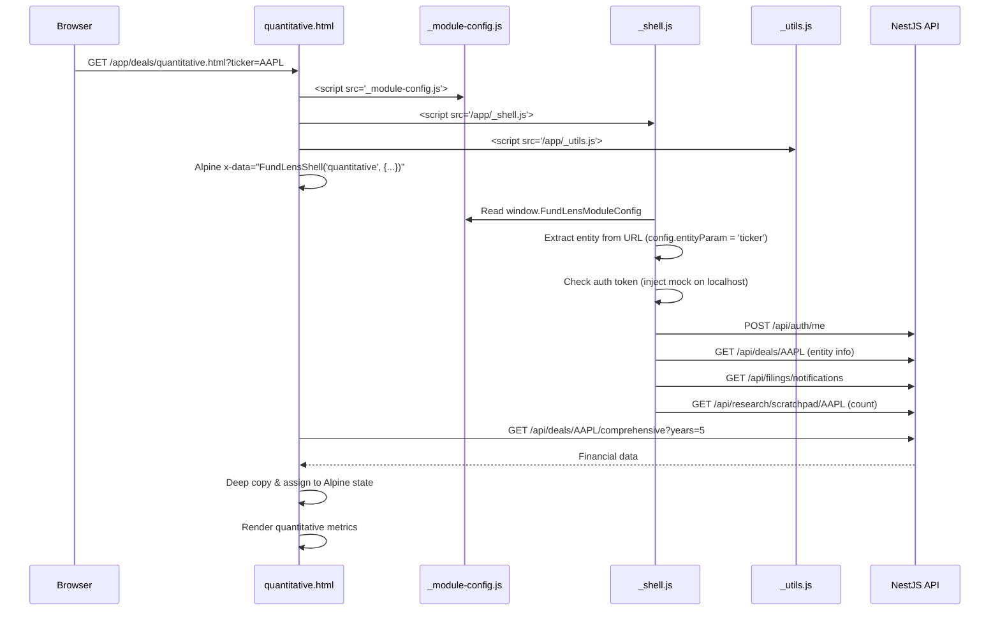

# Design Document: Workspace Page Decomposition

## Overview

This design decomposes the FundLens workspace monolith (`workspace.html`, 5,784 lines) into 7 independent HTML pages plus a module-agnostic shared shell and utilities module. The architecture replaces Alpine.js `x-show` view toggling with real browser navigation, eliminating the single massive reactive object that causes Alpine.js 3.x proxy crashes.

The shell is designed to be module-agnostic: it reads its configuration (sidebar items, entity type, breadcrumb labels) from a per-module config file. This means when Private Equity or Credit Analysis modules launch, they provide their own `_module-config.js` and get the same shell chrome (nav bar, sidebar, breadcrumbs, auth, filing notifications) without any shell code changes.

### Key Design Decisions

1. **No build step** — All JS is loaded via `<script>` tags from CDN or local files. Shell, utils, and module config use `window` globals.
2. **Module-agnostic shell** — `_shell.js` lives at `public/app/_shell.js` and reads `window.FundLensModuleConfig` for module-specific behavior. Each module provides its own `_module-config.js`.
3. **Shell merges Alpine data** — `FundLensShell(viewName, viewData)` returns a single object that Alpine uses as `x-data`. The shell injects common state/methods, and the page provides view-specific state/methods.
4. **Deep copy on API responses** — All pages use `JSON.parse(JSON.stringify(data))` before assigning API responses to Alpine reactive properties to prevent proxy crashes.
5. **URL-based navigation** — `navigateTo('research')` does `window.location.href = '/app/deals/research.html?ticker=AAPL'`. No SPA routing.
6. **CSS scoping** — Each page loads only the CSS it needs. Shell loads `design-system.css` and `filing-notifications.css`. Research loads `instant-rag.css`. Scratchpad loads `research-scratchpad.css`. IC Memo loads `ic-memo.css`.
7. **Grouped sidebar** — Sidebar preserves the current UX grouping (Analysis, Tools, Research) with collapsible groups, rather than flattening to 7 items.
8. **Entity context abstraction** — Shell reads entity param name from module config (`ticker` for equity, `dealId` for PE), so pages don't hardcode entity types.
9. **In-page event bus** — Shell provides `shellOn`/`shellEmit` for decoupled communication, upgradeable to SSE/WebSocket later.

## Architecture

```
public/
├── app/
│   ├── _shell.js              ← Module-agnostic shell (nav, auth, sidebar, breadcrumbs, event bus)
│   ├── _utils.js              ← Shared formatters (formatCurrency, formatPercent, deepCopy, etc.)
│   └── deals/                 ← Equity Research module
│       ├── _module-config.js  ← Equity module config (sidebar groups, entity type, breadcrumbs)
│       ├── workspace.html     ← Redirect hub (backward compat)
│       ├── quantitative.html
│       ├── qualitative.html
│       ├── export.html
│       ├── provocations.html
│       ├── research.html
│       ├── scratchpad.html
│       └── ic-memo.html
│   └── pe/                    ← Future: Private Equity module (not built now)
│       ├── _module-config.js  ← PE module config (different sidebar, dealId entity)
│       ├── pipeline.html
│       └── ...
├── css/
│   ├── design-system.css
│   ├── filing-notifications.css
│   ├── instant-rag.css
│   ├── research-scratchpad.css
│   └── ic-memo.css
└── js/
    └── theme-toggle.js
```

### Page Load Sequence



## Components and Interfaces

### 1. `_module-config.js` — Equity Module Configuration

```javascript
// public/app/deals/_module-config.js
window.FundLensModuleConfig = {
    moduleName: 'Equity Research',
    moduleSlug: 'deals',
    basePath: '/app/deals',
    
    // Entity context — what identifies the "thing" being analyzed
    entityParam: 'ticker',           // URL param name (?ticker=AAPL)
    entityType: 'ticker',            // semantic type for API calls
    
    // Sidebar navigation — grouped to preserve current UX
    sidebarGroups: [
        {
            label: 'Analysis',
            collapsed: false,
            items: [
                { name: 'Quantitative', page: 'quantitative', icon: 'fas fa-chart-bar', shortcut: '1' },
                { name: 'Qualitative', page: 'qualitative', icon: 'fas fa-search', shortcut: '2' },
            ]
        },
        {
            label: 'Tools',
            collapsed: false,
            items: [
                { name: 'Export', page: 'export', icon: 'fas fa-file-export', shortcut: '3' },
                { name: 'Provocations', page: 'provocations', icon: 'fas fa-bolt', shortcut: '4' },
            ]
        },
        {
            label: 'Research',
            collapsed: false,
            items: [
                { name: 'Research Assistant', page: 'research', icon: 'fas fa-robot', shortcut: '5' },
                { name: 'Scratchpad', page: 'scratchpad', icon: 'fas fa-sticky-note', shortcut: '6', badge: 'scratchpadCount' },
                { name: 'IC Memo', page: 'ic-memo', icon: 'fas fa-file-contract', shortcut: '7' },
            ]
        }
    ],
    
    // Breadcrumb config
    breadcrumbs: {
        home: { label: 'Home', path: '/fundlens-main.html' },
        module: { label: 'Deals', path: '/app/deals/index.html' },
    },
    
    // Entity info loader — fetches display name for breadcrumbs
    async loadEntityInfo(entityValue, authHeaders) {
        try {
            const resp = await fetch(`/api/deals/${entityValue}`, { headers: authHeaders });
            if (resp.ok) {
                const data = await resp.json();
                return { displayName: data.data?.name || entityValue, sector: data.data?.sector || '' };
            }
        } catch (e) { /* fallback below */ }
        return { displayName: entityValue, sector: '' };
    }
};
```

### 2. `_shell.js` — Module-Agnostic Shared Shell

```javascript
// public/app/_shell.js
window.FundLensShell = function(viewName, viewData) {
    const config = window.FundLensModuleConfig;
    if (!config) throw new Error('FundLensModuleConfig not loaded. Include _module-config.js before _shell.js');
    
    const params = new URLSearchParams(window.location.search);
    const entityValue = params.get(config.entityParam) || '';

    const shellData = {
        // --- Common State ---
        currentPage: viewName,
        user: { email: '', tenantId: '', tenantName: '', tenantSlug: '', role: '', isPlatformAdmin: false },
        entityContext: { type: config.entityType, value: entityValue, displayName: entityValue, extra: {} },
        isOnline: navigator.onLine,
        dataLoadError: null,
        showUserMenu: false,
        filingNotifications: [],
        filingNotifCount: 0,
        filingNotifOpen: false,
        scratchpadCount: 0,
        sidebarGroups: config.sidebarGroups,

        // --- Event Bus ---
        _eventListeners: {},
        shellOn(event, callback) {
            if (!this._eventListeners[event]) this._eventListeners[event] = [];
            this._eventListeners[event].push(callback);
        },
        shellEmit(event, data) {
            (this._eventListeners[event] || []).forEach(cb => cb(data));
        },

        // --- Auth ---
        getAuthHeaders() {
            const token = localStorage.getItem('fundlens_token');
            if (!token) { window.location.href = '/login.html'; return {}; }
            return { 'Authorization': `Bearer ${token}`, 'Content-Type': 'application/json' };
        },
        
        async loadUser() {
            const token = localStorage.getItem('fundlens_token');
            if (!token) {
                // Dev mode: auto-inject mock token on localhost
                if (window.location.hostname === 'localhost') {
                    this._injectDevToken();
                } else {
                    window.location.href = '/login.html';
                    return;
                }
            }
            // Parse token payload for user info
            try {
                const payload = JSON.parse(atob(token.split('.')[1]));
                this.user = {
                    email: payload.email || payload['cognito:username'] || 'User',
                    tenantId: payload['custom:tenant_id'] || '00000000-0000-0000-0000-000000000000',
                    tenantName: payload['custom:tenant_name'] || 'Development',
                    tenantSlug: payload['custom:tenant_slug'] || 'dev',
                    role: payload['custom:tenant_role'] || 'analyst',
                    isPlatformAdmin: false
                };
            } catch (e) {
                console.error('Token parse error:', e);
            }
            // Verify with server
            try {
                const resp = await fetch('/api/auth/me', {
                    method: 'POST', headers: this.getAuthHeaders()
                });
                if (resp.ok) {
                    const data = await resp.json();
                    if (data.success && data.user) {
                        this.user = { ...this.user, ...data.user };
                    }
                }
            } catch (e) { console.warn('Auth verify failed:', e.message); }
        },
        
        logout() {
            localStorage.removeItem('fundlens_token');
            localStorage.removeItem('fundlens_refresh_token');
            localStorage.removeItem('fundlens_user');
            window.location.href = '/login.html';
        },
        
        getUserInitials() {
            if (!this.user.email) return '?';
            return this.user.email.substring(0, 2).toUpperCase();
        },

        // --- Entity Context ---
        async loadEntityInfo() {
            if (config.loadEntityInfo && this.entityContext.value) {
                const info = await config.loadEntityInfo(this.entityContext.value, this.getAuthHeaders());
                this.entityContext.displayName = info.displayName || this.entityContext.value;
                this.entityContext.extra = info;
            }
        },

        // --- Navigation ---
        navigateTo(pageName) {
            const url = `${config.basePath}/${pageName}.html?${params.toString()}`;
            window.location.href = url;
        },
        
        navigateToWithParams(pageName, extraParams) {
            const newParams = new URLSearchParams(params.toString());
            Object.entries(extraParams || {}).forEach(([k, v]) => newParams.set(k, v));
            window.location.href = `${config.basePath}/${pageName}.html?${newParams.toString()}`;
        },

        // --- Breadcrumbs ---
        get breadcrumbItems() {
            const bc = config.breadcrumbs;
            const currentItem = config.sidebarGroups
                .flatMap(g => g.items)
                .find(i => i.page === this.currentPage);
            return [
                { label: bc.home.label, path: bc.home.path, icon: 'fas fa-home' },
                { label: bc.module.label, path: bc.module.path },
                { label: this.entityContext.displayName, path: null },
                { label: currentItem?.name || this.currentPage, path: null },
            ];
        },

        // --- Filing Notifications ---
        async loadFilingNotifications() {
            try {
                const resp = await fetch('/api/filings/notifications?limit=10', {
                    headers: this.getAuthHeaders()
                });
                if (resp.ok) {
                    const data = await resp.json();
                    this.filingNotifications = data.data || [];
                    this.filingNotifCount = this.filingNotifications.filter(n => !n.read).length;
                    this.shellEmit('filing:loaded', this.filingNotifications);
                }
            } catch (e) { console.warn('Filing notifications unavailable:', e.message); }
        },
        
        startFilingNotifPolling() {
            setInterval(() => this.loadFilingNotifications(), 60000);
        },

        // --- Scratchpad Count ---
        async loadScratchpadCount() {
            try {
                const entity = this.entityContext.value || 'default';
                const resp = await fetch(`/api/research/scratchpad/${entity}`, {
                    headers: this.getAuthHeaders()
                });
                if (resp.ok) {
                    const data = await resp.json();
                    this.scratchpadCount = (data.data || []).length;
                    this.shellEmit('scratchpad:countChanged', this.scratchpadCount);
                }
            } catch (e) { this.scratchpadCount = 0; }
        },

        // --- Keyboard Shortcuts ---
        _setupKeyboardShortcuts() {
            document.addEventListener('keydown', (e) => {
                if (e.metaKey || e.ctrlKey) {
                    const allItems = config.sidebarGroups.flatMap(g => g.items);
                    const item = allItems.find(i => i.shortcut === e.key);
                    if (item) {
                        e.preventDefault();
                        this.navigateTo(item.page);
                    }
                }
            });
        },

        // --- Online/Offline ---
        _setupOnlineOfflineHandlers() {
            window.addEventListener('online', () => { this.isOnline = true; });
            window.addEventListener('offline', () => { this.isOnline = false; });
        },

        // --- Dev Token ---
        _injectDevToken() {
            // Same mock token logic as current workspace.html
            const mockPayload = btoa(JSON.stringify({
                email: 'dev@fundlens.local',
                'custom:tenant_id': '00000000-0000-0000-0000-000000000000',
                'custom:tenant_name': 'Development',
                'custom:tenant_slug': 'dev',
                'custom:tenant_role': 'admin'
            }));
            const mockToken = `eyJ0eXAiOiJKV1QiLCJhbGciOiJIUzI1NiJ9.${mockPayload}.mock`;
            localStorage.setItem('fundlens_token', mockToken);
        },

        // --- Shell Init ---
        async _shellInit() {
            if (!this.entityContext.value) {
                window.location.href = config.basePath + '/index.html';
                return;
            }
            await this.loadUser();
            await this.loadEntityInfo();
            this.loadFilingNotifications();
            this.startFilingNotifPolling();
            this.loadScratchpadCount();
            this._setupKeyboardShortcuts();
            this._setupOnlineOfflineHandlers();
        },
    };

    // Merge shell data with view-specific data
    const merged = { ...shellData, ...viewData };

    // Wrap init: call shell init first, then view init if provided
    const viewInit = viewData.init;
    merged.init = async function() {
        await this._shellInit();
        if (viewInit) await viewInit.call(this);
    };

    return merged;
};
```

### 3. `_utils.js` — Shared Utilities Module

```javascript
// public/app/_utils.js
window.FundLensUtils = {
    formatCurrency(value) {
        if (value == null || isNaN(value)) return '—';
        const abs = Math.abs(value);
        const sign = value < 0 ? '-' : '';
        if (abs >= 1e9) return sign + '$' + (abs / 1e9).toFixed(1) + 'B';
        if (abs >= 1e6) return sign + '$' + (abs / 1e6).toFixed(1) + 'M';
        if (abs >= 1e3) return sign + '$' + (abs / 1e3).toFixed(1) + 'K';
        return sign + '$' + abs.toFixed(0);
    },

    formatPercent(value) {
        if (value == null || isNaN(value)) return '—';
        return (value * 100).toFixed(1) + '%';
    },

    formatRatio(value) {
        if (value == null || isNaN(value)) return '—';
        return value.toFixed(2) + 'x';
    },

    formatDays(value) {
        if (value == null || isNaN(value)) return '—';
        return Math.round(value) + ' days';
    },

    getYoYGrowth(growthData, period) {
        if (!growthData || !period) return '—';
        const entry = growthData.find(g => g.period === period);
        return entry ? (entry.value * 100).toFixed(1) + '%' : '—';
    },

    getMarginForPeriod(marginData, period) {
        if (!marginData || !period) return '—';
        const entry = marginData.find(m => m.period === period);
        return entry ? (entry.value * 100).toFixed(1) + '%' : '—';
    },

    getValueForPeriod(data, period, type) {
        if (!data || !period) return '—';
        const entry = data.find(d => d.period === period);
        if (!entry) return '—';
        if (type === 'currency') return this.formatCurrency(entry.value);
        if (type === 'percent') return this.formatPercent(entry.value);
        if (type === 'ratio') return this.formatRatio(entry.value);
        if (type === 'days') return this.formatDays(entry.value);
        return entry.value;
    },

    deepCopy(obj) {
        return JSON.parse(JSON.stringify(obj));
    }
};
```

### 4. Page Structure Pattern

Each page follows this HTML structure. Note the script load order: module config first, then shell, then utils.

```html
<!DOCTYPE html>
<html lang="en">
<head>
    <meta charset="UTF-8">
    <meta name="viewport" content="width=device-width, initial-scale=1.0">
    <title>FundLens - [Page Name]</title>
    <!-- Shared CSS -->
    <link rel="stylesheet" href="/css/design-system.css">
    <link rel="stylesheet" href="/css/filing-notifications.css">
    <!-- Page-specific CSS (if any) -->
    <script src="https://cdn.tailwindcss.com"></script>
    <script defer src="https://unpkg.com/alpinejs@3.14.8/dist/cdn.min.js"></script>
    <link href="https://cdnjs.cloudflare.com/ajax/libs/font-awesome/6.0.0/css/all.min.css" rel="stylesheet">
    <!-- Module config FIRST, then shell, then utils -->
    <script src="_module-config.js"></script>
    <script src="/app/_shell.js"></script>
    <script src="/app/_utils.js"></script>
</head>
<body>
    <div x-data="FundLensShell('pageName', { /* page-specific state & methods */ })"
         x-init="init()" x-cloak>

        <!-- Nav Bar (inline, driven by shell state) -->
        <nav class="bg-white shadow-sm border-b border-gray-100 sticky top-0 z-50">
            <!-- ... same nav bar HTML as current workspace.html, using shell state bindings ... -->
        </nav>

        <!-- Breadcrumbs -->
        <div class="bg-white border-b border-gray-200 px-6 py-3">
            <div class="flex items-center space-x-2 text-sm mb-2">
                <template x-for="(crumb, i) in breadcrumbItems" :key="i">
                    <span class="flex items-center space-x-2">
                        <span x-show="i > 0"><i class="fas fa-chevron-right text-gray-400 text-xs"></i></span>
                        <a x-show="crumb.path" :href="crumb.path" class="text-gray-500 hover:text-blue-600" x-text="crumb.label"></a>
                        <span x-show="!crumb.path" class="text-gray-900 font-medium" x-text="crumb.label"></span>
                    </span>
                </template>
            </div>
        </div>

        <!-- Main Layout -->
        <div class="flex h-[calc(100vh-132px)]">
            <!-- Sidebar with collapsible groups -->
            <div class="sidebar flex flex-col" role="navigation">
                <nav class="flex-1 p-3 space-y-3">
                    <template x-for="group in sidebarGroups" :key="group.label">
                        <div>
                            <div class="text-xs font-semibold text-gray-400 uppercase tracking-wider px-3 py-1" x-text="group.label"></div>
                            <template x-for="item in group.items" :key="item.page">
                                <div @click="navigateTo(item.page)"
                                     :class="{'active': currentPage === item.page}"
                                     class="nav-item flex items-center px-3 py-2.5 rounded-lg cursor-pointer">
                                    <i :class="item.icon" class="w-5 text-gray-400"></i>
                                    <span class="ml-3 text-sm font-medium" x-text="item.name"></span>
                                    <span x-show="item.badge && $data[item.badge] > 0"
                                          class="badge" x-text="$data[item.badge]"></span>
                                </div>
                            </template>
                        </div>
                    </template>
                </nav>
                <!-- Keyboard Shortcuts Hint -->
                <div class="p-4 border-t border-gray-200">
                    <p class="text-xs text-gray-400 mb-2">Keyboard Shortcuts</p>
                    <div class="space-y-1 text-xs text-gray-500">
                        <template x-for="item in sidebarGroups.flatMap(g => g.items).filter(i => i.shortcut)" :key="item.shortcut">
                            <div><span x-text="'⌘' + item.shortcut + ' - ' + item.name"></span></div>
                        </template>
                    </div>
                </div>
            </div>

            <!-- Content Area (page-specific) -->
            <div class="flex-1 overflow-auto">
                <!-- Offline Indicator -->
                <div x-show="!isOnline" class="bg-yellow-50 border-b border-yellow-200 px-6 py-3">
                    <span class="text-sm text-yellow-800">⚠️ You are currently offline.</span>
                </div>
                <!-- Page content goes here -->
            </div>
        </div>
    </div>
</body>
</html>
```

Since there's no build step, the nav bar, sidebar, and breadcrumbs HTML is duplicated inline in each page. All dynamic behavior is driven by shell state and module config, so the markup is identical across pages — only the `x-data` page-specific object differs.

### 5. `workspace.html` — Redirect Hub

```javascript
// Minimal redirect logic — no Alpine needed
(function() {
    const params = new URLSearchParams(window.location.search);
    const hash = window.location.hash.substring(1);

    const redirectMap = {
        'research': 'research',
        'scratchpad': 'scratchpad',
        'ic-memo': 'ic-memo',
        'analysis': 'quantitative',
        '': 'quantitative'
    };

    const target = redirectMap[hash] || 'quantitative';
    // Preserve ALL query params (ticker, conv, etc.)
    window.location.replace(`${target}.html?${params.toString()}`);
})();
```

### 6. Cross-Page Interaction Patterns

| Interaction | Source Page | Mechanism |
|---|---|---|
| Save to Scratchpad | Research, Provocations | API call `POST /api/research/scratchpad/:ticker` → toast → `shellEmit('scratchpad:countChanged')` |
| Ask in Research | Provocations | `navigateToWithParams('research', { query: encodedQuestion })` |
| Add to Report | Scratchpad | `navigateTo('ic-memo')` |
| Scratchpad count badge | All pages (sidebar) | Shell fetches count on init, badge reads `scratchpadCount` from shell state |
| Auto-populate research | Research (on load) | Reads `?query=` param, decodes, populates input field |

## Data Models

### Shell Common State

```typescript
interface ShellState {
    currentPage: string;           // 'quantitative' | 'qualitative' | 'export' | 'provocations' | 'research' | 'scratchpad' | 'ic-memo'
    user: {
        email: string;
        tenantId: string;
        tenantName: string;
        tenantSlug: string;
        role: string;
        isPlatformAdmin: boolean;
    };
    entityContext: {
        type: string;              // 'ticker' for equity, 'dealId' for PE (future)
        value: string;             // 'AAPL', 'uuid-123', etc.
        displayName: string;       // 'Apple Inc.', populated by loadEntityInfo
        extra: Record<string, any>; // sector, etc.
    };
    isOnline: boolean;
    dataLoadError: string | null;
    showUserMenu: boolean;
    filingNotifications: FilingNotification[];
    filingNotifCount: number;
    filingNotifOpen: boolean;
    scratchpadCount: number;
    sidebarGroups: SidebarGroup[];
}

interface SidebarGroup {
    label: string;
    collapsed: boolean;
    items: SidebarItem[];
}

interface SidebarItem {
    name: string;
    page: string;
    icon: string;
    shortcut: string;
    badge?: string;                // Alpine state property name for count badge
}
```

### Quantitative Page State

```typescript
interface QuantitativeState {
    loading: boolean;
    years: number;                 // default 5
    data: ComprehensiveFinancialData | null;
    retryCount: number;
    maxRetries: number;            // default 3
}
```

### Qualitative Page State

```typescript
interface QualitativeState {
    loadingQualitative: boolean;
    refreshingQualitative: boolean;
    refreshQualitativeStatus: string;
    qualitativeData: Record<string, QualitativeItem[]>;
    qualitativeHasData: boolean;
    _autoTriggerFired: boolean;
    _qualitativeSectionMeta: Record<string, SectionMeta>;
}
```

### Export Page State

```typescript
interface ExportState {
    exportStep: number;            // 1 | 2 | 3
    exportSelectedYear: string | null;
    exportFilingType: string | null;
    availablePeriods: {
        annualPeriods: string[];
        quarterlyPeriods: string[];
        has8KFilings: boolean;
    };
    selectedYears: string[];
    selectedQuarterYear: string | null;
    selectedQuarters: string[];
    selectedStatements: string[];   // default ['income_statement', 'balance_sheet', 'cash_flow']
    includeCalculatedMetrics: boolean;
    exportLoading: boolean;
    exportError: string | null;
}
```

### Provocations Page State

```typescript
interface ProvocationsState {
    provocationsData: Provocation[];
    provocationsLoading: boolean;
    provocationsMode: 'provocations' | 'sentiment' | null;
    sentimentData: SentimentAnalysis | null;
    presetQuestions: PresetQuestion[];
}
```

### Research Page State

```typescript
interface ResearchState {
    researchMessages: ChatMessage[];
    researchInput: string;
    researchTyping: boolean;
    conversationId: string | null;
    notebookId: string | null;
    provocationsMode: 'provocations' | 'sentiment' | null;
    showSettingsModal: boolean;
    systemPrompt: string;
    defaultSystemPrompts: Record<string, string>;
    showSourceModal: boolean;
    sourceModal: SourceModalData;
    currentCitations: Citation[];
    // Instant RAG
    instantRagSession: RagSession | null;
    instantRagFiles: RagFile[];
    instantRagUploading: boolean;
    instantRagIntakeSummaries: IntakeSummary[];
    instantRagDragOver: boolean;
    instantRagTimeoutWarning: boolean;
    instantRagDuplicateToast: string | null;
    instantRagMessages: ChatMessage[];
    instantRagInput: string;
    instantRagTyping: boolean;
    instantRagProcessingStatus: Record<string, string>;
    instantRagTimeRemaining: number;
    showInstantRagSummaries: boolean;
}
```

### Scratchpad Page State

```typescript
interface ScratchpadState {
    scratchpadItems: ScratchpadItem[];
    scratchpadCount: number;
    scratchpadScrolled: boolean;
}
```

### IC Memo Page State

```typescript
interface ICMemoState {
    memoGenerated: boolean;
    memoGenerating: boolean;
    memoContent: string;
    scratchpadItems: ScratchpadItem[];
}
```

## Correctness Properties

### Property 1: Shell merge completeness

*For any* view name string and any view data object, calling `FundLensShell(viewName, viewData)` should return an object that contains all required shell properties (`user`, `entityContext`, `isOnline`, `filingNotifications`, `filingNotifCount`, `scratchpadCount`, `currentPage`, `sidebarGroups`) AND all required shell methods (`getAuthHeaders`, `loadUser`, `logout`, `navigateTo`, `navigateToWithParams`, `loadFilingNotifications`, `getUserInitials`, `shellOn`, `shellEmit`, `init`) AND all properties from the provided viewData object.

**Validates: Requirements 1.1, 1.3, 1.4, 14.1**

### Property 2: Entity extraction from URL

*For any* valid entity string (1-20 alphanumeric characters including hyphens), when the URL contains `?{entityParam}={value}` and the module config specifies `entityParam`, calling `FundLensShell` should produce a result where `entityContext.value` equals the entity value from the URL parameter.

**Validates: Requirements 1.5**

### Property 3: Breadcrumb generation

*For any* entity display name and any page name from the valid set defined in module config, the `breadcrumbItems` computed property should return an array of 4 items: Home (with link), Module (with link), Entity display name (no link), and Page display name (no link, derived from sidebar config).

**Validates: Requirements 1.9**

### Property 4: Navigation URL construction

*For any* page name from the valid set and any set of URL query parameters, calling `navigateTo(page)` should construct a URL of the form `{basePath}/{page}.html?{preservedParams}` where all existing query parameters are preserved.

**Validates: Requirements 1.11, 7.3, 9.3, 9.4, 12.2**

### Property 5: formatCurrency correctness

*For any* numeric value, `formatCurrency(value)` should return a string starting with `$` (or `-$` for negatives) and ending with a magnitude suffix (`K`, `M`, `B`) or a plain number. *For any* null or undefined input, `formatCurrency` should return `"—"`.

**Validates: Requirements 3.2, 3.4**

### Property 6: formatPercent correctness

*For any* numeric value, `formatPercent(value)` should return a string ending with `%` containing exactly one decimal place. *For any* null or undefined input, `formatPercent` should return `"—"`.

**Validates: Requirements 3.3, 3.4**

### Property 7: Page state isolation

*For any* page in the system, the Alpine data object returned by `FundLensShell(pageName, pageData)` should contain shell properties plus only that page's specific properties. The quantitative page should not contain `researchMessages`, `memoContent`, or `scratchpadItems`; the research page should not contain `data` (financial), `exportStep`, or `memoContent`.

**Validates: Requirements 4.2, 5.4, 6.5, 7.5, 8.7, 9.5, 10.4, 13.1, 13.2**

### Property 8: Deep copy prevents reference sharing

*For any* JavaScript object (including nested objects and arrays), applying `deepCopy(obj)` should produce a result that is deeply equal to the original but shares no object references with it. Mutating the copy should not affect the original.

**Validates: Requirements 4.3, 13.3**

### Property 9: Redirect mapping correctness

*For any* set of query parameters and any hash value from the set `{'', 'analysis', 'research', 'scratchpad', 'ic-memo'}`, the redirect hub should map to the correct target page (`quantitative.html`, `research.html`, `scratchpad.html`, `ic-memo.html`) with all query parameters preserved.

**Validates: Requirements 11.1, 11.2, 11.3, 11.4, 11.5, 11.7**

### Property 10: Query parameter auto-populate

*For any* non-empty query string passed as `?query=ENCODED_QUERY` to the Research_Page, the research input field should be populated with the decoded query string.

**Validates: Requirements 8.4, 12.5**

### Property 11: Event bus delivery

*For any* event name and callback registered via `shellOn(event, callback)`, when `shellEmit(event, data)` is called with that event name, the callback should be invoked with the provided data.

**Validates: Requirements 14.1, 14.2, 14.3**

## Error Handling

### Authentication Errors
- If no JWT token exists in localStorage and not on localhost → redirect to `/login.html`
- If token parse fails → redirect to `/login.html`
- If `/api/auth/me` returns non-200 → log warning, keep parsed token data, continue with degraded state

### Entity Context Errors
- If entity param is missing from URL → redirect to module index page (e.g., `/app/deals/index.html`)
- If entity info API fails → use raw entity value as display name

### API Failures
- All API calls use try/catch with error logging
- Quantitative page: exponential backoff retry (up to 3 attempts) with user-visible error banner
- Other pages: single retry with error message display
- Offline detection: show yellow banner, suppress API calls

### Alpine.js Proxy Crash Prevention
- All complex API responses are deep-copied via `FundLensUtils.deepCopy()` before assignment to reactive state
- This is enforced as a mandatory pattern in all page implementations

### Navigation Errors
- If redirect hub encounters unknown hash → default to `quantitative.html`

## Testing Strategy

### Property-Based Testing

Use **fast-check** (JavaScript property-based testing library) for all correctness properties. Each property test runs a minimum of 100 iterations with randomly generated inputs.

### Unit Testing

Unit tests complement property tests by covering specific examples, edge cases, integration points, and error conditions. Unit tests use Jest.

### Test Organization

| Test File | Covers |
|---|---|
| `test/properties/shell-merge.property.spec.ts` | Property 1, 2, 3, 11 |
| `test/properties/navigation-urls.property.spec.ts` | Property 4, 9 |
| `test/properties/formatting-utils.property.spec.ts` | Property 5, 6 |
| `test/properties/page-isolation.property.spec.ts` | Property 7 |
| `test/properties/deep-copy.property.spec.ts` | Property 8 |
| `test/unit/shell.spec.ts` | Shell init, auth, dev mode, event bus |
| `test/unit/utils.spec.ts` | Formatting edge cases |
| `test/unit/redirect-hub.spec.ts` | Redirect mapping examples |
| `test/unit/module-config.spec.ts` | Module config validation |
