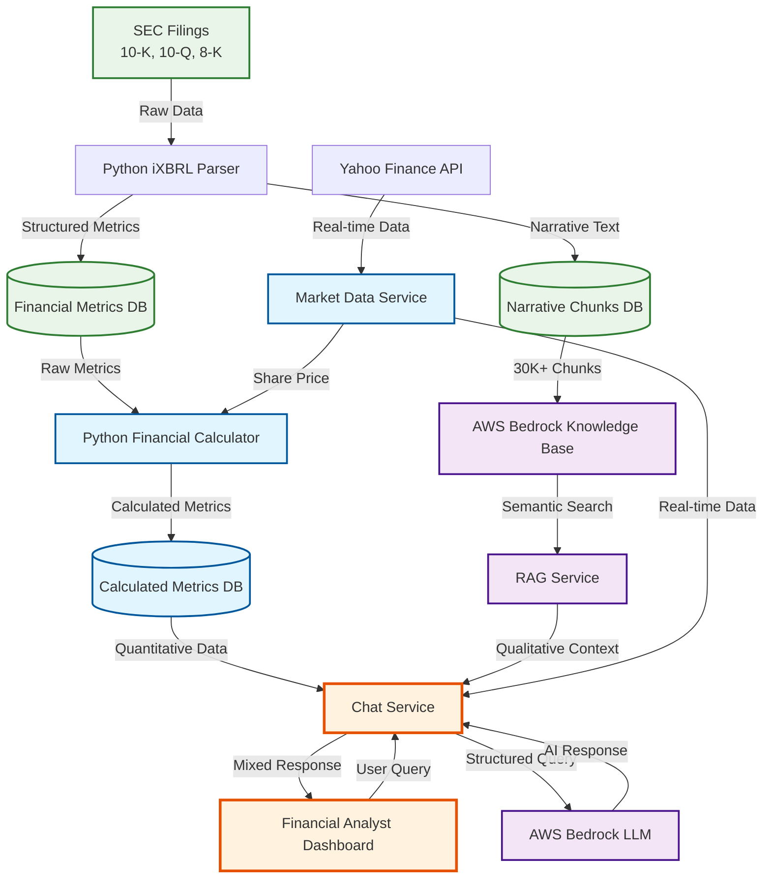
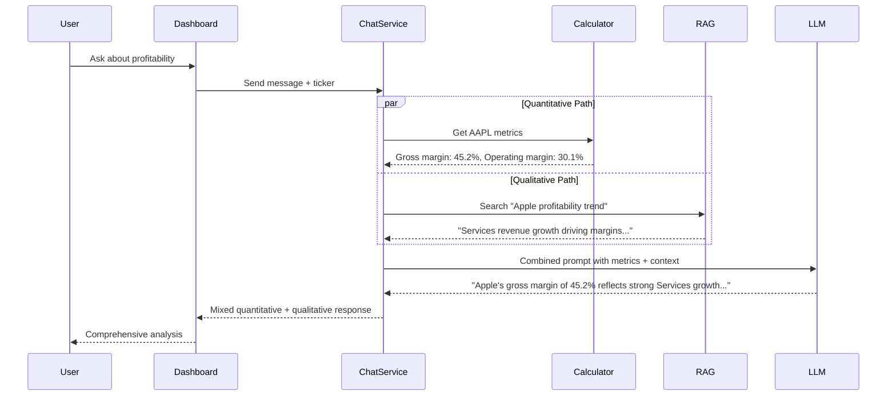
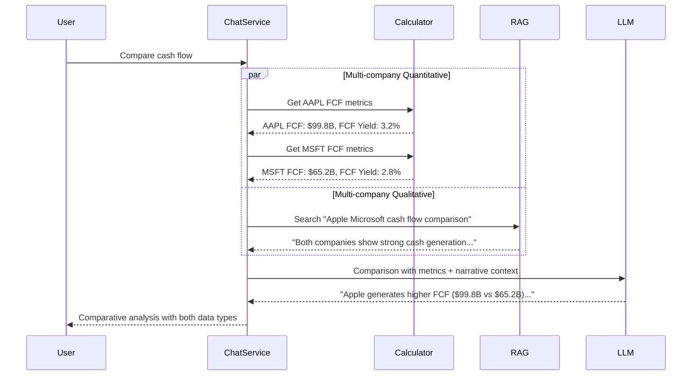

# Quantitative + Qualitative Integration Architecture

## System Overview Diagram



## Integration Points - Where Quantitative Meets Qualitative

### 1. Chat Service Integration Hub
**File: `src/deals/chat.service.ts`**

The Chat Service is the **primary integration point** where quantitative and qualitative data merge:

```typescript
// QUANTITATIVE: Get calculated metrics
const metrics = await this.financialCalculatorService.getMetricsSummary(ticker);

// QUALITATIVE: Get narrative context from RAG
const ragResponse = await this.ragService.query(userMessage, {
  ticker,
  includeMetrics: true
});

// MIXED RESPONSE: Combine both in AI prompt
const enhancedPrompt = `
User Question: ${userMessage}

QUANTITATIVE DATA:
- Revenue TTM: ${metrics.revenue.ttm}
- Gross Margin: ${metrics.profitability.grossMargin.ttm}
- Free Cash Flow: ${metrics.cashFlow.freeCashFlow.ttm}

QUALITATIVE CONTEXT:
${ragResponse.context}

Please provide a comprehensive analysis combining both quantitative metrics and qualitative insights.
`;
```

### 2. RAG Service Enhancement
**File: `src/rag/rag.service.ts`**

Enhanced to include calculated metrics in responses:

```typescript
async query(question: string, options: { includeMetrics?: boolean }) {
  // Get qualitative context from Bedrock KB
  const semanticResults = await this.bedrockService.query(question);
  
  // INTEGRATION: Add quantitative metrics if requested
  if (options.includeMetrics && options.ticker) {
    const metrics = await this.financialCalculatorService.getMetricsSummary(options.ticker);
    
    return {
      answer: semanticResults.answer,
      context: semanticResults.context,
      quantitativeMetrics: metrics, // ← MIXED DATA
      sources: semanticResults.sources
    };
  }
}
```

### 3. Dashboard Real-time Integration
**File: `public/financial-analyst-dashboard.html`**

The dashboard displays both types of data simultaneously:

```javascript
// QUANTITATIVE: Load calculated metrics
async loadFinancialMetrics() {
  const response = await fetch(`/api/financial-calculator/dashboard/${ticker}`);
  this.financialMetrics = response.data;
}

// QUALITATIVE: Send chat message with context
async sendMessage() {
  const response = await fetch(`/api/deals/${dealId}/chat/message`, {
    body: JSON.stringify({
      content: this.chatInput,
      includeMetrics: true, // ← REQUEST MIXED RESPONSE
      ticker: this.currentDeal.ticker
    })
  });
}
```

## Data Flow Architecture

### Quantitative Data Flow
```
SEC Filings → Python Parser → Raw Metrics DB → Python Calculator → Calculated Metrics DB → API → Dashboard
```

### Qualitative Data Flow  
```
SEC Filings → Python Parser → Narrative Chunks → Bedrock KB → RAG Service → API → Dashboard
```

### **MIXED Data Flow (The Integration)**
```
User Question → Chat Service → [Calculated Metrics + RAG Context] → LLM → Enhanced Response → Dashboard
```

## File Impact Analysis

### Core Integration Files (Where Mixing Happens)

#### 1. **`src/deals/chat.service.ts`** ⭐ PRIMARY INTEGRATION
- **Role**: Main orchestrator of quantitative + qualitative responses
- **Quantitative**: Calls `FinancialCalculatorService` for metrics
- **Qualitative**: Calls `RAGService` for narrative context
- **Integration**: Combines both in LLM prompts

#### 2. **`src/rag/rag.service.ts`** ⭐ ENHANCED RAG
- **Role**: Enhanced RAG with quantitative awareness
- **Quantitative**: Can include calculated metrics in responses
- **Qualitative**: Primary semantic search and context retrieval
- **Integration**: Mixed response format with both data types

#### 3. **`public/financial-analyst-dashboard.html`** ⭐ UI INTEGRATION
- **Role**: Displays both quantitative metrics and qualitative chat
- **Quantitative**: Financial metrics panel with calculations
- **Qualitative**: AI chat interface with narrative responses
- **Integration**: Side-by-side display with cross-referencing

### Quantitative-Focused Files

#### 4. **`python_parser/financial_calculator.py`**
- **Role**: Pure quantitative calculations
- **Output**: Deterministic financial metrics
- **Integration Point**: Results consumed by Chat Service

#### 5. **`src/deals/financial-calculator.service.ts`**
- **Role**: NestJS wrapper for Python calculator
- **Output**: Formatted quantitative metrics
- **Integration Point**: Called by Chat Service for mixed responses

#### 6. **`src/deals/financial-calculator.controller.ts`**
- **Role**: API endpoints for quantitative metrics
- **Output**: RESTful access to calculated metrics
- **Integration Point**: Used by dashboard and chat service

### Qualitative-Focused Files

#### 7. **`src/rag/bedrock.service.ts`**
- **Role**: AWS Bedrock Knowledge Base integration
- **Output**: Semantic search results from narrative chunks
- **Integration Point**: Called by RAG Service for qualitative context

#### 8. **`src/rag/semantic-retriever.service.ts`**
- **Role**: Semantic search and retrieval
- **Output**: Relevant narrative chunks and context
- **Integration Point**: Provides qualitative context to Chat Service

### Data Processing Files

#### 9. **`python_parser/hybrid_parser.py`**
- **Role**: Extracts both metrics (quantitative) and narratives (qualitative)
- **Output**: Structured data for both calculation and semantic search
- **Integration Point**: Source data for both processing pipelines

#### 10. **`src/s3/comprehensive-sec-pipeline.service.ts`**
- **Role**: Orchestrates data ingestion for both pipelines
- **Output**: Populates both metrics DB and narrative chunks
- **Integration Point**: Ensures both data types are available

## Integration Scenarios

### Scenario 1: "What's Apple's profitability trend?"



### Scenario 2: "Compare AAPL vs MSFT cash flow"



## Response Format Integration

### Mixed Response Structure
```json
{
  "answer": "Apple's gross margin of 45.2% TTM reflects strong Services revenue growth...",
  "quantitativeMetrics": {
    "grossMargin": { "ttm": 0.452, "formatted": "45.2%" },
    "freeCashFlow": { "ttm": 99800000000, "formatted": "$99.8B" }
  },
  "qualitativeContext": [
    {
      "text": "Services revenue has been a key driver of margin expansion...",
      "source": "AAPL 10-K 2023",
      "confidence": 0.95
    }
  ],
  "sources": [
    { "title": "Apple Inc. 10-K", "url": "...", "type": "quantitative" },
    { "title": "Management Discussion", "url": "...", "type": "qualitative" }
  ]
}
```

## Benefits of Integration

### 1. **Comprehensive Analysis**
- Quantitative metrics provide precise, comparable data
- Qualitative context explains the "why" behind the numbers
- Combined insights offer complete investment picture

### 2. **Validation & Cross-Reference**
- Calculated metrics validate narrative claims
- Qualitative context explains metric anomalies
- Dual-source verification increases confidence

### 3. **Enhanced User Experience**
- Single interface for both data types
- Natural language queries with precise numerical answers
- Rich context with supporting evidence

### 4. **Scalable Architecture**
- Independent processing pipelines
- Flexible integration points
- Easy to enhance either component

## Future Enhancements

### 1. **Deeper Integration**
- Metric-aware semantic search (find narratives explaining specific metrics)
- Trend analysis combining historical metrics with management commentary
- Automated insight generation from metric + narrative correlation

### 2. **Advanced Analytics**
- Sentiment analysis of qualitative data correlated with quantitative performance
- Predictive modeling using both numerical trends and narrative indicators
- Risk assessment combining financial ratios with qualitative risk factors

### 3. **Interactive Features**
- Click on metrics to see related narrative explanations
- Highlight narrative text that supports/contradicts metrics
- Dynamic metric calculations based on qualitative scenario analysis

## Summary

The system successfully integrates **quantitative financial calculations** with **qualitative narrative analysis** through:

- **Chat Service** as the primary integration hub
- **Enhanced RAG** with quantitative awareness  
- **Dashboard** displaying both data types simultaneously
- **Mixed response format** combining metrics with context
- **Dual processing pipelines** feeding into unified user experience

This architecture provides analysts with both the **precision of calculated metrics** and the **insight of narrative context**, creating a comprehensive financial analysis platform.